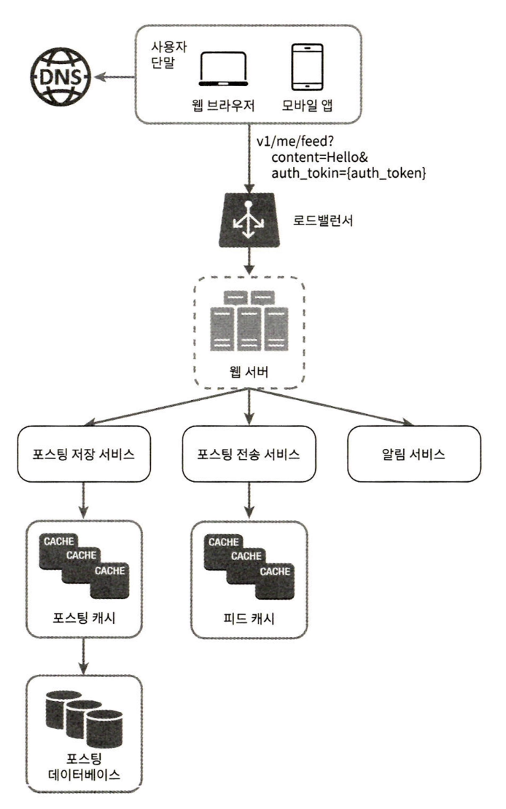

# 시스템디자인인터뷰 11장 - 뉴스 피드 시스템 설계

Created: October 26, 2025 1:34 PM

# 뉴스피드

> 뉴스 피드는 여러분의 홈 페이지 중앙에 지속적으로 업데이트되는 스토리들로, 사용자 상태 정보 업데이트, 사진, 비디오, 링크, 앱 활도, 그리고 여러분이 페이스북에서 팔로우하는 사람들, 페이지, 또는 그룹으로부터 나오는 ‘좋아요’등을 포함 - facebook
> 

# 1단계 - 문제 이해 및 설계 범위 확정

- 모바일/웹 모두 지원
- 중요한 기능 : 새로운 스토리 올리기 / 친구들이 올리는 스토리 확인(뉴스 피드 확인)
- 단순 시간 흐룹 역순으로 표시
- 한 명의 사용자는 최대 5000명의 친구 가짐
- 트래픽 규모: 매일 천만 명(10milion DAU)
- 스토리에 이미지/비디오 등의 이미지 파일 포함 가능

# 2단계 - 개략적 설계안 제시 및 동의 구하기

## API

- 피드 발행 API
    - `POST /v1/me/feed`
- 피드 읽기 API
    - `GET /v1/me/feed`

### 피드 발행

- 포스팅 저장 서비스 : 새 포스팅을 DB와 캐시에 저장
- 포스팅 전송 서비스 : 새 포스팅을 친구의 뉴스 피드에 푸시
- 알림 서비스 : 친구들에게 새 포스팅이 올라왔음을 알림

### 뉴스 피드 생성

# 3단계 상세 설계

## 피드 발행 흐름 살세 설계

- 웹 서버
    - 인증, ratelimit 등 검토
- 포스팅 전송(팬아웃) 서비스
    - 쓰기 시점 팬아웃, 읽기 시점 팬 아웃  검토

### 쓰기 시점 팬 아웃

- 포스팅될때 뉴스 피드 갱신 → 포스팅이 완료되면 바로 해당 사용자의 캐시에 포스팅 기록
- 장: 즉시 갱신됨, 뉴스피드를 읽는 시간이 짧아짐
- 단: 친구가 많은 유저의 경우, 갱신에 많은 시간이 소요(핫키 문제), 자주 접속하지 않는 사용자들의 캐시도 매번 업데이트해야함

### 읽기 시점 팬아웃

- 피드를 읽어야 하는 시점에 뉴스피드를 갱신
- 장: 자주 접속하지 않는 사용자의 경우 이 방법이 유리, 핫키 문제 X
- 단: 뉴스 피드를 읽는데 많은 시간이 소요될 수 있음

*여기서는 푸시 기반, 유저 많을 경우 풀 모델 사용

1. 그래프 DB에서 친구 ID 목록 조회
2. 사용자 정보 캐시에서 친구들 정보 조회 (+필터링…등)
3. 친구 목록과 새 스토리의 포스팅 ID를 메시지 큐에 넣음
4. 팬아웃 서버가 메세지 큐에서 데이터 꺼내어 뉴스피드 캐시 갱신 `<포스팅 ID, 사용자 ID>` 

## 피드 읽기 흐름 상세 설계

1. 사용자의 요청
2. 로드밸런서가 요청을 웹 서버 가운데 하나로 전송
3. 웹 서버는 피드를 가져오기 위해 피드 서비스 호출
4. 뉴스피드 캐시에서 포스팅 ID 목록 가져옴
5. 포스팅 ID 목록으로 사용자 캐시, 포스팅 캐시에서 정보를 가져와 뉴스 피드 구성
6. 생성한 뉴스 피드를 클라로 전송

### 캐시 구조

# 4단계 마무리

- 다양한 타협점이 있음. 회사에 따라 타협이 가능한 부분/타협할 수 없는 부분이 있을 수 있음.
- 규모 확장성 이슈 논의 가능
    - DB 규모 확장
        - 수직 vs 수평
        - SQL vs NoSQL
        - Master-Slave 다중화
        - Replica 에 대한 읽기 연산
        - 일관성 모델
        - DB 샤딩
- 기타 논의 아이템
    - 웹 계층을 무상태로 운영
    - 가능한 한 많은 데이터를 캐시할방법
    - 여러 데이터센터를 지원할 방법
    - 메세지 큐를 사용하여 컴포넌트 사이 결합도 낮추기
    - 핵심 메트릭에 대한 모니터링 (e.g. 트래픽이 몰리는 시간대 QPS, 뉴스피드 새로고침 시 지연시간..)