채팅 시스템 설계 → 페이스북, 왓츠앱, 위챗, 라인 등등 서비스마다 지원하는 기능의 범위가 다양하기 때문에  요구사항을 확실하게 하는 것이 중요하다. 

---

## **1단계 문제 이해 및 설계 범위 확정**

1:1 채팅에 집중하는 앱들인지 그룹 채팅에 중점을 둔 업무용 앱인지 등등의 고려 필요!

<인터뷰 요구사항 정리>

- 응답지연이 낮은 일대일 채팅 기능
- 최대 100명 까지 참여할 수 있는 그룹 채팅 기능
- 사용자의 접속상태 표시 기능
- 다양한 단말 지원. 하나의 계정으로 여러 단말에 동시 접속 지원
- 푸시 알림
- 처리해야 하는 트래픽 규모 → 일별 능동 사용자 수(DAU) 기준으로 5천만 명

## **2단계 개략적 설계안 제시 및 동의 구하기**

클라이언트는 서로 직접 통신하는 것이 아닌 **채팅 서비스**와 통신함 

<채팅 서비스에서 제공해야 할 기능>

1. 클라이언트들로부터 메시지 수신
2. 메시지 수신자 결정 및 전달
3. 수신자가 접속 상태가 아닌 경우에는 접속할 때까지 해당 메시지 보관

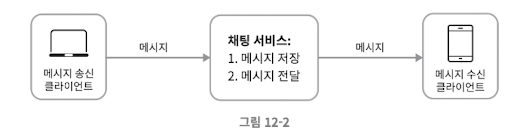

채팅을 시작하려는 클라이언트는 네트워크 통신 프로토콜을 사용하여 서비스에 접속 → 어떤 통신 프로토콜을 사용할 것인가도 중요한 문제로 면접관과 상의 필요!

**메시지 송신 시나리오**

- 송신 클라이언트가 채팅 서비스에 메시지를 보낼 때 HTTP 프로토콜을 사용
- keep-alive 헤더를 사용하면 TCP 접속 과정에서 발생하는 핸드쉐이크 횟수를 줄일 수 있다. → TCP연결을 즉시 끊지 않고 일정 시간 동안 유지할 수 있음
- HTTP는 메시지 전송 용도로 괜찮은 선택이며 페이스북같은 많은 대중적 채팅 프로그램이 초기에 HTTP 프로토콜을 사용했음

**메시지 수신 시나리오**

- HTTP는 클라이언트는 요청을 주도하는 **'요청-응답(Request-Response)'** 모델을 기반으로 하지만 수신 시나리오에서는 서버에서 클라이언트로 임의 시점에 메시지를 보내기 때문에 사용할 수 없음.

<이를 위해 사용할 수 있는 기법>

1. 폴링 

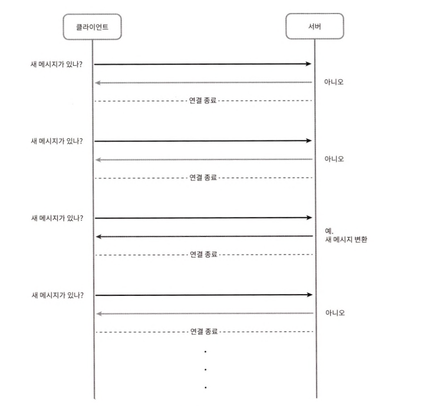

- 수신 클라이언트가 서버에게 주기적으로 새 메세지가 있는지 물어보는 방법.

→ 폴링을 자주할수록 비용이 올라감. 답해줄 메시지가 없는 경우에는 서버 자원이 불필요하게 낭비될 수 있음

1. 롱 폴링 

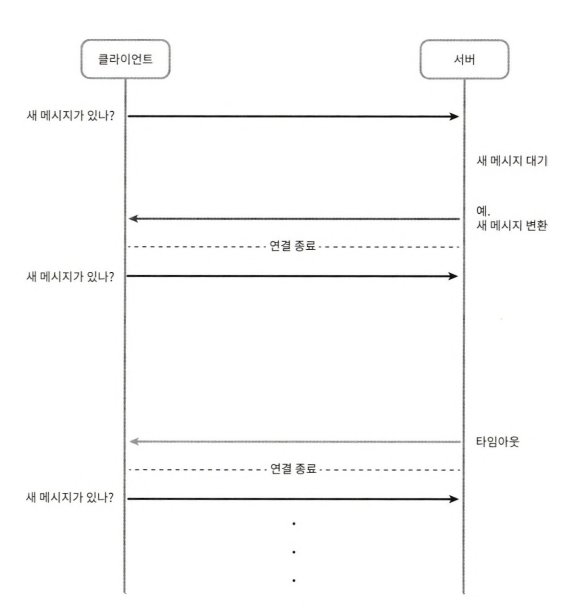

- 클라이언트는 새 메시지가 반환되거나 타임아웃 될 때까지 연결을 유지하는 것
- 클라이언트가 새 메시지를 받으면 기존 연결을 종료하고 서버에 새로운 요청을 보내어 모든 절차를 다시 시작한다
- 약점
    - 로드밸런서가 **라운드 로빈(Round Robin)**같은 알고리즘으로 요청을 분산하면, 메시지를 보낸 클라이언트와 받는 클라이언트가 **서로 다른 채팅 서버**에 연결될 수 있다.
    - HTTP는 **비연결 지향(Connectionless)** 프로토콜이기 때문에, 서버 입장에서는 클라이언트가 연결을 해제했는지 아닌지 알 수 없다.
    - 폴링보다는 요청 횟수가 줄지만, 메시지가 자주 오지 않는 사용자도 타임아웃이 발생하면 다시 요청하여 **메시지가 없는 상황에서도 주기적인 재연결이 계속 발생**하며, 서버에 부하를 준다.
1. 웹소켓

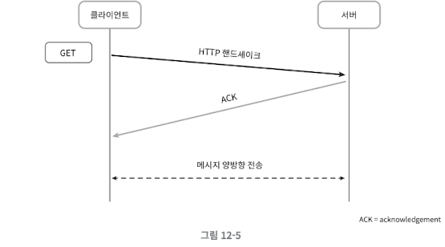

- 서버가 클라이언트에게 비동기 메시지를 보낼 때 가장 널리 사용되는 기술
- 웹소켓 연결은 클라이언트가 시작, 첫 연결은 HTTP 핸드쉐이크를 이용하고, 이후에는 **TCP 연결 위에서 양방향(full-duplex)** 통신이 시작(웹 소켓 연결로 업그레이드) → 서버가 클라이언트에게 비동기적으로 메시지를 전송 가능
- HTTP 혹은 HTTPS 프로토콜이 사용하는 기본 포트번호를 그대로 쓰기 때문에 방화벽이 있는 환경에서도 잘 동작한다.
- HTTP 프로토콜과 가장 다른 점은 양방향 통신이 가능하다는 것인데, 이 부분 떄문에 웹 소켓 대신 HTTP를 쓸 이유 없음

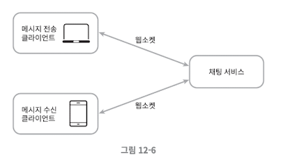

웹소켓을 이용하면 메시지를 보낼 때나 받을 때 동일한 프로토콜을 사용할 수 있음 

다만 웹소켓 연결은 항구적으로 유지되어야 하기 때문에 서버에서 연결 관리를 효율적으로 해야함

### **개략적 설계안**

- 채팅할 때 통신 프로토콜로 웹소켓을 사용하기로 결정했다. → 하지만 다른 부분에서는 굳이 웹소켓을 쓸 필요는 없다.
- 해당 채팅 시스템은 무상태 서비스, 상태유지 서비스, 제 3자 서비스 연동의 세 부분으로 나누어서 살펴 보아야 함.
1. **무상태 서비스**
    - 많은 웹사이트와 앱이 보편적으로 제공하는 기능들인 로그인, 회원가입, 사용자 프로파일 표시 등을 처리하는 전통적인 요청/응답 서비스
    - 무상태 서비스는 로드밸런서 뒤에 위치한다.
        - 로드밸런서 뒤에는 모놀리틱 또는 마이크로서비스일 수도 있다.

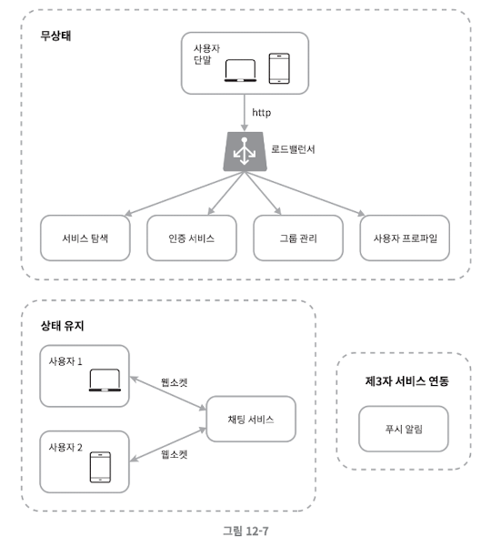

1. **상태 유지 서비스**
    - 채팅 서비스
    - 각 클라이언트와 채팅 서버는 독립적인 네트워크 연결을 유지.
        - 클라이언트는 서버와 연결이 살아있는 한 다른 서버로 연결을 변경하지 않는다.
- 서비스 탐색 서비스는 채팅 서비스와 협력하여 특정 채팅 서버에 부하가 몰리지 않도록 한다.

*서비스 탐색(service discovery): 서비스는 클라이언트가 접속할 채팅 서버의 DNS 호스트명을 클라이언트에게 알려주는 역할

1. **제 3자 연동 서비스**
    - 푸시 알람
    - 앱이 실행 중이 아니어도 알림을 받아야한다.

**규모 확장성**

- 서버 한대로 모든 걸 처리시 SPOF → 확장성이 필요

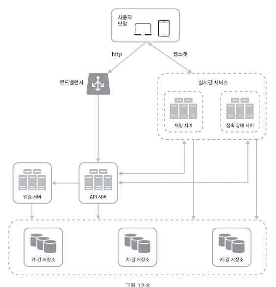

- 채팅 서버는 클라이언트 사이에 메시지를 중계하는 역할을 담당한다.
- 접속 상태 서버는 사용자의 접속 여부를 관리한다.
- API 서버는 로그인, 회원가입, 프로필 변경 등 그 외 나머지 전부를 처리한다.
- 알림 서버는 푸시 알림을 보낸다.
- 키-값 저장소에 채팅 이력을 보관한다.

**저장소**

어떤 데이터베이스를 사용할 것인지? 

→**데이터의 유형**과 **읽기/쓰기 연산의 패턴**을 고려해야 한다.

- 채팅 시스템이 다루는 데이터 유형 두 가지
    1. 사용자 프로필 설정, 친구 목록처럼 일반적인 데이터
        1. 안정성을 보장하는 관계형 데이터 베이스에 보관한다.
        2. 다중화(replication), 샤딩(sharding)은 데이터의 가용성과 규모 확장성을 보증하기 위해 보편적으로 사용되는 기술이다.
    2. 채팅 시스템에 고유한 데이터
        1. 페이스북 메신저나 왓츠앱은 매일 600억 개의 메시지를 처리 → 채팅 이력 데이터는 매우 많다
        2. 대부분 사용자는 최근 메시지이 사용
        3. 1:1 채팅 앱의 경우 읽기:쓰기 비율은 대략 1:1
        
        → 키-값 저장소 추천
        
        <이유>
        
        - 수평적 규모확장이 쉽다.
        - 데이터 접근 지연시간이 낮다.
        - 관계형 데이터베이스는 롱테일에 해당하는 부분을 잘 처리하지 못한다.
            - 이유 : 인덱스가 커지면 데이터에 대한 무작위 접근( random access)을 처리하는 비용이 늘어난다.
        - 이미 많은 안정적인 채팅 시스템이 키-값 저장소를 사용한다.
            - 페이스북 메신저는 HBase를 사용하며 디스코드는 카산드라를 사용한다.

**데이터 모델**

1. 1:1 채팅을 위한 메시지 테이블
:이 테이블의 기본 키(primary key)는 message_id로, 메시지 순서를 쉽게 정할 수 있도록 하는 역할도 담당한다. 두 메시지가 동시에 만들어질 수 있기 때문에 create_at을 사용하여 메시지 순서를 정할 수는 없어 message_id 순서를 정한다. 
2. 그룹 채팅을 위한 메시지 테이블
channel_id, message_id의 복합 키를 기본 키로 사용한다. 
channel_id는 파티션 키(partition key)로도 사용할 것인데, 그룹 채팅에 적용될 모든 질의는 특정 채널을 대상으로 할 것이기 떄문이다.
3. 메시지 ID
<message_id 만들기 위해 만족해야 할 속성>
    1. message_id는 고유해야한다.
    2. ID는 정렬 가능하며 시간 순서와 일치해야한다.
    
    <위 두 조건을 만족시키는 방법>
    
    1. auto_increment: NoSQL은 제공하지 않음
    2.  스노플레이크: 전역적 64-bit 순서 번호(sequency number) 생성기를 이용한다.
    3. 지역적 순서 번호 생성기 (local sequence number generator): ID의 유일성은 같은 그룹 안에서만 보증하면 충분하기 떄문에 지역적 순서 번호 생성기 사용

## **3단계 상세 설계**

**서비스 탐색**

클라이언트에게 가장 적합한 채팅 서버를 추천하는 것

- 기준은 클라이언트의 위치, 서버의 용량 등이 있다.
- 널리 쓰이는 오픈 소스 솔루션으로 아파치 주키퍼가 있다.
- 사용 가능한 모든 채팅 서버를 등록하고 클라이언트가 접속 시도 시, 기준에 따라 최적의 채팅 서버를 골라주면 된다.

- 주키퍼로 구현한 서비스 탐색 기능 동작 예시
    
    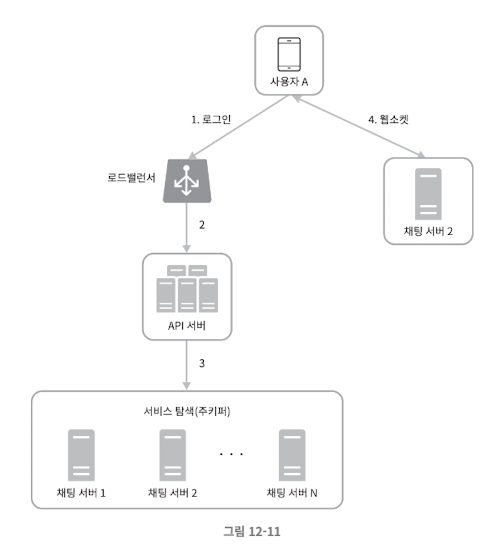
    
    1. 사용자 A가 시스템에 로그인을 시도
    2. 로드 밸런서가 로그인 요청을 API 서버들 가운데 하나로 보낸다.
    3. API 서버가 사용자 인증을 처리하고 나면 서비스 탐색 기능이 동작하여 해당 사용자를 서비스할 최적의 채팅 서버를 찾는다. 예제의 경우 채팅 서버 2가 선택되어 사용자 A에게 반환
    4. 사용자 A는 채팅 서버 2와 웹소켓 연결을 맺는다.

**메시지 흐름**

1. 1:1 채팅 메시지 처리 흐름
    
    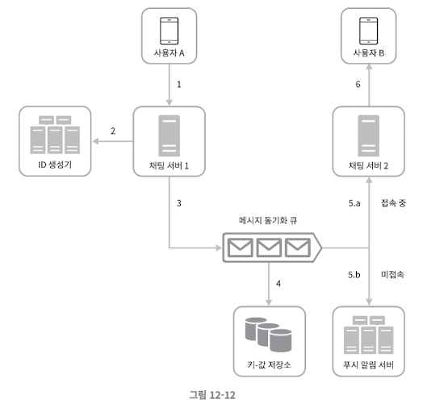
    1. 사용자 A가 채팅 서버 1로 메시지 전송
    2. 채팅 서버 1은 ID 생성기를 사용해 해당 메시지의 ID 결정
    3. 채팅 서버 1은 해당 메시지를 메시지 동기화 큐로 전송
    4. 메시지가 키-값 저장소에 보관됨
    5. 사용자 B가 접속 중인 경우, 메시지는 사용자 B가 접속 중인 채팅 서버인 채팅 서버2로 전송됨
    6. 사용자 B가 접속 중이 아니라면 푸시 알림 메시지를 푸시 알림 서버로 보냄
    7. 채팅 서버 2는 메시지를 사용자 B에게 전송. 사용자 B와 채팅 서버 2 사이에는 웹 소켓 연결이 되어있어 소켓을 사용함.
    
2. 여러 단말 사이의 메시지 동기화

<여러 단말 사용 사례>

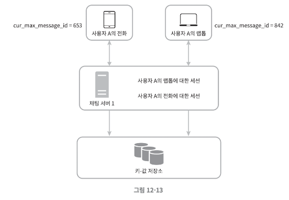

- 사용자 A는 전화기와 랩톱 두 대의 단말을 사용 중
- 사용자 A가 전화기에서 채팅 앱에 로그인 한 결과로 채팅 서버 1과 해당 단말 사이에 웹 소켓이 만들어진다. 랩톱에서 로그인한 결과 또한 별도 웹 소켓이 채팅 서버 1에 연결되어 있다.
- 각 단말은 cur_max_message_id 변수를 유지하는데, 해당 단말에서 관측된 가장 최신 메시지의 ID를 추적하는 용도이다.
- 아래 두 조건을 만족하는 메시지는 새 메시지로 간주한다.
    - 수신자 ID가 현재 로그인한 사용자 ID와 같다.
    - 키-값 저장소에 보관된 메시지로서, 그 ID가 cur_max_message_id보다 크다.
- cur_max_message_id는 단말마다 별도로 유지 관리하면 되는 값이라 키-값 저장소에서 새 메시지를 가져오는 동기화 작업도 쉽게 구현할 수 있다.
3. 소규모 그룹 채팅에서의 메시지 흐름
    
    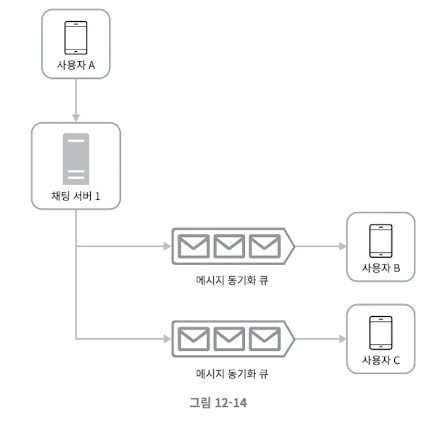
    
    - 그림 12-14를 보면, 사용자 A가 그룹 채팅 방에서 메시지를 보냈을 때 메시지가 사용자 B,C앞에 존재하는 각각의 메시지 동기화 큐에 들어가는데, 이 큐는 각 사용자를 위한 메시지 수신함 같은 것이다. 이 설계는 다음의 이유로 소규모 채팅방에 적합하다.
    - 새로운 메시지가 왔는지 확인하려면 자기 큐만 보면 되니까 메시지 동기화 플로우가 단순하다.
    - 그룹이 크지 않으면 메시지를 수신자별로 복사해서 큐에 넣는 작업의 비용이 문제가 되지 않는다.
    - 위챗이 위와 같은 접근법을 쓰고 있으며 그룹의 크기는 500명으로 제한하고 있다.→ 인원이 늘어나면 쓰기 비용이 증가한다.
    - 위와 같은 설계를 수신자 관점에서 살펴보자. 한 수신자가 여러 사용자가 보내는 메시지를 받아야 한다.
        
        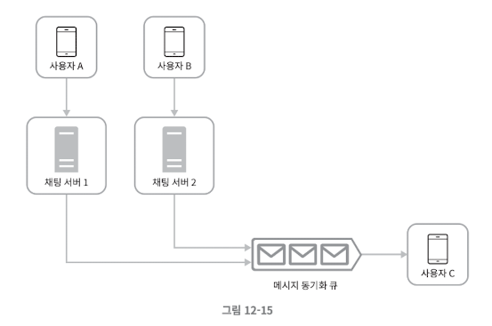
        

**접속 상태 표시**

- 사용자의 접속 상태를 표시하는 것은 상당수 채팅 어플리케이션의 핵심적 기능
- 개략적 설계안에서는 접속 상태 서버를 통해 사용자의 상태를 관리한다고 했다. 접속 상태 서버는 클라이언트와 웹소켓으로 통신하는 실시간 서비스의 일부라는 점에 유의해야 함
- 사용자의 상태가 바뀌는 시나리오는 아래와 같다.
1. 사용자 로그인
    
    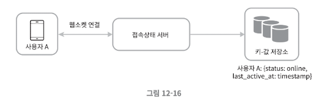
    
    1) 클라이언트와 실시간 서비스 사이에 웹소켓 연결이 맺어지고 나면 
    
    2) 접속 상태 서버는 A의 상태와 last_active_at 타임 스탬프 값을 키-값 저장소에 보관한다. 
    
    3) 이 절차 끝나고 해당 사용자는 접속 중인 것으로 표시 
    
2. 로그 아웃
    
    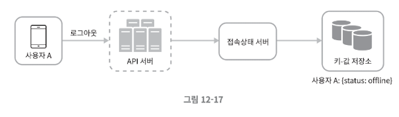
    
    1)사용자 로그아웃 시 키-값 저장소에 보관된 사용자 상태가 online에서 offline으로 변경된다.
    
    2)이 절차가 끝나고 나면 UI 상에서 사용자의 상태는 접속 중이 아닌 것으로 표시된다.
    
3. 접속 장애
- 인터넷 연결이 끊어졌다 복구되는 현상에 대응할 수 있는 설계를 준비해야 한다.
- 이런 장애에 대응하는 간단한 방법은 사용자를 오프라인 상태로 표시하고 연결이 복구되면 온라인 상태로 변경하는 것이다.
- 하지만 짧은 시간 동안 인터넷 연결이 끊어지는 것처럼 짧은 터널을 반복해서 통과하는 동안 사용자의 접속 상태를 변경한다면 사용자 경험 측면에서 바람직하지 않다.
- 본 설계안에서는 heartbeat 검사를 사용
- 온라인 상태의 클라이언트로 하여금 주기적으로 heartbeat event를 접속상태 서버로 보내고, 마지막 이벤트를 받은 지 x초 이내에 또 다른 heartbeat event 메시지를 받으면 해당 사용자의 접속 상태를 계속 온라인으로 유지한다. 그렇지 않은 경우에만 오프라인으로 바꾼다.
    
    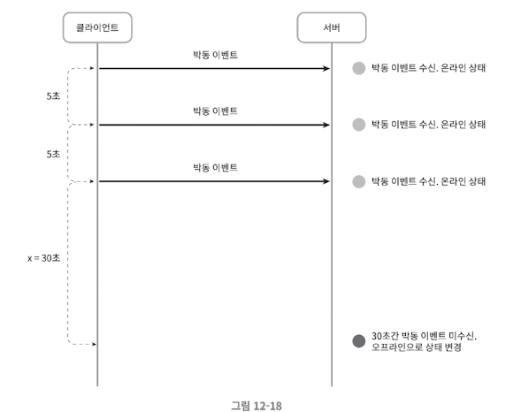
    
    - 그림 12-18의 클라이언트는 heartbeat event를 5초에 한번씩 서버로 보낸다. 이벤트를 3번 보낸 후, 클라이언트가 30초 동안 heatbeat event를 보내지 않았기 때문에 서버는 사용자를 오프라인 상태로 변경한다.
1. 상태 정보의 전송
    
    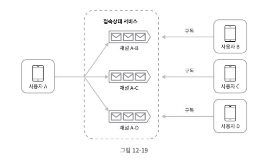
    
    - 상태 정보 서버는 발행-구독 모델을 사용하며 친구 관계마다 채널을 하나씩 둔다. 가령 사용자 A의 접속 상태가 변경되었다고 하면 A-B,A-C,A-D 세 개의 채널에 쓴다.
        - 채널 A-B : B가 구독
        - 채널 A-C : C가 구독
        - 채널 A-D : D가 구독
    - 클라이언트와 서버 사이의 통신에는 실시간 웹소켓을 사용한다.
    - 이 방안은 그룹의 크기가 작을 때 효과적이다. 위쳇이 이와 유사한 접근법을 사용한다.
    - 그룹의 크기가 커지면 이런 식의 접속 상태 변화 알림은 비용과 시간이 많이 든다. 가령 100,000 명의 사용자가 사용하는 채팅 그룹에서는 상태 변화 1건당 100,000개의 이벤트 메시지가 발생한다.
    - 이를 해결하기 위해서는 입장하는 순간에만 상태 정보를 읽어가게 하거나, 친구 리스트에 있는 접속 상태를 갱신하고 싶으면 수동으로 하도록 유도한다.

## **4단계 마무리**

- 사진이나 비디오 등의 미디어 파일을 지원하는 방법
    - 미디어 파일은 텍스트 파일에 비해 용량이 크기 때문에 관련하여  압축, 클라우드 저장소, 섬네일 생성 등을 논의할 수 있음
- 종단 간 암호화
    - 발신인과 수신인 외에 아무도 볼 수 없게 하는 것
- 캐시
    - 이미 읽은 메시지를 캐시하면 서버와 주고받는 데이터를 줄일 수 있다.
- 로딩 속도 개선
    - 슬랙은 사용자 데이터, 채널 등을 지역적으로 분산하는 네트워크를 구축하여 앱 로딩 속도를 개선했다.
- 오류 처리
    - 채팅 서버 오류
        - 채팅 서버가 죽으면 서비스 탐색 서비스가 클라이언트에게 새로운 서버를 배정하고 재접속 할 수 있도록 해야한다.
        - 주키퍼가 동작하여 클라이언트에게 새로운 서버를 배정하고 다시 접속할 수 있도록 한다.
    - 메시지 재전송
        - 재시도나 큐는 메시지의 안정적 전송을 보장하는 일반적인 기법이다.