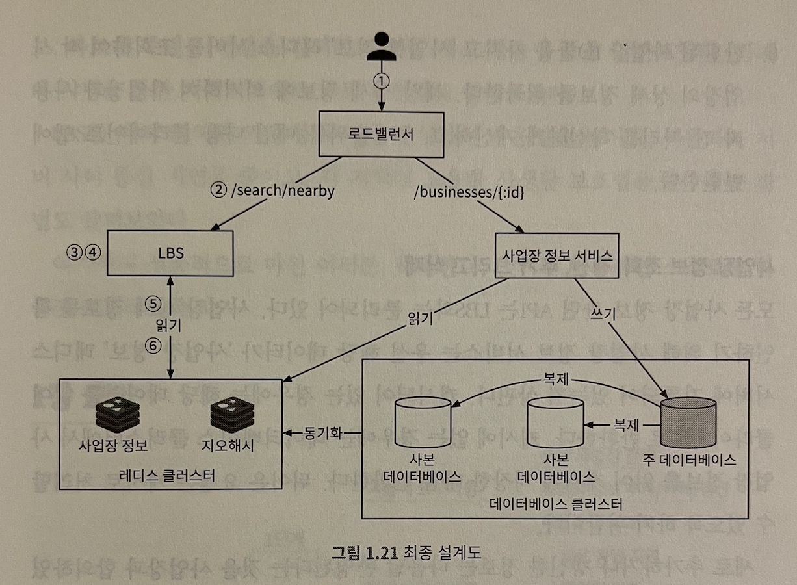

# 1장 근접성 서비스

- 현재 위치에서 가까운 시설을 찾는데 사용한다
- 주변에 있는 좋은 식당 또는 가까운 k개 주유소 등 검색

| 기능 요구사항                                                                                                                                                          | 비기능 요구사항                                                                                                                                          |
| ---------------------------------------------------------------------------------------------------------------------------------------------------------------------- | -------------------------------------------------------------------------------------------------------------------------------------------------------- |
| - 사용자 위치/검색 반경 정보에 매칭되는 사업장 목록 - 사업장 소유주가 사업장 정보 추가/삭제/갱신하되 실시간 반영은 아님 - 고객은 사업장 상세 정보 살필 수 있어야 | - 낮은 응답 지연(latency) - 데이터 보호: GDPR(General Data Protection Regulation), CCPA(California Consumer Privacy Act) - 고가용성 및 규모 확장성 |

## 개략적 설계

### API 설계

- GET /v1/search/nearby: 위도/경도/반경으로 특정 검색 기준에 맞는 사업장 목록 반환
- 그 외 특정 사업장의 상세 정보 반환, 추가, 갱신 및 삭제

### 데이터 모델

- READ 연산 실행 빈도가 높다: 주변 사업장 검색, 사업장 정보 확인 -> RDBMS
- 핵심 테이블
  - 사업장(business) 테이블: 사업장 상세 정보 담음
  - 지리적 위치 색인 테이블(geospatial index table): 위치 정보 관련 연산 효율성 높이기 위해 사용

### 설계

- LBS(Location Based System): 주어진 위치, 반경 정보로 주변 사업장 검색
  - WRITE 요청 대신 READ 요청만 빈번하게 발생
  - 높은 QPS(Queries Per Second): 특정 시간대 인구 밀집 지역일수록 더 심함
  - Stateless: 수평적 규모 확장 쉬움
- 사업장 서비스: 소유주가 사업장 정보 생성/갱신/삭제, 고객이 사업장 정보 조회
- 데이터베이스 클러스터: 주-부(primary-secondary) 데이터베이스 형태로 구성

### 주변 사업장 검색 알고리즘

> 내부 구조 알기 < 지리적 위치 색인이 어떻게 동작하는지?

#### 2차원 검색
: 주어진 반경으로 그린 원 안에 놓인 사업장 검색한다
- 직관적이나 지나치게 단순하고
- 테이블 전부 읽어야하므로 효율적이지 않다

데이터베이스 index(색인)로는 오직 한 방향의 검색 속도만 개선할 수 있다 -> 인덱스는 하나의 축 기준으로만 정렬되어 있음

- 지리적 정보에 인덱스를 만드는 방법: 지도를 작은 영역으로 분할, 고속 검색이 가능하도록 인덱스 생성

| 방안      | 널리 사용                               | 상대적으로 덜 사용               |
| --------- | --------------------------------------- | -------------------------------- |
| 해시 기반 | 균등 격자(even grid), 지오해시(geohash) | 카르테시안 계층(cartesian tiers) |
| 트리 기반 | 쿼드트리(quadtree), google S2           | R 트리(R-tree)                   |

> 인덱스가 어떻게 동작하는지, 제약사항이 무엇인지?

#### 균등 격자

: 작은 격자 또는 구획으로 나눔
- 사업장 분포가 균등하지 않다: 도시 vs 사막, 바다
- 격자 식별자 할당에 대한 명확한 규칙이 없음: 옆 칸 id를 유추하기 어렵다

#### 지오해시(Geohash)

: 2차원의 위도 경도 데이터를 1차원의 문자열로 변환

- 비트를 하나씩 늘려가면서 원하는 정밀도(precision)을 얻을 때까지 재귀적으로 세계를 더 작은 격자로 분할
- base32 표현법 사용
- 12단계 정밀도 가짐: 해당 정밀도가 격자 크기 결정
- 최적 정밀도: 사용자가 지정한 반경을 충분히 덮는 최소 크기 격자를 대응하는 지오 해시 길이
- 격자 가장자리 처리 방식에 관한 경계 조건(edge case)
  1. 지오해시: 해시 값의 공통 접두어(prefix)가 긴 격자들이 서로 더 가깝게 놓이지만
       - 아주 가까운 두 위치가 어떤 공통 접두어도 갖지 않을 수도 있다
       - 두 지점이 공통 접두어 길이는 길지만 서로 다른 격자에 놓일 수 있다 -> 현재 격자를 비롯한 인접한 모든 격자의 모든 사업장 정보를 가져오는 것
  2. 표시할 사업장이 충분하지 않은 경우
      - 주어진 반경 내의 사업장만 반환
      - 검색 반경 키움

#### 쿼드트리(Quadtree) 자료구조

: 격자의 내용이 특정 기준을 만족할 때까지 2차원 공간을 재귀적으로 사분면 분할

- 검색 요청에 답하는데 사용될 트리 구조를 메모리 안에 만든다
- 메모리 안에 놓이는 자료 구조로 서버 시작 시점에 구축된다

| 노드      | 정의                  |
| --------- | --------------------- |
| 루트 노드 | 세계 전체 지도        |
| 하위 노드 | 루트 노드의 각 사분면 |

- 쿼드트리 인덱스는 메모리를 많이 잡아먹지 않는다
- 시간 복잡도: nlogn
- 사업장 추가/삭제의 경우: 쿼드트리 점진적 갱신

#### 구글 S2 기하(geometry) 라이브러리

: 메모리 기반, 지구(sphere) 표면을 힐베르트 곡선(Hilbert curve, 공간 채움 곡선)으로 1차원 숫자(인덱스)로 변환

- 힐베르트 곡선 상에서 인접한 두 지점은 인덱싱 이후 1차원 공간 내에서도 인접한 위치에 존재 -> 1차원 공간 내 검색은 2차원 공간 내 검색보다 훨씬 더 효율적
- 지역에 다양한 수준의 영역 지정이 가능하다
- 영역 지정 알고리즘(Region Cover Algorithm): 최소 수준, 최고 수준, 최대 셀 개수 등을 지정할 수 있어 유연하게 조정 -> 지오해시보다 상세한 결과 값 반환

### 지오해시 vs 쿼드트리

| 지오해시                                                                                        | 쿼드트리                                                                                                                               |
| ----------------------------------------------------------------------------------------------- | -------------------------------------------------------------------------------------------------------------------------------------- |
| - 구현/사용 쉬움 - 지정 반경 내 사업자 검색 지원 - 고정 정밀도 사용 - 쉬운 인덱스 갱신 | - 트리 구현으로 좀 더 까다로움 - 거리에 상관없이 가까운 사업장 k개를 찾을 수 있다 - 유동적인 격자 크기 - 까다로운 인덱스 갱신 |

## 상세 설계

### 데이터베이스의 규모 확장성

- 사업자 테이블: 사업장 id를 기준으로 샤딩
- 지리 정보 색인 테이블
  - 모든 사업장 id를 JSON 배열 저장 < 같은 지오해시에 속하는 사업장 id 각각 별도 열로 저장: 지오해시-사업장 id로 복합키 만들어 사용
  - 읽기 부하를 나눌 사본 db 서버 두기: 샤딩은 애플리케이션 계층에서 이뤄지므로
- 캐시 키: 위치가 조금 달라지더라도 변화가 없어야 함
  - 사용자 위치, 위도 경도 정보 X
  - 격자 내 사업장 id

### 지역 및 가용성 구역

- 위치 기반 서비스는 여러 지역과 가용성 구역에 설치
  - 사용자 - 시스템 사이의 물리적 거리 최소화
  - 인구 밀도에 따라 트래픽을 고르게 분산하는 유연성
  - 지역마다 존재하는 사생활 보호법(privacy law)에 맞는 운영

### 시간대, 또는 사업장 유형별 검색

- 해당 데이터(사업장 정보)는 사업장 정보 테이블에 이미 보관되어 있어야 필터링 가능

### 최종 설계도

