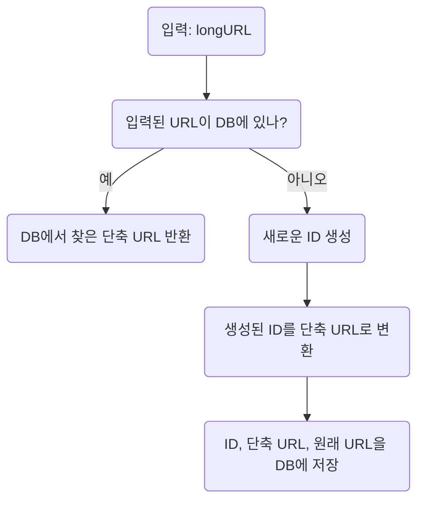
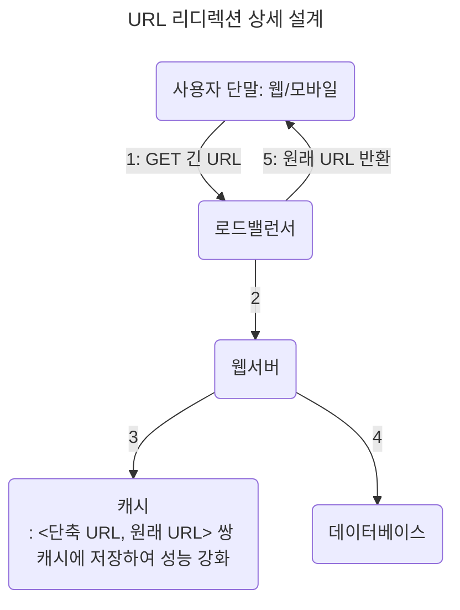

# URL 단축기 설계

## 요구사항

- URL 단축기가 어떻게 동작해야하는지? 단축 URL에 접속하면 원래 URL로도 갈 수 있어야
- 트래픽 규모? 매일 1억개의 단축 URL 생성해야
- 단축 URL 길이? 짧을수록 좋다
- 단축 URL 포함 문자 제한? 숫자(0~9), 영문자(a~z, A~Z) 
- 단축 URL을 시스템에서 지우거나 갱신할 수 있는지? no 

## API 엔드포인트

- URL 단축용 엔드포인트: 클라이언트는 POST 요청시, 단축할 대상 URL을 인자로 보내고 단축 URL을 반환한다
  - POST /api/v1/data/shorten
- URL 리디렉션용 엔드포인트: 단축 URL에 대한 HTTP 요청이 오면 원래 URL을 반환한다
  - GET /api/v1/shortUrl

## URL 리디렉션

- 단축 URL을 받은 서버는 원래 URL로 바꿔 Location 헤더에 넣고 301 응답을 반환한다.
- 과정
  - 클라이언트는 서버에 URL 단축용 엔드포인트에 요청을 보낸다
  - 서버는 Location 헤더에 원래 URL을 넣고 301 응답을 반환한다
  - 클라이언트는 원래 URL에 접속한다

| 응답                  | 설명                                                                                                                                                                     | 활용                                                            |
| --------------------- | ------------------------------------------------------------------------------------------------------------------------------------------------------------------------ | --------------------------------------------------------------- |
| 301 Permanently Moved | 해당 URL에 대한 HTTP 요청의 처리 책임이 영구적으로 Location 헤더에 반환된 URL로 이전 브라우저는 해당 응답을 캐시하여, 동일 요청이 왔을 때 캐시된 원래 URL로 요청 보냄 | 서버 부하 줄이는 것이 중요할 때: 첫 요청만 단축 URL 서버로 전송 |
| 302 Found             | 주어진 URL로의 요청이 일시적으로 Location 헤더가 지정하는 URL에 의해 처리 항상 단축 URL 서버에 먼저 보내진 후 원래 URL로 리디렉션되어야 함                            | 트래픽 분석: 클릭 발생률, 발생 위치 추적                        |

- 해시 테이블 `<단축 URL, 원래 URL>` 저장: URL 리디렉션 구현하는데 가장 직관적

## URL 단축

- 긴 URL을 해시 값으로 대응시킬 해시 함수(hash function) 찾는 것이 중요
  - 입력으로 주어지는 긴 URL의 값이 다르면, 해시 값도 달라야 한다
  - 계산된 해시 값은 원래 입력으로 주어졌던 긴 URL로 복원될 수 있어야 한다
- 해시 테이블을 사용하는데 비용이 비싸므로 순서쌍을 RDB에 저장한다

## 해시 함수 구현

### 해시 후 충돌 해소

- 잘 알려진 해시 함수 사용: CPC32, MD5, SHA-1
- 위 해시 함수 결과 값 > hashValue: 계산된 해시 값에서 처음 n개의 글자만 사용
  - 해시 결과가 충돌할 가능성 있다
  - 충돌이 해소될 때까지 사전에 정한 문자열을 해시 값에 덧붙인다
- 충돌이 해소되는 대신, 단축 URL을 생성할 때마다 오버헤드가 크다
  - 블룸 필터(Bloom Filter; 어떤 집합에 특정 원소가 있는지 검사)를 사용하면 성능을 높일 수 있다

### base-62 변환(base conversion)

- URL 단축기 구현 시 흔히 사용
- 수의 표현 방식이 다른 두 시스템이 같은 수를 공유해야할 때 유용하다
- 62진법 사용하는 이유? hashValue에 사용할 수 있는 문자 개수(0~9, a~z, A~Z)가 62개

|                                 | 해시 후 충돌 해소 전략                          | base-62 변환                                                                       |
| ------------------------------- | ----------------------------------------------- | ---------------------------------------------------------------------------------- |
| 단축 URL 길이                   | 고정                                            | 가변적, ID 값 커지면 길어짐                                                        |
| 유일성 보장 ID 생성기 필요      | X                                               | O                                                                                  |
| 충돌 발생 유무                  | 충돌 가능성 있어 해소 전략 필요                 | ID 유일성 보장된 후 적용 가능한 전략이므로 충돌 자체 불가                          |
| 다음에 사용할 URL 알 수 있는지? | ID로부터 단축 URL을 계산하는 것이 아니므로 불가 | ID가 1씩 증가하는 값이라면, 다음에 사용할 URL은 유추 가능하므로 보안상 문제 가능성 |

- ID 생성기: 단축 URL을 만들 때 사용할 ID 만들기 → 전역적 유일성(globally unique) 보장

### 이후로 생각해볼 수 있는 주제

- 처리율 제한 장치: IP 주소 같은 필터링 규칙 적용
- 웹 서버, 데이터베이스의 규모 확장
- 데이터 분석 솔루션(analytics)
- 가용성, 데이터 일관성, 안정성