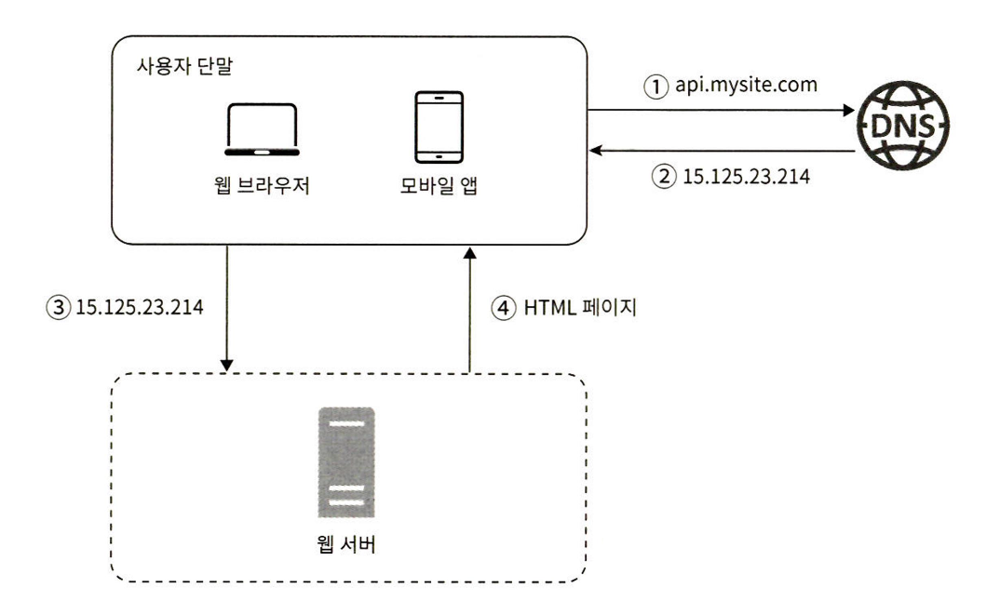

# 사용자 수에 따른 규모 확장성

Created: September 15, 2025 7:21 PM

서비스가 발전하면서, 어떻게 확장해나갈 수 있을지에 대한 내용

아주 간단한 규모에서부터 엔터프라이즈 급 아키텍처로 어떻게 발전해나가는지 간략하게 흐름을 알아가면 좋을 것 같습니다.

이 챕터에서 보여주는 사고의 흐름이 책 스터디 전반적으로 있을 것 같아요. 디테일한 개념을 아는것도 좋지만, 방법론을 얻어가려 노력했습니다.

## **시작**

- 첫 시작은 서버 1대로 서비스를 운영합니다.
- Client -> (DNS) -> Server 로 요청을 하는 단순한 구조입니다.
    - 클라이언트는 App일수도 있고 웹 브라우저일 수도 있습니다.

## **DB**

- 서비스의 유저가 늘어나면, 서버 하나로 트래픽을 감당할 수 없습니다.
- 웹/모바일 트래픽 처리와, 정보를 저장하는 서버(DB)를 분리하게 됩니다.
- 두 계층을 분리하여 각각 확장해 나갑니다.

### **DB의 종류**

- 관계형 DB: 데이터를 테이블 형태로 저장하는 가장 흔한 DB 종류입니다. (MySQL, Oracle..)
- 비관계형 DB: 키-값 저장소, 그래프 저장소, 컬럼 저장소, 문서 저장소 등, 관계형 DB가 아닌 DB입니다.
    - 서비스의 특성 상, 비관계형 DB를 사용해야 할 수 있습니다.
    - ex. 낮은 지연시간, 비정형성 데이터, 데이터의 양… 등
    - MongoDB, Redis, Cassandra, DynamoDB…

## 수직적 규모 확장 VS 수평적 규모 확장

- 수직적 규모 확장 : Scale-UP / Down
    - 서버의 사양을 늘린다.
    - 👍: 단순함
    - 👎: 한계가 있음, 다중화/자동 복구 방안 X
- 수평적 규모 확장 : Scale-Out / In
    - 서버의 수를 늘린다.
    - 👍: 다중화/자동 복구의 일환으로 검토 가능
    - 👎: 서비스 개발/설계시 검토가 필요

### 로드밸런서(이하 LB)

Load(부하를)Balance(균형/균등하게/나눈다)-r

- LB 하위 서버들에 트래픽을 나눠줌
    - 나눠주는 방식은 다양한 알고리즘이 존재
        - RR, Weighted-RR, Least Connection, Weighted Least Connection, IP Hash(sticky 가능)
    - LB 하위에 두는 서버 수 → N+1
        - 서비스 운영시 N대 필요하면 N+1대를 둬 장애상황을 대비
        - ex. 50:50 운영시 한 대 장애 → 나머지 한대도 뻗을가능성 높음
            - 33:33:33 운영시 한대 장애발생시 대응 가능

### DB 다중화

[https://onduway.tistory.com/106#:~:text=에서 필수적이다.-,CAP 이론이란?,장애가 발생할 수 밖에 없다](https://onduway.tistory.com/106#:~:text=%EC%97%90%EC%84%9C%20%ED%95%84%EC%88%98%EC%A0%81%EC%9D%B4%EB%8B%A4.-,CAP%20%EC%9D%B4%EB%A1%A0%EC%9D%B4%EB%9E%80?,%EC%9E%A5%EC%95%A0%EA%B0%80%20%EB%B0%9C%EC%83%9D%ED%95%A0%20%EC%88%98%20%EB%B0%96%EC%97%90%20%EC%97%86%EB%8B%A4).

- Write는 한 노드에서만 이루어질 수 있음.
- 대개 서비스는 Write 보다 Read의 횟수가 높아 Read를 분산시켜 처리
- Master에서 Write를 처리하고, Master를 복제한 Slave에서 read 처리
- 👍: 성능 향상, 안정성 향상
- Master 장애시 Slave에서 Master 승격해 처리
    - https://docs.aws.amazon.com/AmazonRDS/latest/AuroraUserGuide/AuroraMySQL.Replication.CrossRegion.Promote.html

**웹 - 데이터 계층의 분리, 각 계층별 확장**

## 캐시

자주 사용되는 요청을 저장, 실제 웹 서버/DB에 요청하는것보다 빠르게 응답해주는 구성요소

- 좋아보인다고 무조건 넣고 떡칠하면 비용만 많이 나오고 효과가 없을수 있음
- 고려사항
    - 갱신이 자주 일어나지 않으면서 참조가 빈번할경우
    - 어떤 주기로 만료시킬지
    - 캐시와 실제 데이터의 일관성을 어떻게 가져갈지
    - 캐시 장애 시 서비스에 영향은 없는지
- Elasticache, Redis, Valkey
    - → Shard를 나눠 Shard를 replicate 하는 구조
    - https://docs.aws.amazon.com/ko_kr/AmazonElastiCache/latest/dg/Clusters.html

### DB Shard

- DB를 수평적 확장
- 예) Primary Key를 해시하여 각 노드에 어떤 데이터가 들어갈지 연산
- 👍: DB를 수평적으로 확장할 수 있음
- 👎: 한 샤드에 데이터가 몰릴경우 재 샤딩이 필요함, 특정 레코드/노드에 요청이 몰릴경우 과부하 가능

***SPoF(Single Spot of Failure): 단일 장애 지점**

- “이거 죽으면 장애가 난다”
- 이악물고 이중화 N중화를 하려 하는 이유

## CDN

정적 콘텐츠를 전송하는데 사용하는 서버 네트워크

- Akamai, CloudFlare, AWS CloudFront…
- 이미지, JS, 영상… 등 정적 콘텐츠를 사용자 근처에서 준비하고 있다가 요청시 전송

- 검토사항:
    - 비용: 자주 안쓰는것은 굳이 올릴 필요 없음
    - 만료시한
    - 장애시 대처 방안
    - 무효화 방법: 컨텐츠를 바꿔도 제대로 설정하지 않았을 경우 고객에 구 버전이 Serve 될 수 있음

## 무상태 웹 계층

웹을 수평적으로 확장할 때 검토되어야 함

- 상태 정보 의존적인 아키텍처에서는 수평적으로 확장할 수 없음 → 사용자/세션…이 특정 서버에 종속
- 수평적으로 확장하기 위해서는 상태 정보를 분리해 별도의 저장소에 저장해 사용 가능

## 데이터 센터

유저가 가까운 곳으로 라우팅해 사용성 증대 / 다중화 / 재해 복구(Disaster Recovery, DR) 구성 가능

*실제로 다양한 서비스들에서 위치기반 라우팅을 구성

https://docs.aws.amazon.com/ko_kr/Route53/latest/DeveloperGuide/routing-policy-geo.html