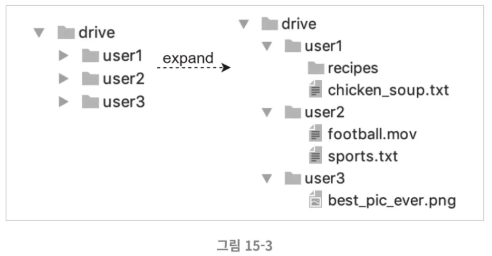
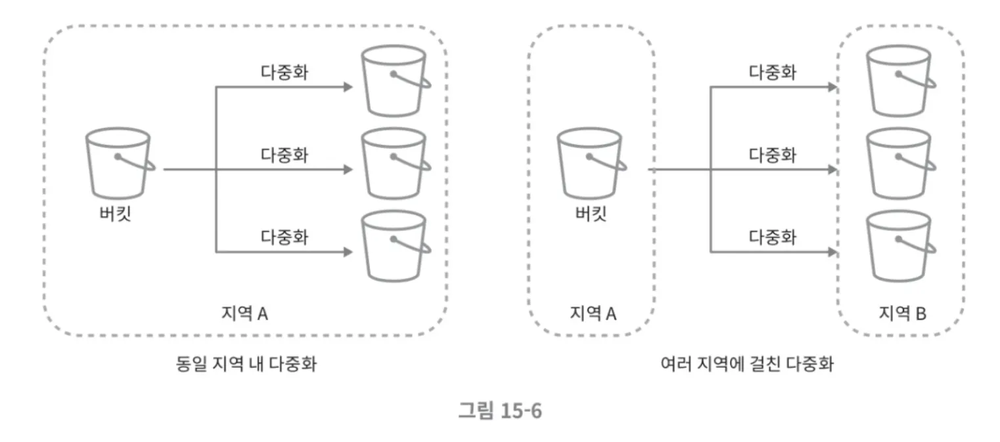
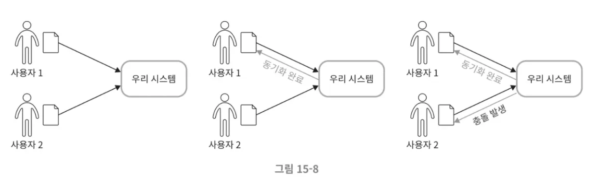
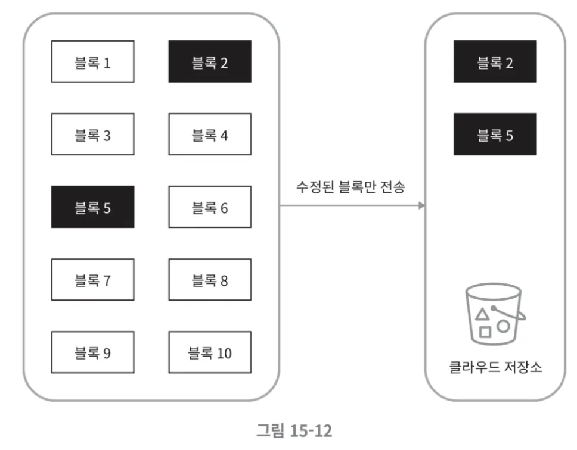
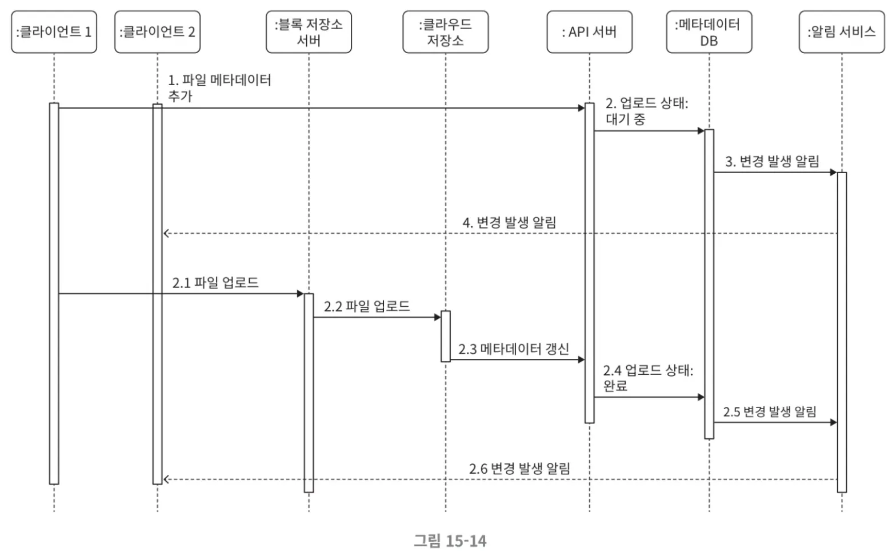
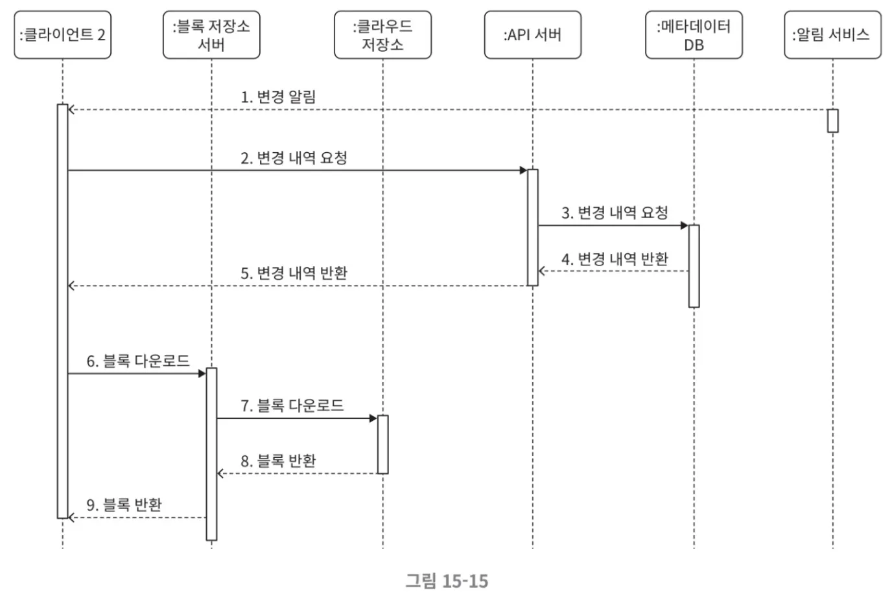

# 15장_구글드라이브설계

대표적인 클라우드 서비스 : 클라우드 저장소 서비스 (구글 드라이브, 드롭박스, 마이크로소프트 원드라이브, 애플 아이클라우드 등)

구글 드라이브란 ?

파일 저장 및 동기화 서비스로 문서, 사진, 비디오, 기타 파일을 클라우드에 보관할 수 있도록 한다.

해당 파일은 컴퓨터, 스마트폰, 태블릿 등 어떤 단말에서도 이용 가능해야 한다. 아울러 보관된 파일은 친구, 가족, 동료들과 손쉽게 공유할 수 있어야 한다. 

## 1단계. 문제 이해 및 설계 범위 확정

구글 드라이브를 설계하는 것은 큰 프로젝트이므로 아래의 질문을 통해 설계 범위를 좁혀야 한다.

- 중요하게 지원해야할 기능은?
    - ex) 파일 업로드/다운로드, 파일 동기화, 알림 기능 등
- 모바일 앱이나 웹 앱 가운데 하나만 지원하면 되는지, 아니면 둘 다 ?
- 암호화가 필요한지
- 파일크기에 제한이 있는지
- 사용자는 얼마나 되는지 (DAU기준)

### 개략적 추정치

- 가입 사용자는 오천만명이고 천만 명의 DAU 사용자가 있다
- 모든 사용자에게 10GB의 무료 저장공간을 할당
- 매일 사용자가 평균 2개의 파일을 업로드한다고 가정하고 파일의 평균 크기는 500KB다
- 읽기:쓰기 비율은 1:1
- 필요한 저장공간 총량 = 5천만 사용자 X 10GB = 500페타바이트
- 업로드 API QPS = 1천만 사용자 X 2회 업로드/24시간/3600초 = 약 240
- 최대 QPS = QPS X 2 = 480

## 2단계. 개략적 설계안 제시 및 동의 구하기

모든 것을 담은 단일 서버로 부터 출발해 점진적으로 천만명 사용자 지원이 가능한 시스템으로 발전시켜보자.

우선 아래와 같은 단일 서버로 시작해보자

- 파일을 올리고 다운로드 하는 과정을 처리할 웹 서버
- 사용자 데이터, 로그인, 파일 정보 등의 메타데이터를 보관할 데이터베이스
- 파일을 저장할 저장소 시스템: 파일 저장을 위해 1TB의 공간을 사용할 것이다.

웹 서버는 아파치, 데이터베이스는 MYSQL로 설치하고, 업로드되는 파일을 저장할 drive/라는 디렉터리를 준비하자. drive/ 디렉터리 안에는 네임스페이스라 불리는 하위 디렉터리들을 둔다. 각 네임스페이스 안에는 특정 사용자가 올린 파일이 보관된다. 이 파링들은 원래 파일과 같은 이름을 갖는다. 각 파일과 폴더는 그 상대 경로를 네임스페이스 이름과 결합하면 유일하게 식별해 낼 수 있다.

아래 그림은 drive/ 디렉터리에 실제 파일이 보관된 그림이다.

### API

이 시스템은 어떤 API들을 제공해야 할까? 기본적으로 세 가지 API가 필요한데, 파일 업로드 API, 다운로드 API, 파일 갱신 히스토리 제공 API다

### 1. 파일업로드 API

이 시스템은 두 가지 종류의 업로드를 지원한다.

- 단순 업로드: 파일 크기가 작을 때 사용한다
- 이어 올리기: 파일 사이즈가 크고 네트워크 문제로 업로드가 중단될 가능성이 높다고 생각되면 사용한다

이어 올리기 API의 예

https://api.example.com/files/upload?uploadType=resumable

인자

- uploadType=resumable
- data: 업로드할 로컬 파일

이어 올리기는 다음 세 단계 절차로 이루어진다.

- 이어 올리기 URL을 받기 위한 최초 요청 전송
- 데이터를 업로드하고 업로드 상태 모니터링
- 업로드에 장애가 발생하면 장애 발생시점부터 업로드를 재시작

### 2. 파일 다운로드 API

API의 예

https://api.example.com/files/download

인자

- path: 다운로드할 파일의 경로

예

{

“path”: “/recipes/soup/best_soup.txt”

}

### 3. 파일 갱신 히스토리 API

API의 예

https://api.exmaple.com/files/list_revisions

인자

- path: 갱신 히스토리를 가져올 파일의 경로
- limit: 히스토리 길이의 최대치

예

{

“path”: “/recipes/soup/best_soup.txt”,

“limit”: 20

}

3개 나열한 API는 모든 사용자 인증을 필요로 하고 HTTPS 프로토콜을 사용해야 한다. SSL를 지원하는 프로토콜을 이용하는 이유는 클라이언트와 백엔드 서버가 주고받는 데이터를 보호하기 위한 것이다.

## 한 대 서버의 제약 극복

업로드되는 파일이 많아지다 보면 결국에는 파일 시스템은 가득 차게 된다.

위 그림의 파일 시스템은 딱 10MB의 여유공간밖에는 남지 않은 상태다. 이렇게 되면 사용자는 더 이상 파일을 올릴 수 없게 되므로, 긴급히 문제를 해결해야 한다. 가장 먼저 떠오르는 해결책은 데이터를 샤딩하여 여러 서버에 나누어 저장하는 것이다. 아래그림은 user_id를 기준으로 샤딩한 예다

위 그림처럼 데이터베이스를 샤딩 해두어도 **서버에 장애가 생기면** 데이터를 잃게 되지 않을까 여전히 걱정할 것이다. 이의 해결책은 아마존S3를 사용하는것이 가장 적합할 것이다. 아마존 S3는 업계 최고 수준의 **규모 확장성, 가용성, 보안, 성능**을 제공하는 객체 저장소 서비스다.

S3는 다중화를 지원하는데, 같은 지역 안에서 다중화를 할 수도 있고 여러 지역에 걸쳐 다중화를 할 수도 있다. AWS 서비스 지역은 아마존 AWS가 데이터 센터를 운영하는 지리적 영역이다. 아래 그림에 나오듯이, 데이터를 다중화 할 때는 같은 지역 안에서만 할 수도 있고 여러 지역에 걸쳐 할 수도 있다. 여러 지역에 걸쳐 다중화하면 데이터 손실을 막고 가용성을 최대한 보장할 수 있으므로 그렇게 하기로 하고, S3 버킷은 마치 파일 시스템의 폴더와도 같은 것이다.

파일을 S3에 넣고 나니 이제 데이터 손실 걱정은 사라졌다. 미래에 비슷한 문제가 벌어지는 것을 막기 위해, 개선할 부분들을 살펴보자.

- 로드밸런서: 네트워크 트래픽을 분산하기 위해 로드밸런서를 사용한다. 트래픽을 고르게 분산할 수 있게 해주는 장치이고, 특정 웹 서버에 장애가 발생하면 자동으로 해당 서버를 **우회**해준다
- 웹 서버: 로드밸런서를 추가하고 나면 더 많은 웹 서버를 손쉽게 추가할 수 있다. 따라서 트래픽이 폭증해도 쉽게 대응이 가능하다.
- 메타데이터 데이터베이스: 데이터베이스를 파일 저장 서버에서 분리하여 SPOF를 회피한다. 아울러 다중화 및 샤딩 정책을 적용하여 가용성과 규모 확장성 요구사항에 대응한다.
- 파일 저장소: S3를 파일 저장소로 사용하고 가용성과 데이터 무손실을 보장하기 위해 두 개 이상의 지역에 데이터를 다중화한다.

이 모든 부분을 개선하고 나면 웹 서버, 메타데이터 데이터베이스, 파일 저장소가 한 대 서버에서 여러 서버로 잘 분리 되었을 것이다. 아래 그림은 수정한 설계안이다.

## 동기화 충돌

구글 드라이브 같은 대형 시스템의 경우 때때로 동기화 충돌이 발생할 수 있다. 두 명 이상의 사용자가 같은 파일이나 폴더를 동시에 업데이트하려고 하는 경우다. 이런 충돌은 어떻게 해소할 수 있을까? 먼저 처리되는 변경은 성공한 것으로 보고, 나중에 처리되는 변경은 충돌이 발생한 것으로 표시하면 해소할 수 있을 것이다.

위 그림에서 사용자 1과 2는 같은 파일을 동시에 갱신하려 한다. 하지만 이 시스템은 사용자 1의 파일을 먼저 처리했다. 따라서 사용자 1의 파일 갱신 시도는 정상적으로 처리되었지만 사용자 2에 대해서는 동기화 충돌 오류가 발생할 것이다. 이 오류는 어떻게 해결할까? 오류가 발생한 시점에 이 시스템에는 같은 파일의 두 가지 버전이 존재하게 된다. 즉, 사용자 2가 가지고 있는 로컬 사본과 서버에 있는 최신 버전이다. 이 상태에서 사용자는 두 파일을 하나로 합칠지 아니면 둘 중 하나를 다른 파일로 대체할지를 결정하면 된다.

여러 사용자가 같은 문서를 편집할 때 발생할 수 있는 동기화 문제를 해결하는 것은 흥미로운 과제다.

# 3단계 상세 설계

블록 저장소 서버, 메타데이터 데이터베이스, 업로드 절차, 다운로드 절차, 알림 서비스, 파일 저장소 공간 및 장애 처리 흐름에 대해 좀 더 자세히 알아보자.

## 블록 저장소 서버

정기적으로 갱신되는 큰 파일들은 업데이트가 일어날 때마다 전체 파일을 서버로 보내면 네트워크 대역폭을 많이 잡아먹는다. 이를 최적화 할때 사용할 수 있는 두 가지 방법을 알아보자

- 델타 동기화: 파일이 수정되면 전체 파일 대신 수정이 일어난 블록만 동기화 하는것
- 압축: 블록 단위로 압축해 두면 데이터 크기를 많이 줄일 수 있다. 이때 압축 알고리즘은 파일 유형에 따라 정한다. 예를 들어 텍스트 파일은 gzip이나 bzip2를 쓰고, 이미지나 비디오를 압축할 때는 다른 압축 알고리즘을 쓰는 것이다.

이 시스템에서 블록 저장소 서버는 파일 업로드에 관계된 힘든 일을 처리하는 컴포넌트다. 클라이언트가 보낸 파일을 블록 단위로 나누고, 각 블록에 압축 알고리즘을 적용해야 하고, 암호화까지 해야한다. 아울러 전체 파일을 저장소 시스템으로 보내는 대신 수정된 블록만 전송해야 한다.

새 파일이 추가되었을 때 블록 저장소 서버가 어떻게 동작하는지는 아래 그림에 나와 있다.

- 주어진 파일을 작은 블록들로 나눈다
- 각 블록을 압축한다
- 클라우드 저장소에 보내기전에 암호화한다
- 클라우드 저장소로 보낸다

아래 그림은 델타 동기화 전략이 어떻게 동작하는지를 보여준다. 검정색 블록은 수정된 블록이다. 갱신된 부분만 동기화해야 하므로 이 두 블록만 클라우드 저장소에 업로드하면 된다.

블록 저장소 서버에 델타 동기화 전략과 압축 알고리즘을 도입하였으므로, 네트워크 대역폭 사용량을 감소할 수 있다.

## 높은 일관성 요구사항

이 시스템은 강한 일관성 모델을 기본으로 지원해야 한다. 같은 파일이 단말에 따라 다르게 보이는 것은 허용할 수 없다는 뜻이다. 메타데이터 캐시와 데이터베이스 계층에도 같은 원칙이 적용되어야 한다.

메모리 캐시는 보통 최종 일관성 모델을 지원한다. 따라서 강한 일관성을 달성하려면 다음 사항을 보장해야 한다.

- 캐시에 보관된 사본과 데이터베이스에 있는 원본이 일치한다.
- 데이터베이스에 보관된 원본에 변경이 발생하면 캐시에 있는 사본을 무효화한다

관계형 데이터베이스는 ACID를 보장하므로 강한 일관성을 보장하기 쉽다. 하지만 NoSQL 데이터베이스는 이를 기본으로 지원하지 않으므로, 동기화 로직 안에 프로그램해 넣어야 한다.

## 메타데이터 데이터베이스

아래그림은 이 데이터베이스의 스키마 설계안이다. 중요한 것만 간추린, 아주 단순화된 형태의 스키마임에 유의하자.

user: user 테이블에는 이름, 이메일, 프로파일 사진 등 사용자에 관계된 기본적 정보들이 보관된다

device: device 테이블에는 단말 정보가 보관된다. push_id는 모바일 푸시 알림을 보내고 받기 위한 것이다. 한 사용자가 여러 대의 단말을 가질 수 있음에 유의해야 한다

namespace: namespace 테이블에는 사용자의 루트 디렉터리 정보가 보관된다.

file: file 테이블에는 파일의 최신 정보가 보관된다.

file_version: 파일의 갱신 이력이 보관되는 테이블. 이 테이블에 보관되는 레코드는 전부 읽기 전용이다. 갱신 이력이 훼손되는 것을 막기 위한 조치

block: 파일 블록에 대한 정보를 보관하는 테이블. 특정 버전의 파일은 파일 블록을 올바른 순서로 조합하기만 하면 복원 가능

## 업로드 절차

사용자가 파일을 업로드하면 무슨 일이 벌어지는지 상세하게 알아보자.

첫 번째 요청은 파일 메타데이터를 추가하는 것이고, 두 번째 요청은 파일을 클라우드 저장소로 업로드하기 위한 요청이다. 이 두 요청은 전부 클라이언트 1이 보낸 것이다.

- 파일 메타데이터 추가
1. 클라이언트 1이 새 파일의 메타데이터를 추가하기 위한 요청 전송
2. 새 파일의 메타데이터를 데이터베이스에 저장하고 업로드 상태를 대기중으로 변경
3. 새 파일이 추가되었음을 알림 서비스에 통지

1. 알림 서비스는 관련된 클라이언트에게 파일이 업로드 되고 있음을 알림
- 파일을 클라우드 저장소에 업로드
1. 클라이언트1이 파일을 블록 저장소 서버에 업로드
2. 블록 저장소 서버는 파일을 블록 단위로 쪼갠 다음 압축하고 암호화 한 후 클라우드 저장소에 전송
3. 업로드가 끝나면 클라우드 스토리지는 완료 콜백을 호출. 이 콜백 호출은 API 서버로 전송됨
4. 메타데이터 DB에 기록된 해당 파일의 상태를 완료로 변경
5. 알림 서브에 파일 업로드가 끝났음을 통지
6. 알림 서비스는 관련된 클라이언트2에게 파일 업로드가 끝났음을 알림

파일을 수정하는 경우에도 흐름은 비슷하다.

## 다운로드 절차

파일 다운로드는 파일이 새로 추가되거나 편집되면 자동으로 시작된다. 그렇다면 클라이언트는 다른 클라이언트가 파일을 편집하거나 추가했다는 사실을 어떻게 감지할까? 두 가지 방법이 있다.

- 클라이언트 A가 접속 중이고 다른 클라이언트가 파일을 변경하면 알림 서비스가 클라이언트 A에게 변경이 발생했으니 새 버전을 끌어가야 한다고 알린다.
- 클라이언트 A가 네트워크에 연결된 상태가 아닐 경우에는 데이터는 캐시에 보관될 것이다. 해당 클라이언트의 상태가 접속 중으로 바뀌면 그때 해당 클라이언트는 새 버전을 가져갈 것이다.

어떤 파일이 변경되었음을 감지한 클라이언트는 우선 API 서버를 통해 메타데이터를 새로 가져가야 하고, 그 다음에 블록들을 다운받아 파일을 재구성해야 한다. 아래 그림은 자세한 흐름을 보여준다. 지면 한계상 가장 중요한 컴포넌트들만 그렸음을 유의하자.

1. 알림 서비스가 클라이언트 2에게 누군가 파일을 변경했음을 알림
2. 알림을 확인한 클라이언트 2는 새로운 메타데이터를 요청
3. API 서버는 메타데이터 데이터베이스에게 새 메타데이터 요청
4. API 서버에게 새 메타데이터가 반환됨
5. 클라이언트 2에게 새 메타데이터가 반환됨
6. 클라이언트 2는 새 메타데이터를 받는 즉시 블록 다운로드 요청 전송
7. 블록 저장소 서버는 클라우드 저장소에서 블록 다운로드
8. 클라우드 저장소는 블록 서버에게 요청된 블록 반환
9. 블록 저장소 서버는 클라이언트에게 요청된 블록 반환. 클라이언트 2는 전송된 블록을 사용하여 파일 재구성

## 알림 서비스

파일의 일관성을 유지하기 위해, 클라이언트는 로컬에서 파일이 수정되었음을 감지하는 순간 다른 클라이언트에게 그 사실을 알려서 충돌 가능성을 줄여야 한다. 알림 서비스는 그 목적으로 이용된다. 단순하게 보자면 알림 서비스는 이벤트 데이터를 클라이언트로 내는 서비스다. 따라서 다음 두가지 정도의 선택지가 있다.

- 롱 폴링: 드롭박스가 이 방식을 채택하고 있다.
- 웹 소켓: 클라이언트와 서버 사이에 지속적인 통신 채널을 제공한다. 따라서 양방향 통신이 가능하다.

롱 폴링 방안을 쓰게 되면 각 클라이언트는 알림 서버와 롱 폴링용 연결을 유지하다가 특정 파일에 대한 변경을 감지하면 해당 연결을 끊는다. 이때 클라이언트는 반드시 메타데이터 서버와 연결해 파일의 최신 내역을 다운로드 해야한다. 해당 다운로드 작업이 끝났거나 연결 타임아웃 시간에 도달한 경우에는 즉시 새 요청을 보내어 롱 폴링 연결을 복원하고 유지해야 한다.

## 저장소 공간 절약

파일 갱신 이력을 보존하고 안정성을 보장하기 위해서는 파일 여러 버전을 여러 데이터센터에 보관할 필요가 있다. 그런 상황에서 모든 버전을 자주 백업하게 되면 저장용량이 너무 빨리 소진될 가능성이 있다. 이런 문제를 피하고 비용을 절감하기 위해서는 보통 아래 세 가지 방법을 사용한다.

- 중복 제거: 중복된 파일 블록을 계정 차원에서 제거하는 방법이다. 두 블록이 같은 블록인지는 해시 값을 비교하여 판단한다
- 지능적 백업 전략을 도입한다. 다음과 같은 전략을 생각해 볼 수 있다
    - 한도 설정: 보관해야 하는 파일 버전 개수에 상한을 두는 것. 상한에 도달하면 제일 오래된 버전은 버린다
    - 중요한 버전만 보관: 어떤 파일은 아주 자주 바뀐다. 예를 들어 편집 중인 문서가 업데이트될 때마다 새로운 버전으로 관리한다면 짧은 시간 동안 1000개가 넘는 버전이 만들어질 수 있다. 불필요한 버전과 사본이 만들어지는 것을 피하려면 그 가운데 중요한 것만 골라내면 된다.
- 자주 쓰이지 않는 데이터는 아카이빙 저장소로 옮긴다. 몇달 혹은 수년간 이용되지 않은 데이터가 이에 해당한다. 아마존 S3 글래시어 같은 아키이빙 저장소 이용료는 S3보다 훨씬 저렴하다.

## 장애 처리

장애는 대규모 시스템이라면 피할 수 없는 것이다. 설계 시 이 점을 반드시 고려해야 한다.

- 로드밸런서 장애, 블록 저장소 서버 장애, 클라우드 저장소 장애

 API 서버 장애, 메타데이터 캐시 장애, 알림 서비스 장애 등