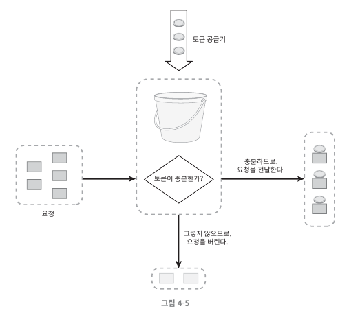
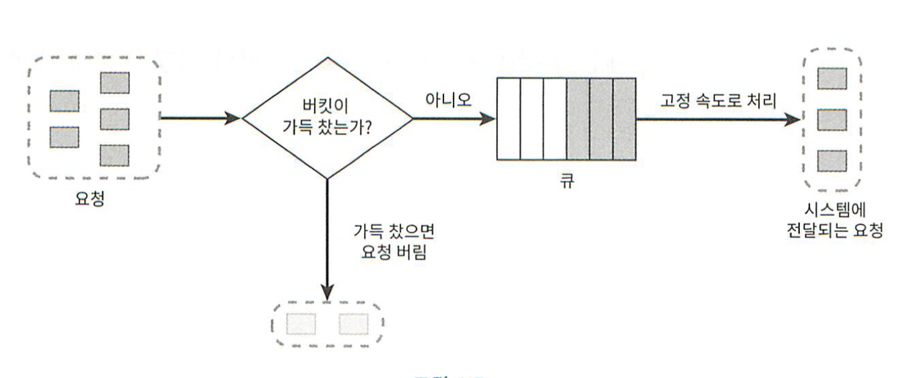
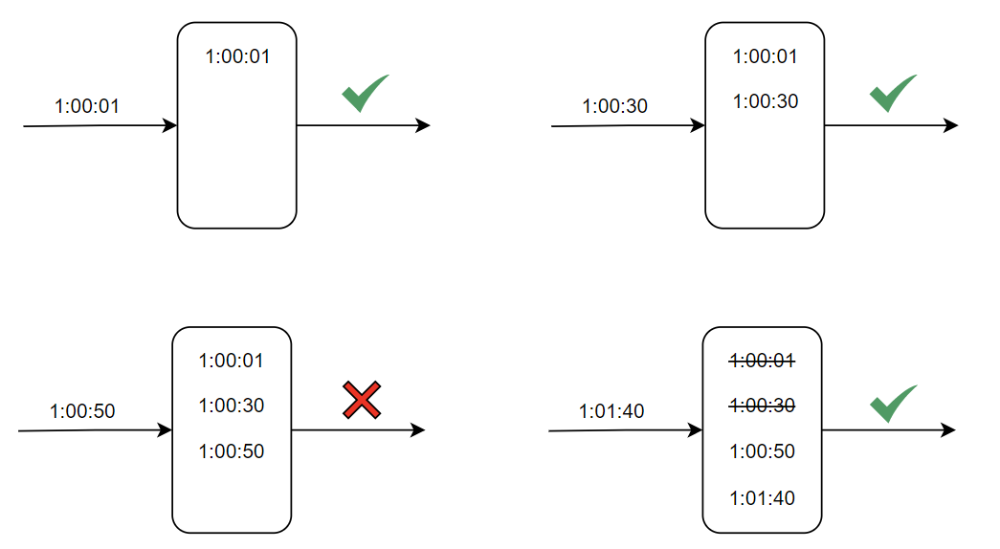
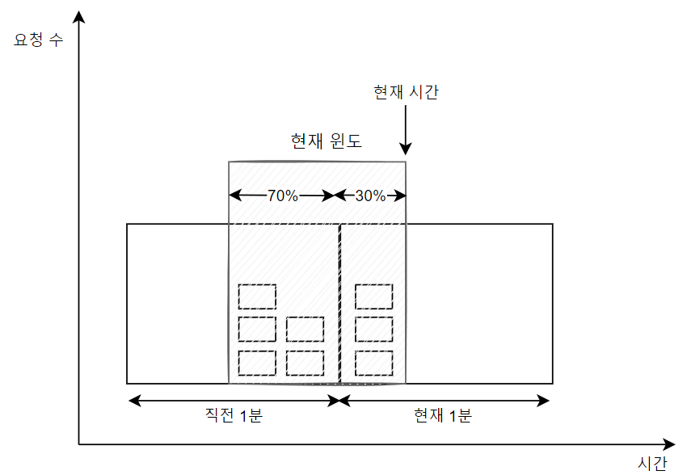

# 처리율 제한 장치의 설계

## 처리율 제한 장치

- 클라이언트 또는 서비스가 보내는 트래픽의 처리율을 제어하기 위한 장치
- HTTP를 예로 들면 이 장치는 특정 기간 내에 전송되는 클라이언트의 요청 횟수를 제한한다
  - API 요청 횟수가 제한 장치에 정의된 임계치(threshold)를 넘어서면 추가로 도달한 모든 호출은 처리가 중단(block)된다

## 처리율 제한 장치의 이점

- DoS(Denial of Service) 공격에 의한 자원 고갈을 방지할 수 있다
- 서버를 많이 두지 않아도 되고, 제3자 API 호출을 줄여 비용을 절감할 수 있다.
- 서버 과부화를 막는다. 봇이나 잘못된 이용 패턴으로 유발된 트래픽을 걸러낼 수 있다.

## 처리율 제한 알고리즘

### 1. 토큰 버킷 알고리즘

- 단순하고 보편적으로 사용되는 알고리즘이다.

#### 작동 방식

1. 토큰 버킷은 지정된 용량을 갖는 컨테이너로, 사전 설정된 양의 토큰이 주기적으로 채워진다.
   토큰이 꽉 찬 버킷에는 더 이상 토큰이 추가되지 않는다
2. 각 요청은 처리될 때마다 하나의 토큰을 사용한다
3. 요청을 처리하기 전에 토큰을 검사하는데, 버킷에 토큰이 없으면 요청은 버려진다.

- 통상적으로는 API 엔드포인트, 사용자마다 별도의 버킷을 둔다.
- IP 주소별로 제한량을 두어야한다면 IP 주소마다 버킷을 하나씩 할당한다.
- 전체적인 시스템 처리율을 제한하고 싶다면 모든 요청이 하나의 버킷을 공유하도록 한다.

 #### 장점

- 구현이 쉽고 메모리 효율적이다.
- 짧은 시간에 집중되는 트래픽(burst of traffic)도 처리가능하다.

#### 단점

- 버킷 크기와 토큰 공급률 인자를 적절하게 튜닝하는 일이 까다롭다.

### 2. 누출 버킷 알고리즘 (leaky bucket)

- 토큰 버킷 알고리즘과 비슷하지만 요청 처리율이 고정되어 있다.
- 고정된 크기의 큐에 들어온 요청을 넣고 처리한다.

#### 작동 방식

1. 요청이 도착할 때 큐가 가득 차지 않았으면 요청을 추가한다.
2. 큐가 가득 차 있는 경우에는 요청을 버린다.
3. 지정된 시간마다 큐에서 요청을 꺼내어 처리한다 (요청 처리율 고정)

#### 장점

- 큐의 크기가 제한되어 메모리 효율적이다.
- 처리율이 고정되어 안정적 출력이 필요한 경우에 적합하다.

#### 단점

- 단시간에 많은 트래픽이 몰리는 경우 큐에 오래된 요청들이 쌓이고 최신 요청들은 버려진다.
- 토큰 버킷과 유사하게 두 인자를 튜닝하는 것이 까다롭다.

### 3. 고정 윈도 카운터 알고리즘

#### 작동 방식

1. 타임라인(timeline)을 고정된 간격의 윈도(window)로 나누고, 각 윈도마다 카운터(counter)를 붙인다.
2. 요청이 접수될 때 카운터 값이 1 증가한다.
3. 카운터의 값이 임계치를 넘으면 새 윈도가 열릴 때까지 요청을 받지 않는다.

**장점**

- 이해하기 쉽고 메모리 효율이 좋다.
- 윈도가 닫히는 시점에 카운터를 초기화하는 방식은 특정한 트래픽 패턴을 처리하기에 적합하다.

**단점**

- 윈도 경계 부근에서 일시적으로 트래픽이 몰리는 경우, 기대했던 시스템의 처리 한도보다 많은 양의 요청을 처리할 수 있다.

### 4. 이동 윈도 로깅 알고리즘

- 고정 윈도 카운터 알고리즘의 문제를 해결한 알고리즘

#### 작동 방식

1. 요청의 타임스탬프를 추적한다. 이는 보통 레디스의 정렬 집합 같은 캐시에 보관한다.
2. 새 요청이 오면 만료된(현재 윈도우에서 벗어난) 타임스탬프는 제거한다.
3. 새 요청의 타임스탬프를 로그에 추가한다.
4. 로그의 크기가 허용치보다 같거나 작으면 요청을 시스템에 전달한다. 그렇지 않은 경우에는 처리를 거부한다.

####  장점

- 어느 순간의 윈도를 보더라도 처리율 한도를 넘지 않는다.

#### 단점

- 거부된 요청의 타임스탬프도 저장하기때문에 메모리를 많이 사용한다.

### 5. 이동 윈도 카운터 알고리즘

- 고정 윈도 카운터 알고리즘 + 이동 윈도 로깅 알고리즘
- 두 가치 구현 접근 방법이 있다.

#### 작동 방식

- 타임스탬프를 전부 기록하지 않고, 카운터 값으로 추정을 한다.
- 추정치: 현재 1분간의 요청 수 + 직전 1분간의 요청 수 * 이동 윈도와 직전 1분이 겹치는 비율
- 해당 추정치는 현재 윈도우에 들어온 요청의 수로, 임계치를 넘었다면 더이상 요청을 받지 않는다.

#### 장점

- 이전 시간대의 평균 처리율에 따라 현재 윈도의 상태를 계산하므로 짧은 시간에 몰리는 트래픽에도 잘 대응한다.
- 메모리 효율이 좋다.

#### 단점

- 추정하는 방식이 직전 시간대에 도착한 요청이 균등하게 분포되어있다고 가정한 것이다.
  - 하지만 클라우드플레어가 실시했던 실험에 따르면 40억 개 요청 가운데 잘못 추정하여 처리한 요청은 0.003%에 불과했다.

## 분산환경에서의 처리율 제한 장치의 구현

- 처리율 한도 초과 트래픽의 처리

  - 429(too many requests) 응답을 클라이언트에 반환

    - 클라이언트는 HTTP 응답 헤더를 통해 요청 한도를 파악할 수 있다.

  - 큐에 보관하여 지연 처리

    

### 1. 경쟁 조건

처리율 제한장치는 대략 다음과 같이 동작한다.

1. 레디스에서 카운터의 값을 읽는다(counter).
2. counter + 1의 값이 임계치를 넘는지 본다.
3. 넘지 않는다면 레디스에 보관된 카운터 값을 1만큼 증가시킨다.

이때 동시성 이슈가 발생하여 레디스의 카운터가 잘못 업데이트 될 수 있다.

#### 해결 방안

- 락을 이용한다
  - 시스템의 성능이 크게 하락
- 루아 스크립트
- 레디스 정렬 집합 사용

### 2. 동기화 이슈

- 여러 처리율 제한 장치를 두게 되면 동기화가 필요하다.

#### 해결 방안

- 고정 세션을 활용하여 같은 클라이언트의 요청은 항상 같은 처리율 제한 장치로 보낸다.
  - 확장성이 낮고 유연하지 않다.
- 레디스와 같은 중앙 집중형 데이터 저장소를 사용한다.

## 성능 최적화와 모니터링

- 사용자의 트래픽을 가장 가까운 에지 서버로 전달하여 지연시간을 줄인다.
- 채택된 처리율 제한 알고리즘이 효과적인지, 처리율 제한 규칙이 효과적인지 모니터링한다.
  - 처리율 제한 알고리즘이 비효율적이면 처리량이 낮아질 수 있다.
  - 처리율 제한 규칙이 너무 빡빡하면 많은 유효 요청이 처리되지 못할 수 있다.