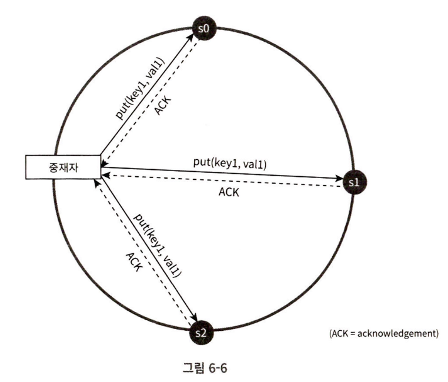

# 시스템디자인인터뷰 6장: 키-값 저장소 설계

Created: September 28, 2025 11:01 PM

# 정의

- 키-값 저장소 : 고유 식별자(키)를 가진 값(키-값 쌍)을 저장하는 저장소
    - 키: 일반적으로 텍스트, 성능상 해시 값일 수 있음
    - 값: 문자열, 리스트, 객체 등 무엇이든 될 수 있음
- 대표적인 키-값 저장소: DynamoDB, memcached, Redis..

# 문제 이해 및 설계 범위 확정

## 연산 정의

- put(key, value): 키-값을 저장소에 저장
- get(key): 입력받은 키의 값을 가져옴

## 특성 정의

- **키-값 쌍의 크기:** 10KB 이하. 큰 데이터도 저장 가능.
- **높은 가용성(High Availability):** 시스템이 장애가 발생하더라도 빠르게 응답해야 함
- **높은 규모 확장성(Scalability):** 트래픽 양에 따라 서버 증설/삭제가 자동으로 이루어져야 함
- **데이터 일관성 수준:** 조정이 가능해야 함
- **응답 지연 시간(Latency):** 짧아야 함

# 단일 서버 키-값 저장소

- 키-값 쌍 전체를 한 서버의 메모리 내 해시 테이블에 저장
- 빠른 속도 보장 / 모든 데이터를 메모리에 두는데 한계가 있음
    - 개선책 → 데이터 압축, 자주 쓰이는 데이터만 메모리에 두고 나머지는 디스트에 저장
    - 개선책을 해도, 확장되면 한계가 옴. **분산 키-값 저장소** 검토 필요

# 분산 키-값 저장소

## CAP 정리

- 일관성(consistency), 가용성(availability), 파티션 감내(partition tolerance) 세가지 요구사항을 모두 만족하는 설계는불가능
    - 일관성: 어느 노드에 접근하더라도 같은 데이터를 가져옴
    - 가용성: 일부 노드에 장애가 발생하더라도 항상 응답을 받을 수 있어야 함
    - 파티션 감내: 네트워크에 파티션이 생기더라도 시스템은 계속 동작
- **CP 시스템:** 일관성과 파티션 감내를 지원하며, 가용성을 희생 (예: 네트워크 파티션 발생 시 오류를 반환하여 일관성을 지킴)
- **AP 시스템:** 가용성과 파티션 감내를 지원하며, 데이터 일관성을 희생 (예: 오래된 데이터를 반환할 위험이 있더라도 계속 읽기 연산을 허용)
- **CA 시스템**: 실제 시스템에서는 네트워크 파티션(통신 장애)을 피할 수 없으므로, CA시스템은 존재하지 않음.

## 시스템 컴포넌트

### 데이터 파티션

- 안정 해시 사용!
    - 해시 공간을 해시 링 형태로 구성 → 서버와 키를 링 위에 두고, 키의 위치로부터 시계 방향으로 링을 순회하며 만나는 첫 서버에 해당 키-값을 저장
- 규모 확장 자동화 → 시스템 부하에 따라 서버가 자동으로 추가되거나 삭제되도록 할 수 있음
- 다양성 → 서버의 용량에 맞게 가상 노드의 수를 조정 가능(이 서버는 용량이 높으니 N개 노드…)

### 데이터 다중화

- 키-값을 N개 서버에 다중화(레플리케이션)
- ex. 해시 링을 순회하며 만나는 N개의 노드에 키-값을 저장
- ! 여러가상 노드가 한 서버에 있는 경우, 서로 다른 서버에 저장하도록 구성 가능

### 데이터 일관성

- 다중화된 노드 간 동기화 필요
- 정족수 합의 알고르짐을 사용해 읽기/쓰기 연산에 일관성 보장가능
- 정의
    - N = 사본 개수
    - W = 쓰기 연산에 대한 정속수(W개 서버로부터 쓰기 연산이 성공했다는 응답을 받아야 함)
    - R = 읽기 연산에 대한 정족수(R개 서버로부터 응답을 받아야 함)

- 중재자가 사용자의 읽기/쓰기 요청을 노드들에 분산, 조건에 맞는 수 만큼의 응답이 오면 사용자에 응답
- 숫자 정하는 방법
    - R =1, W = N : 빠른 읽기 연산에 최적화
    - W = 1, R = N : 빠른 쓰기 연산에 최적화
    - W+R > N 인 경우 강한 일관성 보장(보통 N = 3, W=R=2)
    - W+R ≤ N 인경우 강한 일관성이 보장되지 않음

### 일관성 모델

- 강한 일관성 : 모든 읽기 연산이 가장 최근에 갱신된 결과를 반환
    - e.x. 모든 사본에 쓰기 결과 반영 전까지 해당 데이터에 대한 읽기/쓰기 금지
        - 고가용성 시스템에는 적합하지 않음
- 약한 일관성 : 읽기 연산이 최근 결과가 아닐 수 있음
- 최종 일관성 : 약한 일관성의 한 형태로, 갱신된 결과가 모든 사본에 반영(동기화)되는 모델
    - 다이나모/카산드라 → 우리도 이렇게 할 예정

### 비 일관성 해소 방법 - 데이터 버저닝, 벡터 시계

- 한 버전은 변경 불가능(Immutable), 데이터를 변경할때마다 새로운 버전을 생성.
- 벡터 시계 → D([서버번호1, 버전번호1], [서버번호2, 버전번호2], … [서버번호n, 버전번호n]) 형태로 표시
    - [서버번호i, 버전번호i] 가 있으면 버전 번호 i를 증가
    - 그렇지 않으면 새 항목 [서버번호i, 버전번호1]을 생성

- Dx, Dy 간 충돌 감지 → Dy의 구성요소 가운데 Dx의 구성요소보다 작은 값을 갖는것이 있는지 확인
- 한계
    - 클라가 처리해야 함. 복잡해짐.
    - [서버:버전] 순서쌍이 매우 많아짐 → Dynamo는 그냥 다 저장

### 장애 처리 - 장애 감지

- 노드간 멀티캐스팅 채널 구축(서로가 서로를 계속 핑) → 서버가 많을때는 비효율적
- 가십 프로토콜
    - 맴버십 목록과 하트비트 카운터를 유지, 주기적으로 무작위 노드들에 카운터 목록을 전송
    - 어떤 노드가 주기적으로 하트비트 갱신이 안되면 그 노드를 장애로 간주

### 장애 처리 - 일시적 장애 처리

- 장애 감지 시, 앞에서 정한 정족수를 “엄격하게” 하면 읽기/쓰기 연산을 금지해야 함.
- “느슨한 정족수” → 쓰기 연산을 수행할 W개의 건강한 서버, 읽기 연산을 수행할 R개의 건강한 서버를 해시 링에서 선택 → 장애 상태인 서버는 무시
    - 장애 상태로 가능 요청은 다른 서버가 임시 처리, 추후 일괄처리

### 장애 처리 - 영구 장애 처리

- 키 공간을 버킷으로 쪼개고, 쪼갠 버킷 내 키 해시 처리 → 버킷별 해시 계산 후 해당 해시 값을 레이블로 가지는 노드를 만듦 → 자식 노드의 레이블에서 또 해시 값 계산, 이진 트리를 상향식으로 만들어 감
- → 두 서버 간 해시 값이 다른 노드를 순회해서 내려가면, 값이 다른 버킷 찾을 수 있음

## 설계

- 분산 키-값 저장소는 클라이언트와 중재자 를 통해 노드와 통신
- 안정 해시 링 위에 노드 분산
- 완전히 분산된 시스템 채택, 모든 노드가 동일한 책임 → SPoF X

### e.g. 쓰기 경로

### e.g. 쓰기 경로

Bloom filter : https://www.jasondavies.com/bloomfilter/