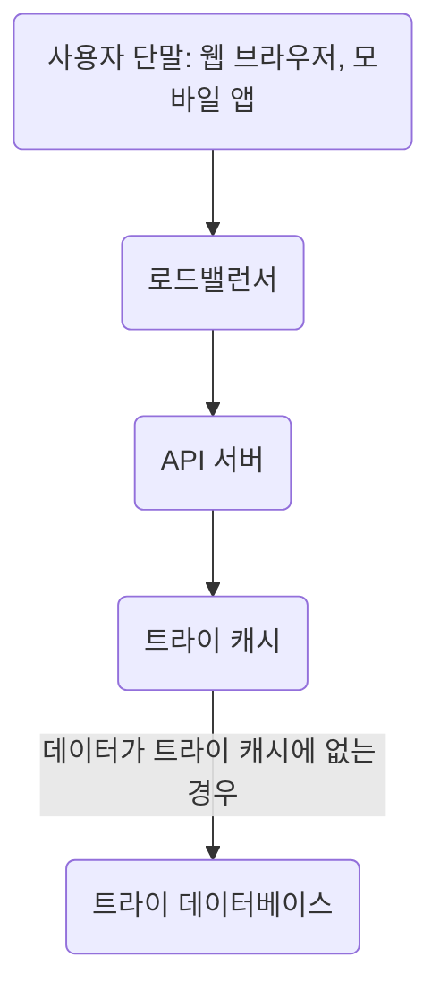
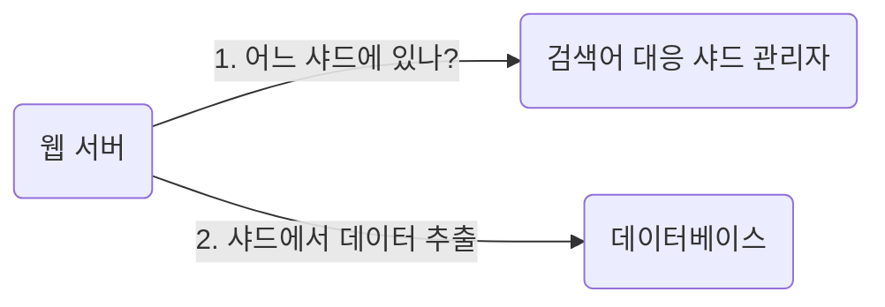

# 검색어 자동완성 시스템

: autocomplete, typeahead, search-as-you-type, incremental search

**: 빠른 응답 속도, 연관성, 정렬, 규모 확장성, 고가용성**

1. 입력 단어는 자동완성될 검색어 어느 부분인지? 첫 부분, 중간 부분 등
2. 결과로 보여야 할 자동완성 검색어 갯수
3. 자동완섬 검색어 고르는 기준
4. 맞춤법 검사 기능 제공 여부
5. 기본 영어 지원, 가능하다면 다국어
6. 대문자, 특수 문자 처리
7. 사용자 지원 어느정도?

## 개략적 규모 추정

- ASCII: 문자 인코딩 용
- 글자 입력할 때마다 백엔드에 글자 수만큼 요청
  - search?q=a
  - search?q=ap
  - search?q=app
  - search?q=appl
  - search?q=apple
- 질의 중 20%는 신규 검색어로 가정

### 데이터 수집 서비스(data gathering service)

: 사용자가 입력한 질의를 실시간으로 수집

### 질의 서비스(query service)

: 주어진 질의에 n개의 인기 검색어를 정렬해서 보여줌

- 질의 테이블(frequency table): 질의문, 사용빈도 저장

- ex) 차례대로 twitter, twit, twit, twelve 검색
  | 질의(query) | 빈도(frequency) |
  | ----------- | --------------- |
  | twitter     | 1               |
  | twit        | 2               |
  | twelve      | 1               |

- query: 질의문 저장 필드
- frequency: 질의문 사용 빈도 저장 필드, 정렬 기준으로 사용

## 트라이(trie) 자료구조, 접두어 트리(prefix tree)

- 문자열을 간력하게 저장할 수 있는 자료구조, '문자열을 꺼내는 연산'에 초점

### 핵심 아이디어

- 트리 형태의 자료구조
- 루트 노드는 빈 문자열
- 각 노드: 글자(character) 하나 저장, 자식 노드 26개 가질 수 있음
- 각 트리 노드: 단어 하나, 접두어 문자열(prefix string) 나타냄

- 이용 빈도에 따라 정렬된 결과를 보여주기 위해 노드에 빈도 정보를 저장한다

| p                   | n                   | c                            |
| ------------------- | ------------------- | ---------------------------- |
| 접두어(prefix) 길이 | 트라이 안 노드 개수 | 주어진 노드의 자식 노드 개수 |

> 트라이 자료구조 동작 원리

### 트라이로 검색어 자동완성 구현

1. 해당 접두어를 표현하는 노드 찾기: O(p)
2. 해당 노드부터 시작하는 하위 트리 탐색하여 모든 유효 노드 찾기: O(c)
3. 유효 노드 정렬하여 가장 인기있는 검색어 k개 찾기: O(clogc)

- 전체 시간 복잡도: O(p) + O(c) + O(clogc)
- 최악의 경우, 전체 트라이를 전부 검색해야할 수도 있다 → 접두어 최대 길이 제한, 각 노드에 인기 검색어 캐시

**접두어 최대 길이 제한**

- 사용자가 검색창에 긴 검색어를 입력하는 일은 거의 없어, p값은 작은 정숫값으로 가정해도 괜찮음
- 접두어 노드 찾는 단계 시간 복잡도: O(p) → O(1)

> O(1) 이해 못함..

**노드에 인기 검색어 캐시**

- 각 노드에 인기 검색어 k(5~10)개 저장해두면 전체 트라이 검색 방지
- 캐시하면 질의하는 시간 복잡도는 엄청나게 낮출 수 있지만, 질의어를 저장할 공간이 필요(trade off)
- 시간 복잡도: 검색 결과가 이미 캐시되어 있으므로 O(1)

## 데이터 수집 서비스

타이핑할 때마다 실시간으로 데이터 수정하면..
- 어마무시한 질의 개수만큼 트라이가 갱신되므로 서비스 속도가 느려짐
- 인기 검색어는 자주 바뀌지 않으므로 트라이를 자주 갱신할 필요 없음

규모 확장이 쉬운 데이터 수집 서비스 → 데이터가 어디서 오고 어떻게 이용되는가?
  - SNS 같은 실시간 애플리케이션: 제안되는 검색어가 신선해야하지만(트렌드가 계속 바뀌므로)
  - 일반 검색 애플리케이션은 자주 바꿀 이유가 없다: 검색 결과는 어느 정도 고정
  - 트라이를 만드는 데 쓰는 데이터: 데이터 분석 서비스(analytics), 로깅 서비스(logging service)로부터 출처

### 데이터 분석 서비스 로그

검색창에 입력된 질의에 관한 원본 데이터 보관용
- 새 데이터는 추가되지만, 수정은 이뤄지지 않는다
- 로그 데이터에 인덱스 걸지 않음

### 로그 취합 서버

- 엄청난 양 + 제각각인 데이터 형식 잘 취합하는 것이 중요
- 실시간 애플리케이션: 빠른 결과를 위해 데이터 취합 주기 짧게 가져감
- 그 외: 일주일에 한 번 정도 로그 취합 → frequency로 해당 질의가 해당 주에만 사용된 횟수 합

### 작업 서버(worker)

주기적으로 비동기 작업(job) 실행하는 서버 집합
- 트라이 자료 구조 생성
- 트라이 데이터베이스에 저장

### 트라이 캐시

분산 캐시 시스템
- 트라이 데이터를 메모리에 유지 - READ 연산 성능 높이기
- 매주 트라이 데이터베이스 스냅샷떠서 갱신

### 트라이 데이터베이스

- 문서 저장소:  매주 새 트라이 생성하여 주기적으로 db 저장
- 키-값 저장소: 각 트라이 노드가 하나의 <키, 값> 쌍으로 변환    
  - 접두어: 해시 테이블 키
  - 노드 데이터: 해시 테이블 값

## 질의 서비스

최적화 방안
1. AJAX 요청(request): 요청 보내고 받는데 새로고침 필요 없음
2. 브라우저 캐싱(Cache-Control): 자동완성 검색어 제안 결과는 단시간에 바뀌지 않음
3. 데이터 샘플링(data sampling): 모든 질의 결과를 로깅하기에 CPU 자원, 저장공간 부족하므로 N개 요청 중 1개만 로깅

## 트라이 연산

1. 트라이 생성: 작업 서버 담당, 데이터 분석 서비스 로그 또는 데이터베이스로부터 취합된 데이터 이용
2. 트라이 갱신
   1. 매주 한 번 갱신: 새 트라이 만들고 기존 트라이 대체
   2. 트라이의 각 노드 개별 갱신: 모든 상위 노드도 갱신해야하므로 성능 면에서는 떨어짐, 트라이가 작을 때 고려 가능
3. 검색어 삭제: 트라이 캐시 앞에 필터 계층(filter option) 추가, 데이터베이스에서의 물리적 삭제는 다음 업데이트 사이클에서 비동기로 진행

## 저장소 규모 확장

트라이의 크기가 너무 커서 한 서버에 넣을 수 없다면?
- 영어 지원 기준, 첫 글자 기준으로 샤딩(sharding)
  - 2대 서버 필요: 'a'~'m', 'n'~'z'
  - 3대 서버 필요: 'a'~'i', 'j'~'r', 's'~'z'

26대 이상 늘리고 싶다면?
- 샤딩을 계층적으로 하기
  - 'a'로 시작하는 검색어 서버 3대에 나눠서 보관: 'aa'~'ai', 'aj'~'ar', 'as'~'az'
  - 데이터를 각 서버에 균등하게 배분하기 어렵다(Hotspot 문제) → 과거 질의 데이터 패턴 분석해서 샤딩

## 그 외..

1. 다국어 지원: 유니코드 저장
2. 국가 별로 인기 검색어 순위 다르면? 국가별로 트라이를 다르게 생성하여 CDN에 저장, 응답 속도 높이기
3. 실시간 검색어 추이 반영? 작업 서버를 실시간으로 돌린다고 하더라도 트라이 구성에 너무 많은 시간 소요
   - 샤딩으로 작업 대상 데이터 양 줄이기
   - 순위 모델(ranking model) 바꿔서 최근 검색어에 높은 가중치 두기
   - 데이터가 스트림으로 오는(지속적으로 생성되는) 특징 고려하여 하둡, 스파크 등 특정 시스템 사용