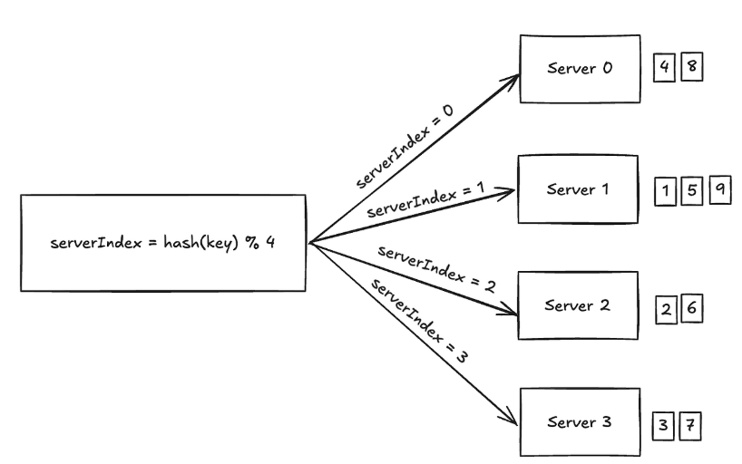
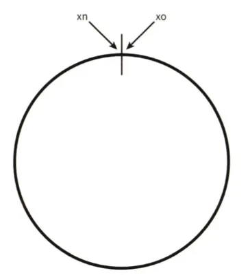
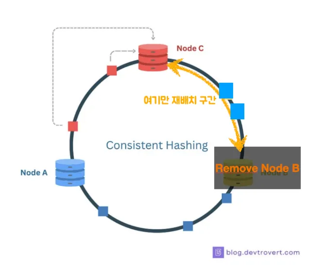

# 5장 안정 해시 설계

## 수평적 규모 확장성(Scale-out)

수평적 규모 확장성을 달성하기 위해서는 요청 또는 데이터를 서버에 균등하게 나누는 것이 중요함

## 수평확장(Scale-out)

서버 1대를 쓰다가 → 2대, 4대, 10대 … 늘려서 처리량을 확장하는 것  
즉, 많은 요청을 여러 서버가 동시에 나눠서 처리하는 구조

### 왜 균등분산이 중요한가?

- **성능 최적화**  
한 서버가 90% 요청 받고, 나머지 서버가 10%만 받으면 → 그 서버가 병목 지점(Bottleneck)이 됨  
결과적으로 전체 성능이 한 서버 성능과 비슷하게 떨어짐

- **안정성**  
특정 서버에만 데이터가 몰리면 → 그 서버 장애 시 대규모 서비스 중단 발생  
균등하게 분산돼 있다면 → 일부 서버 장애에도 나머지가 커버 가능

- **예측 가능한 확장성**  
요청/데이터가 균등하게 나뉘면, 서버 2대 → 4대 → 8대로 늘릴 때 처리량도 선형적으로 늘어남

---

## 해시 키 재배치(rehash) 문제

N개의 캐시 서버가 있다고 하면, 이 서버들에 부하를 균등하게 나누는 보편적 방법은 아래 해시함수를 사용

- N은 서버의 개수

<aside>
💡 **해시란?**  
해시의 사전적 의미는 '임의 길이의 데이터 문자열을 입력으로 받아서 고정 크기의 출력, 일반적으로는 숫자와 문자열로 이루어진 해시 값 또는 해시 코드를 생성하는 수학적 함수'입니다.  
쉽게 풀어 이야기하면 같은 문자열 입력은 항상 같은 해시 코드를 반환한다는 것입니다. 해시의 이런 특성을 이용하여 암호화나 파일의 위변조 판정 등 다양한 용도로 사용됩니다.
</aside>

---

## 안정해시란?

안정 해시(Consistent Hashing)란 분산되어 있는 서버 혹은 서비스에 데이터를 균등하게 나누기 위한 기술이다.  
굳이 안정 해시를 사용하지 않더라도 데이터를 균등하게 나누는 게 불가능하지는 않다. 다만, 안정 해시는 수평적 확장을 용이하게 하는 것에 초점이 맞춰져 있다.

---

## 키 값이 서버에 어떻게 분산되는가?

총 4개의 서버를 사용한다고 하면, 주어진 각각의 키에 대해 해시값과 서버 인덱스를 계산한 예시는 다음과 같다.

| 키    | 해시값    | 해시 % 4 (서버 인덱스) |
|-------|----------|-----------------------|
| key0  | 18358617 | 1                     |
| key1  | 26143584 | 0                     |
| key2  | 18131146 | 2                     |
| key3  | 35863496 | 0                     |
| key4  | 34085809 | 1                     |
| key5  | 27581703 | 3                     |
| key6  | 38164978 | 2                     |
| key7  | 22530351 | 3                     |

- 예: `hash(key0) % 4 = 1`이면, 클라이언트는 캐시에 보관된 데이터를 가져오기 위해 서버1에 접속

---

서버 풀의 크기가 고정되어 있고, 데이터 분포가 균등할 때는 위 방법이 잘 동작한다.  
하지만, 서버가 추가되거나 기존 서버가 삭제되면 문제가 생긴다.  
예를 들어 서버 3개에서 4개로 서버 1개가 추가되었을 때 문제가 발생한다.

출처 : Sean 션 가상 면접 사례로 배우는 대규모 시스템 설계 기초 5장: 안정 해시 설계

나머지 연산 알고리즘 결과가 아예 달라지면서, 전체 데이터의 대부분이 재배치가 된다.

이런 현상이 해시 키 재배치 문제입니다. 

서버 4개 → 3개의 경우도 마찬가지. 예를들어 1번 서버가 장애를 일으켜 동작을 중단하면, 서버 풀의 크기는 3으로 변함.

이에 따라 장애가 발생한 1번 서버에 보관되어있는 키 뿐만 아닌 대부분의 키가 재분배 되고, 1대부분 캐시 클라이언트가 데이터가 없는 엉뚱한 서버에 접속하게 되어, 대규모 캐시미스가 발생하게 됩니다.

- **캐시 미스 폭증**
    - 기존 캐시에 있던 키의 ~75%가 다른 서버로 이동→ 새 서버의 캐시는 비어있음 → 캐시 미스 급증.
- **백엔드 과부하(Thundering Herd)**
    - 캐시 미스로 인해 같은 시점에 수많은 요청이 DB/API로 쏠림 → DB 연결 고갈, 응답 지연, 타임아웃, 서비스 장애 유발.
- **네트워크 / I/O 증가**
    - 대량의 데이터 재전송(마이그레이션) 또는 캐시 리로드로 네트워크와 디스크 I/O 폭증.
- **복구 지연과 연쇄 장애**
    - 백엔드 지연으로 클라이언트 재시도 증가 → 추가 부하 → 시스템 복구 지연.

이를 문제를 효과적으로 해결하는 기술이 “안정해시”입니다.

 

## 안정해시란?

해시 테이블 크기가 조정 될 때 평균적으로 오직 k/n개의 키만 재배치하는 해시 기술

해시 테이블(또는 서버 풀)의 크기, 즉 슬롯 수가 변경되더라도 **대부분의 키는 기존 위치를 유지**

하고, **평균적으로 k/n개의 키만 재배치** 되도록 설계된 해시 기법

- 슬롯(Slot) = 해시 링에서의 위치, 또는 서버/노드
- 키(Key) = 저장하고 싶은 데이터 항목 개수
- 해시 테이블 크기(슬롯 수)가 변해도 **대부분 키가 기존 서버에 남는다**

**해시 공간과 해시 링**

- 해시 함수 f를 SHA-1을 사용한다고 가정할 경우
    - 함수의 출력 값 : x0, x1, x2, .. xn
    - 해시 공간 범위 : 0 ~ (2^160)-1
    - 해시 공간 표현

나머지 연산 알고리즘 결과가 아예 달라지면서, 전체 데이터의 대부분이 재배치가 된다.

이런 현상이 해시 키 재배치 문제입니다. 

서버 4개 → 3개의 경우도 마찬가지. 예를들어 1번 서버가 장애를 일으켜 동작을 중단하면, 서버 풀의 크기는 3으로 변함.

이에 따라 장애가 발생한 1번 서버에 보관되어있는 키 뿐만 아닌 대부분의 키가 재분배 되고, 1대부분 캐시 클라이언트가 데이터가 없는 엉뚱한 서버에 접속하게 되어, 대규모 캐시미스가 발생하게 됩니다.

- **캐시 미스 폭증**
    - 기존 캐시에 있던 키의 ~75%가 다른 서버로 이동→ 새 서버의 캐시는 비어있음 → 캐시 미스 급증.
- **백엔드 과부하(Thundering Herd)**
    - 캐시 미스로 인해 같은 시점에 수많은 요청이 DB/API로 쏠림 → DB 연결 고갈, 응답 지연, 타임아웃, 서비스 장애 유발.
- **네트워크 / I/O 증가**
    - 대량의 데이터 재전송(마이그레이션) 또는 캐시 리로드로 네트워크와 디스크 I/O 폭증.
- **복구 지연과 연쇄 장애**
    - 백엔드 지연으로 클라이언트 재시도 증가 → 추가 부하 → 시스템 복구 지연.

이를 문제를 효과적으로 해결하는 기술이 “안정해시”입니다.

 

• 해시 링(hash ring) : 해시 공간의 양쪽을 구부려 접은 형태

해시 함수 f 를 사용해 서버 IP, 이름을 이 링의 어떤 위치에 대응시킬 수 있다.

아래 그림의 Node A, B, C 가 해시 서버다.

빨간박스 = Node C에 해시할 키 key0

노란박스 = Node B에 해시할 키 key1

파란박스 = Node A에 해시할 키 key2

### 서버 조회

어떤 키가 저장되는 서버는, 해당 키의 위치로부터 시계방향으로 링을 탐색해나가면서 만나는 첫 번째 서버다. 따라서 빨가색박스인 key0은 Node C에 저장이 된다.

### 서버 추가

이 링 위에 하나의 서버(Node D)를 추가하면 초록 구간만 재배치하면 된다.

위의 그림을 보면 서버 Node D가 추가된 이후에 파란색박스였던 key2만 재매치됨을 알 수 있다.

key0과 key1은 같은 서버에 남는다.

key2는 서버 Node C에 저장되어있었다. 하지만 서버 Node D가 추가된 뒤 key2는 서버 Node D에 저장될 것이다. 왜냐하면 key2 위치에서 시계방향으로 순회했을 때 처음으로 만나게 되는 서버가 Node D이기 때문. 다른키들은 재배치되지 않는다.

### 서버 제거

노란 구간을 제외하고는 영향이 없다.

하나의 서버가 제거되면 키 가운데 일부만 재배치된다.

서버 Node B가 삭제되면, key1만이 서버 Node A로 재배치됨을 알 수 있다. 나머지 키에는 영향이 없다.

### 이런 접근법에는 문제점이 있다?

- 파티션 크기를 균등하게 유지하는 게 불가능하다.
    - 여기서 파티션은 인접한 서버 사이의 해시 공간.즉 어떤 서버는 굉장히 작은 공간 할당, 다른 어떤 서버는 굉장히 큰 공간을 할당받을 수 있음.
- 키의 균등 분포(uniform distribution)를 달성하기는 어렵다.
    - 위에 서버 제거 그림을 보면, 결국에 Node A에만 키가 몰리는 것을 볼 수 있다.이런경우를 균등 분포가 깨진다고 할 수 있음. Node A에 대한 파티션이 타른 파티션 대비 거의 2배로 커지는 상황
  

### 가상 노드(virtual node) 또는 복제(replica)

실제 노드 또는 서버를 가리키는 노드.

**하나의 서버는 링 위에 여러 개의 가상 노드를 가진다.**

서버는 하나가 아닌 여러 개 파티션을 관리해야 한다는 것!

기존에는 데이터의 hash 값 이상에 제일 가까운 node에 배치하는 것이었다면, 이번엔 **hash 값 이상에 제일 가까운 vnode의 node에 배치**하게 된다.
이렇게 되면 더 다양하고, 비정형화된 규칙으로 hash ring이 구성되게 된다. 

- Node 3 이 사라진다고 해보자. vnode를 사용하지 않았더라면 Node 1 에 모든 부하가 쏠렸을 것이다. 하지만 vnode를 사용하게 됨으로써 DataC 는 Node 2 로, DataD 는 Node 1 로 재배치되게 된다. 즉, 기존과 달리 더 다양하고 부하가 몰리지 않게 끔 재배치 되게 된다.
- 당연하지만 vnode의 배치가 랜덤하게 될수록 부하가 몰리는 현상이 줄어들 수 있다. 랜덤하게 배치되었다면 데이터가 더 많아지고, vnode가 더 많아짐에 따라 거의 균등하게 재배치 되는 것을 확인할 수 있을 것이다.

### 가상 노드 개수를 늘리면 키의 분포는 점점 더 균등해진다.

표준 편차가 작아지면서 데이터가 고르게 분포될 수 있다.

책에 의하면 다음과 같다.

- 200개의 가상 노드 사용 시 평균 표준 편차 값 5%
- 100개의 가상 노드 사용 시 평균 표준 편차 값 10%

가상 노드를 많이 사용할수록 저장 공간이 많이 필요하게 되니

이는 타협점 결정(tradeoff)이 필요하다. 따라서 시스템 요구사항에 맞도록 가상 노드 개수를 적적히 조정해야한다.

<참고문헌>
https://velog.io/@mxnzx/system-design-interview1-ch5

https://binux.tistory.com/119

