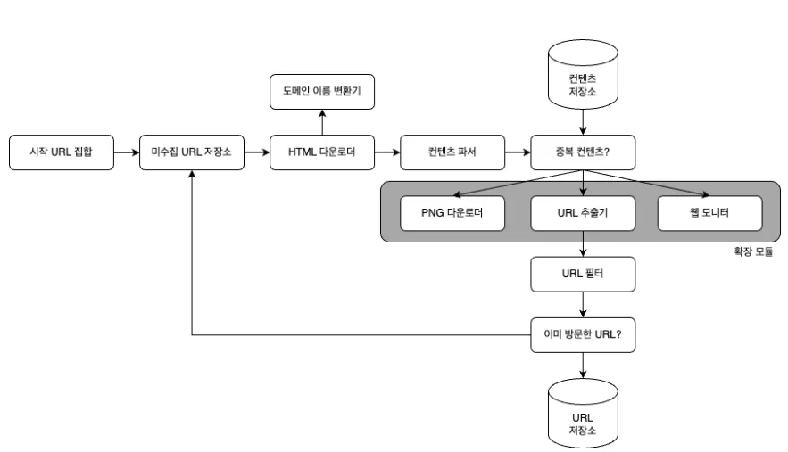

# 웹 크롤러 설계

## 웹 크롤러란?

웹 크롤러(로봇, 스파이더)는 검색엔진에 널리 사용되는 기술로, 웹에 새로 올라오거나 갱신된 콘텐츠(웹페이지, 이미지, 비디오, PDF 파일 등)를 찾아내는 것이 주요 목적입니다.

웹 크롤러는 몇 개 웹페이지에서 시작하여 그 링크를 따라 나가면서 새로운 콘텐츠를 수집합니다. 특정한 몇 개의 출발점을 정해놓고 거기서부터 탐색을 시작합니다.

검색엔진(구글)은 이런 크롤러를 전 세계에 수천 대씩 돌려서 웹의 수십억 페이지를 **자동으로 탐색 + 색인**합니다.

### 크롤러 동작 방식

웹 크롤러(예: Googlebot)가 `www.a.com`을 방문하면:

1. HTML을 다운로드함
2. `<a href="...">` 부분을 자동으로 파싱해서 URL들을 추출함
   - 예: `www.line.com`, `www.peach.com`, `www.mango.com`
3. "이런 URL이 있네?" 하고 Frontier(다음 방문 목록)에 추가
4. 나중에 그 URL들도 방문해서 각각의 페이지 내용을 또 크롤링함

👉 이렇게 해서 **크롤러는 링크를 따라가며 탐색 범위를 넓혀갑니다**.

## 크롤러의 용례

### 검색엔진 인덱싱 (ex. Googlebot)
- 크롤러는 웹 페이지를 모아 검색엔진을 위한 로컬 인덱스를 생성
- 구글봇은 구글 검색엔진이 사용하는 웹 크롤러

### 웹 아카이빙 (ex. 미국국회도서관, EU 웹 아카이브)
- 추후 사용할 목적으로 장기보관을 위해 웹에서 정보를 모으는 절차
- 많은 국립 도서관이 크롤러를 돌려 웹사이트를 아카이빙
- 역사적 기록을 남기기 위함

> **예시:** 2014년에 정부가 발표한 정책 보고서가 홈페이지에만 있었는데, 2020년에 사이트 리뉴얼하면서 파일이 사라짐 → 그 정책의 '원본'을 볼 수 있는 사람은 없게 됨

이런 걸 막기 위해 도서관이 주기적으로 크롤러를 돌려 "그 시점의 웹을 스냅샷처럼 보관"합니다.

### 웹 마이닝 (ex. 금융기업들의 주주총회자료, 연차보고서 수집)
- 인터넷에서 유용한 지식을 도출해내기 위해 활용
- 유명 금융 기업들은 크롤러를 사용해 주주총회자료나 연차보고서를 다운

### 웹 모니터링 (ex. 디지마크사의 웹 크롤러)
- 크롤러를 통해 인터넷에서 저작권이나 상표권이 침해되는 사례 모니터링

---

데이터 규모에 따라 웹 크롤러의 복잡도가 달라지므로, 크롤러가 감당할 수 있는 데이터의 규모와 기능을 알아내야 합니다.
- 몇 시간이면 끝내는 작은 프로젝트인가?
- 엔지니어링 팀을 꾸릴만한 초대형 프로젝트인가?

## 1단계. 문제 이해 및 설계 범위 확정

### 웹 크롤러의 기본 알고리즘

1. URL 집합이 입력으로 주어지면, 해당 URL들이 가리키는 모든 웹페이지를 다운로드
2. 다운받은 웹 페이지에서 URL들을 추출
3. 추출된 URL들을 다운로드할 URL 목록에 추가하고 위의 과정을 처음부터 반복

주어진 인터뷰 시간 동안은 큰 확장성이 있는 웹 크롤러 설계하는 것은 거의 불가능하므로, 설계 진행 전에 질문을 던져서 요구사항을 알아내고 설계범위를 좁히는 것이 중요합니다.

### 주요 질문사항

- **크롤러의 주된 용도**
  - 검색엔진 인덱스 생성용인지, 데이터마이닝인지 또는 다른 용도가 있는지
- **수집량**
  - 매달 얼마나 많은 웹페이지를 수집해야하는가 (ex. 10억개)
- **다른 페이지 고려 여부**
  - 새로 만들어진 웹페이지나 수정된 웹페이지 고려 여부
- **수집된 페이지 저장 여부와 기간**
  - 5년간 저장
- **중복된 콘텐츠 처리방식**
  - 중복된 콘텐츠를 갖는 페이지를 무시해도 되는지

### 좋은 웹 크롤러의 속성

- **규모 확장성**
  - 웹은 거대하므로 병행성을 활용하면 효과적으로 웹 크롤링을 할 수 있다
- **안정성**
  - 잘못 작성된 HTML, 반응 없는 서버, 장애, 악성코드 링크 등에 잘 대응할 수 있어야 한다
- **예절**
  - 수집 대상 웹사이트에 짧은 시간 동안 너무 많은 요청 보내지 말아야 한다
- **확장성**
  - 새로운 형태의 콘텐츠를 지원하기가 쉬워야 한다 (이미지 파일 크롤링을 위해 전체 시스템을 새로 설계해야한다면 곤란함)

### 개략적 규모 추정

면접관과 협의하는 것이 중요합니다:

- **매달 몇 개의 웹 페이지를 다운로드 하는지**
  - 10억개라고 가정하면 1,000,000,000 / 30일 / 24시간 / 3600초 = 대략 400페이지 / 초
  - 최대 QPS(Queries per second, 초당 처리 가능한 질의 수) = 2 × QPS = 800
- **웹 페이지의 크기 평균** (500k로 가정)
- **1개월치 데이터를 보관하는데 얼마의 스토리지가 필요한지**
- **5년간 보관한다고 가정하면, 30PB의 저장용량 필요**

## 2단계. 개략적 설계안 제시 및 동의 구하기

### 웹 크롤러의 주요 컴포넌트

#### 시작 URL 집합
웹 크롤러가 크롤링을 시작하는 출발점

- **예시:** 대학 웹사이트로부터 찾아 나갈 수 있는 모든 웹페이지를 크롤링하는 가장 좋은 방법은 해당 대학의 도메인 이름이 붙은 모든 페이지의 URL을 시작 URL로 사용
- **전체 웹 크롤링 시:** 크롤러가 가능한 많은 링크를 탐색하도록 하는 URL 선정
  - 일반적으로 전체 URL 공간을 작은 부분집합으로 나누는 전략을 사용
  - 지역적인 특색에 기반하여 다른 시작 URL (나라별로 인기 있는 웹사이트가 다름)
  - 주제별로 다른 시작 URL (쇼핑, 스포츠, 건강 등 주제별로 세분화)

#### 미수집 URL 저장소
현대적 웹 크롤러는 크롤링 상태를 아래와 같이 구분:

1. 다운로드할 URL = 저장 관리하는 컴포넌트를 미수집 URL로 부름 (아직 다운로드 안되었으므로)
2. 다운로드된 URL

#### HTML 다운로더
인터넷에서 웹페이지를 다운로드하는 컴포넌트. 다운로드 할 페이지의 URL은 미수집 URL 저장소가 제공

#### 도메인 이름 변환기
웹 페이지 다운하려면 URL을 IP 주소로 변환하는 절차가 필요한데, HTML 다운로더는 도메인 이름 변환기를 사용해 URL에 대응하는 IP 주소를 알아냅니다.

- 예: www.wikipedia.org의 IP주소는 198.35.26.96

#### 콘텐츠 파서
웹페이지를 다운로드하면 파싱과 검증 절차를 거쳐야 합니다.

#### 중복 콘텐츠 확인
연구결과에 의하면, 29% 가량 웹페이지 콘텐츠는 중복입니다.

자료구조를 도입하여 데이터 중복을 줄이고, 데이터 처리에 소요되는 시간을 줄입니다!

가장 간단한 방법은 두 문서를 문자열로 보고 비교하는 것이지만, 많을 경우에는 웹페이지의 해시 값을 비교합니다.

#### 콘텐츠 저장소
HTML 문서를 보관하는 시스템

저장할 데이터의 유형, 크기, 저장소 접근 빈도, 데이터의 유효기간 등을 종합적으로 고려

#### URL 추출기
HTML 페이지를 파싱하여 링크들을 골라내는 역할

상대경로는 전부 절대경로로 변환합니다.

#### URL 필터
특정한 콘텐츠 타입이나 파일 확장자를 갖는 URL, 접속 시 오류 발생하는 URL, 접근 제외목록에 포함된 URL 등을 크롤링 대상에서 배제하는 역할

#### 이미 방문한 URL 확인
이미 방문한 URL이나 미수집 URL 저장소에 보관된 URL을 추적할 수 있도록 하는 자료구조 사용

블룸 필터나 해시 테이블 자료구조가 널리 활용됩니다.

#### URL 저장소
이미 방문한 URL을 보관하는 저장소

### 웹 크롤러 작업 흐름

1. 시작 URL을 미수집 URL 저장소에 저장
2. HTML 다운로더는 미수집 URL 저장소에서 URL 목록을 가져옴
3. HTML 다운로더는 도메인 이름 변환기를 사용하여 URL의 IP 주소를 알아내고, 접속하여 다운받음
4. 콘텐츠 파서는 다운된 HTML 페이지를 파싱하여 올바른 형식을 갖춘 페이지 검증
5. 콘텐츠 파싱과 검증이 끝난 후 중복 콘텐츠인지 확인
   - 이미 저장소에 있는 콘텐츠인 경우 처리하지 않고 버림
   - 저장소에 없는 콘텐츠인 경우 저장소에 저장한 뒤 URL 추출기로 전달
6. URL 추출기는 해당 HTML 페이지에서 링크를 골라내고 URL 필터로 전달
7. 남은 URL만 중복 URL 판별 단계로 전달
8. 이미 처리한 URL인지 확인
9. 저장소에 없는 URL은 URL 저장소와 미수집 URL 저장소에 저장

## 3단계. 상세 설계

### DFS vs BFS

크롤링 프로세스는 페이지가 노드이고, 하이퍼링크가 엣지인 유향 그래프를 탐색하는 과정입니다.

그래프 크기가 클 경우 어느 정도로 깊숙이 가게 될지 가늠하기 어렵기 때문에 **DFS를 사용하지 않고 주로 BFS를 사용**합니다.

표준적인 큐를 사용하면 다음과 같은 문제가 발생합니다:

- 한 페이지에서 나오는 링크의 상당수는 같은 서버입니다. 따라서 서버는 수많은 요청으로 과부하게 걸리게 되고 이러한 크롤러를 '예의 없는(impolite)' 크롤러라 합니다.
- 모든 웹 페이지가 같은 수준의 품질, 같은 수준의 중요성을 갖지 않습니다.

### 미수집 URL 저장소

위의 문제를 해결하기 위한 방법 중 하나입니다.

URL 저장소는 다운로드할 URL을 보관하는 장소인데, 이 저장소를 잘 구현하면 '예의'를 갖춘 크롤러를 구현할 수 있습니다.

#### 예의(Politeness)

웹 크롤러는 수집 대상 서버로 짧은 시간 안에 과도한 요청을 보내는 것을 삼가야 합니다.

예의 바른 크롤러를 만드는 중요 원칙은, **동일 웹 사이트에 대해서는 한 번에 한 페이지만 요청**한다는 것입니다.

해당 규칙을 만족하려면 웹 사이트의 호스트명과 다운로드를 수행하는 워커 스레드 사이의 관계를 유지합니다.

- **큐 라우터(queue router):** 같은 호스트에 속한 URL은 언제나 같은 큐로 가도록 보장하는 역할
- **매핑 테이블(mapping table):** 호스트 이름과 큐 사이의 관계를 보관하는 테이블
- **FIFO 큐:** 같은 호스트에 속한 URL은 언제나 같은 큐에 보관
- **큐 선택기(queue selector):** 큐들을 순회하면서 큐에서 URL을 꺼낸 후 다운로드하도록 지정된 워커 스레드에 전달하는 역할
- **워커 스레드(worker thread):** 전달된 URL을 순차적으로 다운로드하며, 작업들 사이에 delay를 둘 수 있음

#### 우선순위

유용성에 따라 URL의 우선순위를 나눌 때는 페이지 랭크, 트래픽 양, 갱신 빈도 등 다양한 척도를 사용할 수 있습니다.

순위결정장치(prioritizer)는 URL 우선순위를 정하는 컴포넌트입니다.

큐에 URL을 저장하기 전에 prioritizer를 거치도록 설계합니다.

- **순위결정장치(prioritizer):** 입력받은 URL을 우선순위 계산
- **큐(queue):** 우선순위별로 큐가 하나씩 할당됨
- **큐 선택기(queue selector):** 임의 큐에서 처리할 URL을 꺼내는 역할, 순위가 높은 큐에서 더 자주 꺼내도록 프로그래밍되어 있습니다
- **전면 큐(front queue):** 우선순위 결정 과정을 처리합니다
- **후면 큐(back queue):** 크롤러가 예의 바르게 동작하도록 보증합니다

#### 신선도

데이터의 신선함을 유지하기 위해서는 이미 다운로드한 페이지라 하더라도 주기적으로 재수집할 필요가 있습니다.

- 웹 페이지의 변경 이력 활용
- 우선순위를 활용해, 중요한 페이지는 좀 더 자주 재수집

#### 미수집 URL 저장소를 위한 지속성 저장장치

검색 엔진 인덱싱 용 크롤러는 수억 개의 URL을 처리해야 합니다.

따라서 메모리와 디스크를 둘 다 활용하여 대부분의 URL은 디스크에 저장하지만 IO 비용을 줄이기 위해 메모리 버퍼에 큐를 두어 주기적으로 디스크에 기록합니다.

### HTML 다운로더

#### Robots.txt

로봇 제외 프로토콜이라고 부르는 robots.txt는 웹 사이트가 크롤러와 소통하는 표준 방법입니다.

이 파일에는 크롤러가 수집해도 되는 페이지 목록이 저장되어 있고, 크롤러는 해당 파일에 나열된 규칙을 먼저 확인합니다.

robots.txt 파일들은 거푸 다운로드하는 것을 피하기 위해, 이 파일은 주기적으로 다시 다운받아 캐시에 보관합니다.

#### 성능 최적화

1. **분산 크롤링:** 성능을 높이기 위해 크롤링 작업을 여러 서버에 분산
2. **도메인 이름 변환 결과 캐시:** DNS 조회 결과로 얻어진 도메인 이름과 IP 주소 사이의 관계를 캐시에 보관하여 cron job 등을 돌려 주기적으로 갱신
3. **지역성:** 서버를 지역별로 분산
4. **짧은 타임아웃:** 응답이 느리거나 응답하지 않는 서버를 대비하기 위해 wait time을 설정

#### 안정성

- **안정 해시(consistent hashing):** 크롤링 서버를 분산할 때 적용
- **크롤링 상태 및 수집 데이터 저장:** 서버 장애를 대비하여 수집된 데이터를 지속적으로 저장장치에 기록
- **Exception handling**
- **Data validation**

#### 확장성

시스템은 항상 진화하기 때문에 새로운 형태의 콘텐츠를 쉽게 지원할 수 있도록 설계해야 합니다.

### 문제 있는 콘텐츠 감지 및 회피

1. **중복 콘텐츠:** 해시나 체크섬을 사용하여 중복 콘텐츠 탐지
2. **거미 덫(Spider trap):** URL 최대 길이를 제한 → 완벽히 회피하기 어렵기 때문에 URL 필터 목록 활용
   - 예: `spidertrapexample.com/foo/bar/foo/bar/foo/bar/...`
3. **데이터 노이즈:** URL 필터 목록 활용

## 4단계. 마무리

### 추가적으로 논의하면 좋은 것

- **서버 측 렌더링:** 많은 웹 사이트는 자바스크립트, AJAX 등의 기술을 사용해서 링크를 즉석으로 만들기 때문에 페이지를 파싱하기 전에 서버측 렌더링을 적용
- **원치 않는 페이지 필터링:** 스팸 방지 컴포넌트
- **데이터베이스 다중화 및 샤딩:** 가용성, 규모 확정성, 안정성 향상
- **수평적 규모 확장성:** 무상태 서버
- **가용성, 일관성, 안정성:** 해당 개념은 대형 시스템을 만들기 위해 필수적으로 고려해야 함
- **데이터 분석 솔루션**