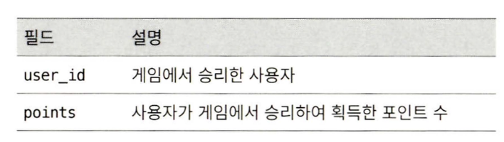

# 시스템디자인인터뷰2 - 10장 실시간 게임 순위표

# 개요 및 요구사항 분석

## 기능 요구사항

- 순위표에 상위 10명의 플레이어 표시
- 특정 사용자의 순위 표시
- 어떤 사용자 +- 4 순위 사용자 표시 (보너스-추가구현)

## 비기능 요구사항

- 점수 업데이트는 실시간 반영 필요
- 일반적인 확장성 가용성 안정성 요구

## 개략적 규모 추정

- 초당 250유저 - DAU가 골고루 있기 어려움.(게임 특성상, 따라서 평균*5)
- 사용자 점수 획득 - 2500QPS
- 상위 10명 순위표 가져오기 - 50QPS

# 개략적 설계안 제시 및 동의 구하기

## API설계

### POST /v1/scores

- 게임에서 사용자 순위 갱신
- 내부 API




### GET /v1/scores

- 순위표에서 상위 10명 플레이어 가져오기
- JSON Array 형식으로 Resp

### GET /v1/scores/{:user_id}

- 특정 사용자(user_id)의 순위를 가져옴

## 개략적 설계안


- 사용자가 게임 승리 시 → 게임 서비스에 요청 → 게임 서비스는 점수 갱신 API 호출
- 순위표 서비스는 점수 갱신, 클라에서의 순위표 및 플레이어 순위 요청 처리

### 이슈사항

- 클라 직접 접근 막기 → 클라의 악의적인 순위표 수정 차단
- 게임 서비스 - 순위표 서버 간 메세지 큐? → 기타 다른 기능 요구가 있을 시 합당한 설계.


## 데이터 모델

### 관계형 DB

- 규모 확장성이 중요하지 않고 사용자 수가 많지 않을 경우.
- 순위표 테이블을 만들어서 처리 가능


- 점수 딴 경우


```jsx
INSERT INTO leaderboard (user_id, score) VALUES ('mary1934', 1); 

UPDATE leaderboard set score=score + 1 where user_id='mary1934' ;
```

- 특정 사용자 순위 검색


```jsx
SELECT (@rownum := @rownum + 1) AS rank, user_id, score 
FROM leaderboard
ORDER BY score DESC;
```

- 레코드가 많아지면 쿼리 부담이 높음
- 매 쿼리 정렬이 필요

> SQL 데이터베이스는 지속적으로 변화하는 대량의 정보를 신속하게 처리하지 못한다. 수백만 개 레코드에 순위를 매기려면 대략 수십 초 정도가 걸리므로, 실시간성을 요구하는 애플리케이션에는 적합하지 않다. 데이터가 지속적으로 변경되기 때문에 캐시 도입도 불가능하다.
> 

### 레디스

- 메모리 기반 키-값 저장소 시스템
- **정렬 집합** 자료형 제공

### 정렬 집합

- 집합과 유사, 정렬되어 있음
- 스킵 리스트 사용


### 스킵 리스트

- 빠른 검색을 가능하게 하는 자료 구조
- 정렬된 단방향 연결 리스트에 다단계 색인을 두는 구조
- 삽입, 삭제, 검색 연산을 실행하는 시간 - O(n)


- 모든 데이터가 있는 리스트 외에, 중간 노드를 한개씩 건너뛰는 1차 색인, 그 위 한개 뛰어넘는 2차 색인… 등을 만듦
- 데이터가 많을수록 효과가 큼


### 정렬 집합을 활용한 구현

- `ZADD` : 없던 사용자 삽입 or 기존 사용자 갱신 - O(log(n))
- `ZINCRBY` : 사용자 점수를 지정된 값 만큼 증가.- O(log(n))
- `ZRANGE / ZREVRANGE` : 점수에 따라 정렬된 사용자 중 특정 범위 사용자 가져오기. - O(log(n)+m)
    - m - 가져올 항목 수
    - n - 정렬 집합의 크기
- `ZRANK / ZREVRANK` : 오름차순/내림차순 정렬하였을 때 사용자의 위치 가져오기 - O(log(n))
1. 사용자 점수 획득 : `ZINCRBY leaderboard_feb_2021 1 'maryl934'`
2. 순위표 상위 10명 조회 : `ZREVRANGE leaderboard_feb_2021 0 9 WITHSCORES`
3. 자기 순위 조회 : `ZREVRANK leaderboard_feb_2021 'mary1934’`

### 저장소 요구사항

- 저장 데이터: 사용자 ID(24바이트 문자열 가정) + 점수(16비트 정수, 2바이트) = 항목당 26바이트
- 총 필요 용량: 26바이트 × 2,500만 명 = 약 650MB
- 갱신 트래픽: 점수 갱신 연산의 최대 QPS(초당 쿼리 수) ~= 2,500

# 상세 설계

## 클라우드 서비스 사용 여부

### 자체 서비스?


- 자체 구현/개발/운영(Redis, MySQL)

### 클라우드 서비스 이용 방안

- 기존 인프라가 AWS 내 존재 가정
- API Gateway, Lambda 사용
    
    
    
1. 점수 획득 
    
    
    
2. 순위 검색
    
    
    
- 스케일링…등 신경 쓸 필요 없음. (레디스/DB는 필요)

### 레디스 규모 확장

- 데이터 샤딩 방안
    - 고정 파티션 - 순위표에 등장하는 점수의 범위에 따라 파티션을 나누는 방안
        - 순위표 전반에 점수가 고르게 분포되어야 함.
        - 순위표가 바뀌면 노드를 바꿔야 함.
    - 해시 파티션
        - 레디스 클러스터 활용.
        - 사용자의 점수가 특정 대역에 몰려있는 경우 효과적.
        - 각각의 키가 특정한 해시 슬롯에 속하도록 샤딩
        - `CRC16(key) % 16384`
        
        
        
        - 상위 10명을 가져올 경우, 각 노드별 k개 읽어와 정렬 → 고정 파티션 사용
- 레디스 크기
    - 쓰기 작업이 많은 어플리케이션은 많은 메모리가 필요
    - 장애 대비 스냅샷 - 쓰기 연산 감당 필요
    - 쓰기 연산이 많은 어플리케이션에는 메모리 두배 더 할당.

### 대안 - NoSQL

- 주 요구사항 : 쓰기 연산 최적화, 같은 파티션 내 항목을 점수에 따라 효율적으로 정렬
- DynamoDB, MongoDB, 카산드라…
- DynamoDB
    - Managed NoSQL DB
    - 기본 키 외, 속성을 활용하여 데이터를 질의하기 위해 전역 보조 색인(global secondary index) 제공
        
        
        
    - 여기서, 특정 달의 파티션이 핫 파티션이 되는 것 샤딩으로 해결 `game_name#{year-month}# p{partition_number}`
        
        
        
    - 상위 10명을 연산할때는 샤딩된 파티션별로 수집 후 정렬 필요
        
        