# 개요

> 표면적으로는 ‘전자지갑’서비스 구현에 대해 설명하고 있지만, 내부적으로는 안정적이고 신뢰성있는 트랜잭션 관리를 위한 방안을 얘기함

# 1단계. 문제 이해 및 설계 범위 확정

## 기능적 요구 사항

- 전자 지갑 간 이체
- 1,000,000 TPS
- 99.99% 안정성
- 트랜잭션
- 재현성

## 개략적 추정

- 한 개의 데이터 베이스 노드가 1,000 TPS를 처리할 수 있다면, 1000의 데이터베이스 노드가 필요
- 이체 실행 시, 한 계좌에서의 인출 + 다른 계좌에 입금 2개의 연산이 실행되어야 함.
- 총 (1,000TPS *2) ⇒ 2,000개의 노드가 필요

설계 목표 중 하나는 단일 노드가 처리할 수있는 트랜잭션 수를 늘리는 것

# 2단계. 개략적 설계안 제시 및 동의 구하기

해당 절에서는 다음 내용을 다루고 있음. (다음 설계안들은 ‘이벤트 소싱 솔루션’을 가기 위한 과정으로 이해됨)

- API 설계
- 세가지 개략적 설계안
    - 메모리 기반 솔루션
    - 데이터 베이스 기반 분산 트랜잭션 솔루션
    - 재현성을 갖춘 이벤트 소싱 (event sourcing) 솔루션

## API 설계

RESTful 규약을 따르며, 이번 장에서는 ‘이체’ 하나의 API만 구비하면 된다. 

- amount 필드의 자료형이 double이 아닐 string을 사용하지만, double이나 float도 사용 가능
    - 정밀도를 잃을 위험이 있음을 인지하고 있어야 함. (범위를 초과하는 경우)

## 인메모리 샤딩 (메모리 기반 솔루션)

- 모든 사용자 계정의 잔액을 map 또는 키-값 저장소로 관리
    - <사용자, 잔액>
- 인메모리 저장소로 Redis가 있지만, 한 대로는 TPS제한이 있기 때문에 클러스터를 구성하고 노드에 균등하게 분리 시켜야 한다.
- 키-값 데이터를 n개 파티션에 분배하기 위해, 키의 해시 값을 계산해서 파티션에 분배한다.
- 이렇게 나는 레디스 노드의 파티션 수 및 주소는 ‘주키퍼’를 이용해 저장한다.
    - 주키퍼*:설정 정보 전문 저장소
- 지갑 서비스: 명령 처리를 담당하는 서비스
    - 역할
        - 명령의 수신
        - 명령의 유효성 검증
        - 이체에 관계된 두 계정의 잔액 갱신 (두 게정은 다른 레디스 노드에 있을 수 있음)
    - Stateless (무상태) 서비스로, 수평적 규모 확장이 용이하다.

> 해당 설계의 경우 **정확성 요구사항을 충족하지 못한다**. **하나의 원자적 트랜잭션**으로 실행되지 못하며, 이로 인한 문제가 있다. (ex. A에서 돈을 인출했는데, B에 입금이 되기 전에 문제가 발생하는 경우)

## 분산 트랜잭션

### 데이터베이스 샤딩

- 서로 다른 두 저장소 노드를 갱신하는 원자적으로 수행하기 위해, 각 레디스 노드를 트랜잭션을 지원하는 관계형 데이터베이스 노드로 교체

### 2단계 커밋

- 분산 시스템에서 한 트랜잭션에는 여러 노드의 프로세스가 관여할 수 있다. 분산 트랜잭션은 이들 프로세스를 원자적인 하나의 트랜잭션으로 묶는 방안이다.
- 저수준 방안과 고수준 방안 두 가지가 존재
    - 저수준 방안: 2단계 커밋, 데이터 베이스 자체에 의존하는 방법
        - 준비, 커밋 2단계로 구성되어 있다. 그러나 준비 단계 전에 데이터베이스 트랜잭션 실행 방식을 변경해야 한다. (lock을 걸어야 함)
        - 다른 노드의 메시지를 기다리는 동안 락이 오랫동안 걸릴 수 있어서 성능이 좋지 않을 수 있다.
        - 조정자가 SPOF(Single-Point-Of-Failure)가 될 수 있다.
            - SPOF*: 시스템의 구성 요소 중 **하나가 고장 나면 시스템 전체가 멈춰버리는 구간. (**소위 말해 터지면 다 죽는다)
    - 고수준 방안: TC/C (Try-Confirm/Cancel), 두 단계로 구성된 보상 트랜잭션
        - *보상 트랜잭션: 시스템에서 이미 처리된 작업을 ‘원상복구’하기 위해 실행하는 별도의 작업
        - 조정자는 모든 데이터베이스에 필요한 자원을 ‘예약 요청한다.’
        - 조정자가 모든 데이터베이스로부터 회신을 받고, 모두 ‘예’라고  하면 확정(Confirm)을 하고 하나라도 ‘아니오’라고 하면 작업 취소(Cancel0을 요청한다.

[TC/C 그림 12.8 첨부, 12.9 첨부]

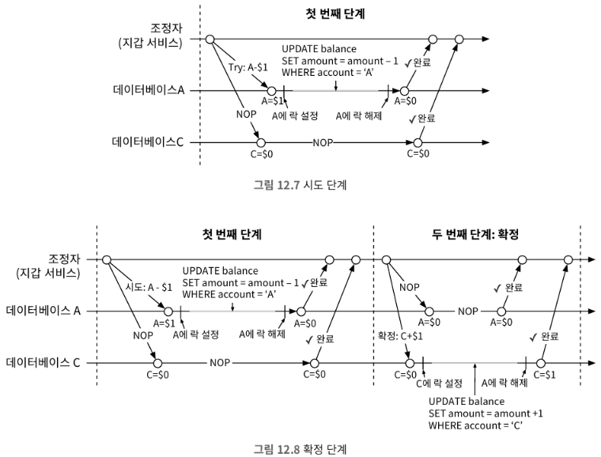

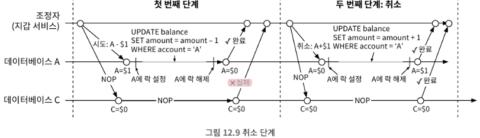

- 2PC의 두 단계는 한 트랜잭션이지만, TC/C는 각 단계가 별도 트랜잭션이다.

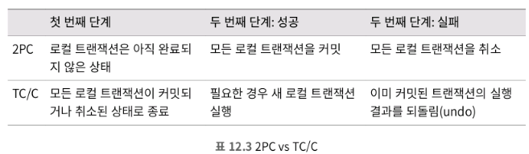

- TC/C의 장점은 특정 데이터베이스에 구애받지 않는다. TC/C의 단점은 애플리케이션 게층의 비즈니스 로직에서 세부 사항을 관리하고 분산 트랜잭션의 복잡성을 처리해야 함.

### TC/C의 단계별 상태 테이블

- TC/C 실행 도중 장애가 발생할 경우, TC/C의 진행 상황 (각 단계 상태 정보)을 트랜잭션 데이터베이스에 저장한다.
    - 최소한 포함되어야 하는 내용
    
    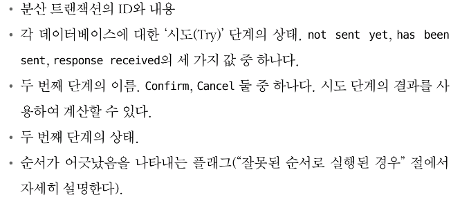
    
- 단계별 상태 테이블은 인출할 지갑의 게정이 있는 데이터베이스에 둔다.

### 불균형 상태

- 분산 트랜잭션 도중에는 항상 데이터 불일치가 발생한다. 그리고 TC/C와 같은 매커니즘을 사용하는 경우에는 이러한 불일치를 직접 처리해줘야 한다.

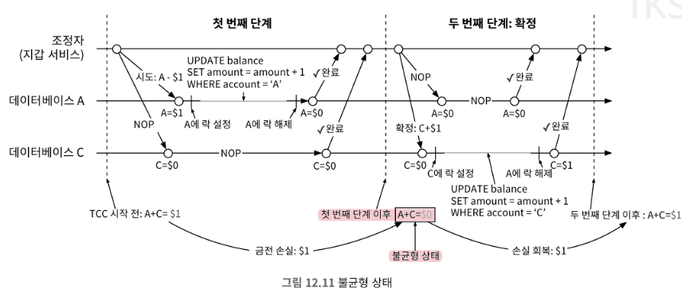

### **유효한 연산 순서**

- ‘시도’ 단계에서는 ‘차감’을 먼저 수행해야 한다. 이체를 먼저 하거나 동시에 수행하는 등의 방법은 문제가 발생할 가능성이 있다.

### 잘못된 순서로 실행할 경우

- ‘시도’ 명령 전에 ‘취소’ 명령이 먼저 들어오는 등의 순서 문제가 발생할 수 있다.
- 이는 다음 단계를 추가해 수정할 수 있다.
    - ‘취소’명령이 먼저 도착하면 시도 명령을 못 봤음을 나타내는 플래그를 ‘True’로 설정
    - ‘시도’명령이 도착하면 항상 먼저 도착한 취소 명령이 있는지 확인. 있으면 바로 실패를 반환한다.
    - ‘단계별 상태 테이블’에서 순서 관련 플래그를 설정한 이유

## 분산 트랜잭션: 사가

Saga는 유명한 분산 트랜잭션 솔루션 가운데 하나로 마이크로서비스 아키텍처에서는 사실상 표준

- 모든 연산은 순서대로 정렬
- 각 연산은 자기 DB에 독립 트랜잭션으로 실행
- 연산은 첫 번째부터 마지막까지 순차적으로 실행
- 실패 시, 실패 연산부터 처음 연산까지 역순으로 트랜잭션을 통해 롤백
- n개의 연산을 실행하는 분산 트랜잭션은, 보상 트랜잭션을 위한 n개 연산까지 총 2n개의 연산을 준비해야 한다.

연산 실행 순서를 조율하는 방법

1. 분산 조율 (Choreography): 사가 분산 트랜잭션에 관련된 모든 서비스가 다른 서비스의 이벤트를 구독하여 작업을 수행하는 방식. 완전히 탈 중앙화된 조율 방식
2. 중앙 집중형 조율 (Orchestration): 하나의 조정자가 모든 서비스가 올바른 순서로 작업을 실행하도록 조율한다. 

일반적으로는 중앙 집중형 조율 방식을 선호하는데, 복잡한 상황을 잘 처리하기 때문이다.

### TC/C vs 사가

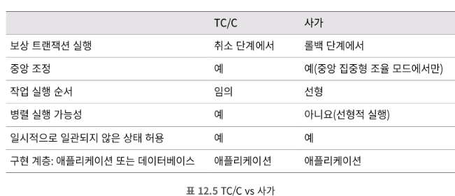

실무에서는 지연시간 요구사항에 따르다 어떤 것을 사용하는지 다르지만, 마이크로 서비스 아키텍처에서 흔히 쓰는 방법은 ‘사가’이고, 지연 시간에 민감하고 많은 서비스/운영이 관계된 시스템이라면 TC/C가 더 낫다.

> 그러나 문제의 근본 원인을 역추적하고 모든 게정에서 발생하는 연산을 감사할 수는 없다. 이를 위해 ‘이벤트 소싱’방법을 생각해내야 한다.

## 이벤트 소싱

- 전자지갑 서비스 제공 업체가 감사받을 것을 대비해서, 도메인 주도 설계(DDD)에서 개발된 기법인 ‘이벤트 소싱’이 있다.
- 이벤트 소싱의 4가지 중요한 용어
    - 명령 (Command):
        - 외부에서 전달된 의도가 명확한 요청. 순서가 매우 중요하기에, FIFO 큐에 저장된다.
        - 명령은 의도가 명확하지만 사실은 아닐 수 있다.
    - 이벤트 (Event)
        - 명령의 유효성 검사를 하고, 통과 시 명령은 반드시 이행(fulfill)되어야 한다.
        - 명령의 이행 결과를 이벤트라고 한다.
        - 이벤트는 과거 시제를 사용하며, 이벤트는 결정론적이며, 과거에 실제로 있었던 일이다.
            - 이벤트 생성 프로세스의 두가지 중요한 특성
                - 하나의 명령으로 여러 이벤트가 만들어질 수 있다. (0이상)
                - 생성 과정에는 외부 I/O 또는 난수가 개입되어, 같은 명령에 항상 동일한 이벤트가 만들어진다는 보장이 없다.
    - 상태 (State)
        - 이벤트가 적용될 때 변경되는 내용이다.
        - 보통 키-값 저장소를 사용한다.
    - 상태 기계 (State Machine)
        - 이벤트 소싱 프로세스를 구동한다.
        - 크게 다음 두 가지 기능이 있다.
            - 명령의 유효성을 검사하고 이벤트를 생성한다.
            - 이벤트를 ‘**적용**’하여 상태를 갱신한다. (이벤트 실행 아니라 적용)
        - 이벤트 소싱을 위한 상태 기계는 결정론적으로 동작해야 한다. 이벤트를 상태에 반영하는 것 또한 항상 같은 결과를 보장해야 한다.

### 지갑 서비스 예시

- 명령은 FIFO 큐에 기록하며, 이때 큐로는 카프카를 널리 사용한다.
- 상태 기계가 다섯 단계로 동작하는 방식
1. 명령 대기열에서 명령을 읽는다.
2. 데이터베이스에서 잔액 상태를 읽는다.
3. 명령의 유효성을 검사한다. 유효하면 계정별로 이벤트를 생성한다.
4. 다음 이벤트를 읽는다.
5. 데이터베이스의 잔액을 갱신하여 이벤트 적용을 마친다.

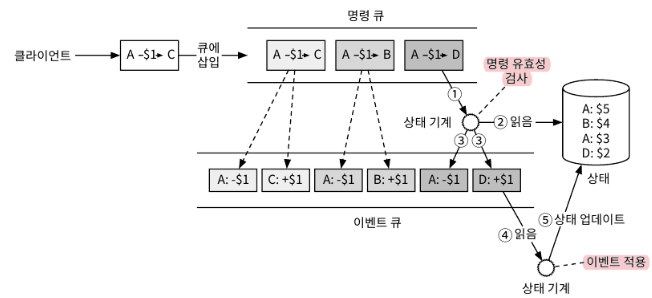

### 재현성

이벤트 소싱이 다른 아키텍처에 비해 갖는 가장 중요한 강점은 재현성이다. 

- 이벤트를 처음부터 다시 재생하면 과거 잔액 상태는 언제든 재구성 할 수 있다.
- 재현성을 갖추면 감사관이 던지는 다음 질문 들에 대해 쉽게 답할 수 있다.
    - 특정 시점의 계정 잔액
    - 과거 및 현재 계정 잔액이 정확한지 확인 방법
    - 코드 변경 후에도 시스템 로직이 올바르게 동작하는 지 증명

감사 가능 시스템이어야 한다는 요건 때문에 이벤트 소싱이 지갑 서비스 구현의 실질적인 솔루션으로 채택되는 경우가 많다.

## 명령-질의 책임 분리 (CQRS)

- 이벤트 소싱 프레임워크 외부의 클라이언트가 상태를 알도록 할 방법이 필요하다.
- 이벤트 소싱은 이벤트를 외부에 보낸다. 그리고 이벤트를 수신하는 외부 주체가 직접 상태를 재구축한다.
- 이러한 설계 철학이 ‘명령-질의 책임 분리’ (CQRS, Command-Query-Responsibility Separation)이다.
- CQRS에서는 상태 기록을 담당하는 상태 기계는 하나고, 읽기 전용 상태 기계는 여러 개 있을 수 있다.
- 읽기 전용 상태 기계는 이벤트 큐에서 다양한 상태 표현을 도출할 수 있다.
- 읽기 전용 상태 기계는 실제 상태에 어느 정도 뒤쳐질 수 있으나 결국에는 같아진다. 따라서 ‘**결과적 일관성 모델**’을 따른다고 한다.
    - 결과적 일관성 모델*: 데이터를 업데이트했을 때, 모든 사용자에게 즉시 반영되지는 않더라도 시간이 조금 지나면 결국 모두 똑같은 데이트를 보게 되는 데이터 일관성 모델 중 하나

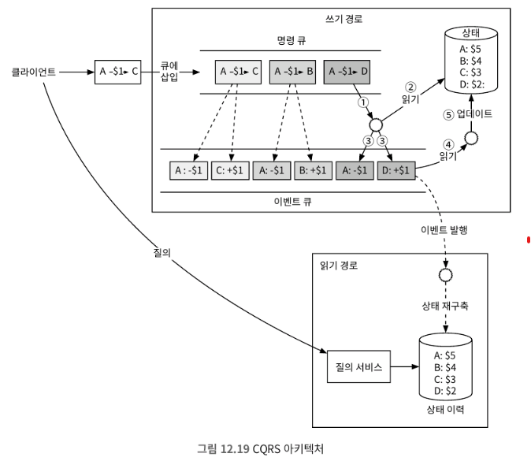

> 이벤트 소싱 아키텍처는 한 번에 하나의 이벤트만 처리하는 데다, 여러 외부 시스템과 통신해야 하기 때문에 더 빠르게 만들 필요가 있다.

# 3단계. 상세설계

높은 성능과 안정성 및 화장성을 달성하기 위한 기술

## 고성능 이벤트 소싱

이전까지는 카프카를 명령 및 이벤트 저장소로, 데이터베이스를 상태 저장소로 사용했다. 이를 최적화 할 수 있는 몇 가지 최적화 방안

### 파일 기반의 명령 및 이벤트 목록

- 명령과 이벤트를 로컬 디스크에 저장 (네트워크를 통한 전송시간 피함)
- 이벤트 목록은 추가(add) 연산만 가능한 자료구조에 저장 (순차적 쓰기 연산으로 일반적으로 매우 빠름)
- 최근 명령과 이벤트를 메모리에 캐시

구체적 구현 방법

- mmap 기술: 로컬 디스크에 쓰는 동시에 최근 데이터는 메모리에 자동으로 캐시
    - 운엥체제는 파일의 특정 부분을 메모리에 캐시하여 읽기 및 쓰기 연산 속도를 높인다.

### 파일 기반 상태

- 상태 정보도 로컬 디스크에 저장할 수 있다.
    - 파일 기반 로컬 관계형 DB인 ‘SQLite’나 로컬 파일 기반 키-값 저장소 ‘RocksDB’를 사용할 수 있다.
    - 본 설계안에서는 쓰기 작업에 최적화 된 자료 구조 LSM을 사용하는 ‘RocksDB’ 선택

### 스냅숏

- 모든 것이 파일 기반일 때, 재현 프로세스의 속도를 높이는 방법으로 ‘스냅숏’이 있다.
    - 스냅숏*: 재현성 확보 시 시간을 절약할 수 있게, 주기적으로 상태 기계를 멈추고, 현재 상태를 저장한 파일
- 스냅숏을 저장하고 나면, 스냅숏을 읽고, 어느 시점에 만들어졌는지 확인한 다음, 그 시점부터 이벤트 처리를 시작하면 된다.
- 스냅숏을 사용하면 읽기 전용 상태 기계는 해당 데이터가 포함된 스냅숏 하나만 로드하면 된다.
- 스냅숏은 거대한 이진 파일이며, 일반적으로는 HDFS와 같은 객체 저장소에 저장된다.

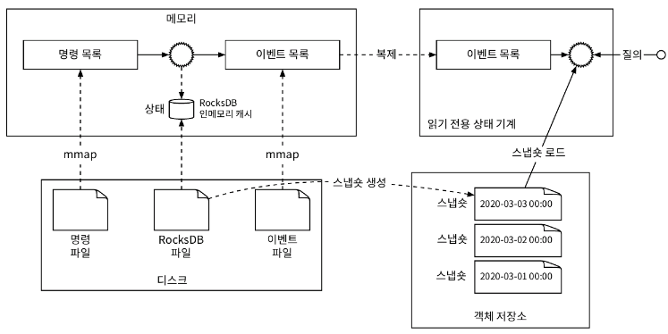

 > 로컬 디스크에 데이터를 저장하는 서버는 더 이상 stateless서버가 아니며, 단일 장애 지점이 된다는 문제가 있지 않은가? 어떻게 안정을 개선할 수 있을까?

## 신뢰할 수 있는 고성능 이벤트 소싱

### 신뢰성 분석

- 신뢰성 분석에서 서버 노드가 하는 일은 데이터와 연산이라는 두 가지 개념에 관계되어 있지만, 데이터 내구성이 보장되는 한 계산 결과는 코드를 다른 노드에서 돌리면 복구할 수 있다. 즉, 데이터의 신뢰성이 훨씬 중요하다는 것이다.
- 그리고 파일 기반 이벤트 소싱 시스템에서 높은 신뢰성을 보장할 수 있는 데이터는 ‘이벤트’ 데이터이다.

### 합의

- 높은 안정성을 제공하기 위해, 이벤트 목록을 여러 노드에 복제해야 한다.
- ‘데이터 손실 없음, 데이터의 상대적 순서가 모든 노드에 동일해야 한다’는 목표를 달성하기 위해, ‘합의 기반 복제 방안’이 적합하다.
- 모든 노드가 동일한 이벤트 목록에 합의하도록 보장하며, ‘래프트 (RAFT) 알고리즘’이 그 예이다.
    - 래프트 (RAFT) 알고리즘: 노드의 절반 이상이 온라인 상태면 그 모두에 보관된 추가 전용 리스트는 같은 데이털르 가진다.
    - 래프트 알고리즘에서 노드는 ‘리더, 후보, 팔로어’의 역할을 가질 수 있으며, 최대 하나의 노드만 클러스터의 리더가 되고 나머지는 팔로어가 된다.
- 래프트 알고리즘을 사용하면 과반수 노드가 작동하는 한 시스템은 안정적이다.

### 고신뢰성 솔루션

복제 매커니즘을 활용하면 파일 기반 이벤트 소싱 아키텍처에서 단일 장애 지점 문제를 없앨 수 있다.

- 리더는 외부 사용자로부터 들어오는 명령 요청을 받아 이벤트로 변환하고 로컬 이벤트 목록에 추가
- 새로운 이벤트를 모든 팔로어에 복제한다.
- 리더에 장애가 발생 시, 나머지 정상 노드 중에서 새 리더를 선출한다.

 > 시스템 안정성과 내결함성 향상 이후, 100만 TPS를 처리하기 위해 시스템의 확정성을 고려해야 한다.

## 분산 이벤트 소싱

이제는 시스템의 확장성을 위해 두 가지 문제를 해결해야 한다.

1. 전자 지갑 업데이트 결과를 즉시 받고 싶지만, CQRS 시스템에서는 요청/응답 흐름이 느릴 수 있다. 
    1. 클라이언트가 디지털 지갑의 업데이트 시점을 정확히 알 수 없어서, 주기적 폴링에 의존
2. 단일 래프트 그룹의 용량은 제한되어 있기에, 일정 규모 이상에서는 데이터를 샤딩하고 분산 트랜잭션을 구현해야 한다.

### 풀 vs 푸시;

- 풀: 외부 사용자가 읽기 전용 상태 기계에서 주기적으로 실행 상태를 읽는다.
- 역방향 프록시 (Pull): 외부 사용자는 역방향 프록시에 명령을 보내고, 역방향 프록시는 명령을 이벤트 소싱 노드로 전달하는 한편 주기적으로 실행상태를 질의
- 읽기 전용 상태 기계 - 역방향 프록시 (Push):  읽기 전용 상태 기계가 이벤트를 수신하자마자 실행 상태를 역방향 프락시에 Push하도록 한다.
    - 이 경우, 사용자에게 실시간으로 응답이 이루어지는 느낌을 줄 수 있다.

## 분산 트랜잭션

모든 이벤트 소싱 노드 그룹이 동기적 실행 모델을 채택하면, TC/C나 사가와 같은 분산 트랜잭션 솔루션을 재사용할 수 있다. (다음은 키의 해시 값을 2로 나누어 데이터가 위치할 파티션을 정했다고 가정한 최종 설계안)

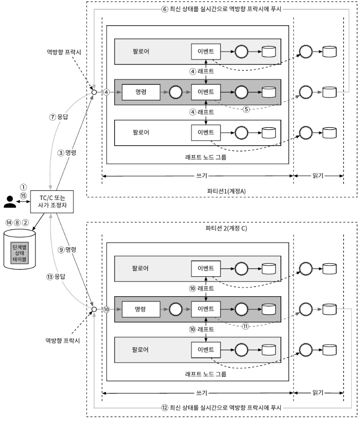

# 4단계. 마무리

초당 100만 건 이상의 결제 명령을 처리할 수 있는 지갑 서비스 걸계 방법에 대해 알아봤다.

1. 첫 번째 설계: 인 메모리 키-값 저장소 설계 → 데이터가 내구성이 없음
2. 두 번쨰 설계: 트랜잭션 데이터베이스 설계 → 데이터 감사가 어려움
3. 세 번쨰 설계: 이벤트 소싱 방안 → 앞선 요구조건이 충족되었으나, 성능이 좋지 않은 문제
4. 네 번째 보완: 데이터를 로컬 파일 시스템에 저장해서 성능 개선
5. 다섯 번째 보완: 래프트 합의 알고리즘으로 이벤트 목록을 여러 노드에 복제
6. 마지막 보완: 
    1. 이벤트 소싱에 CQRS 개념을 도입
    2. 외부 사용자에게 비동기 이벤트 소싱을 동기식으로 제공하기 위해 역방향 프락시 추가
    3. TC/C나 사가 프로토콜을 사용해 여러 노드의 명령 실행을 조율

# 요약

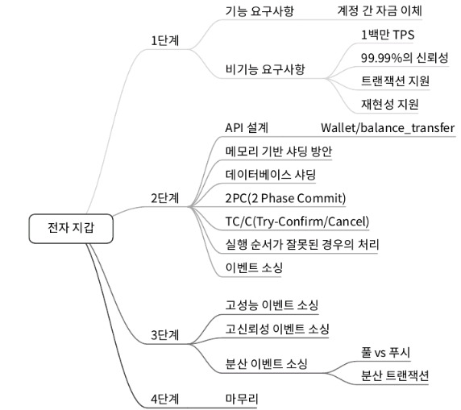