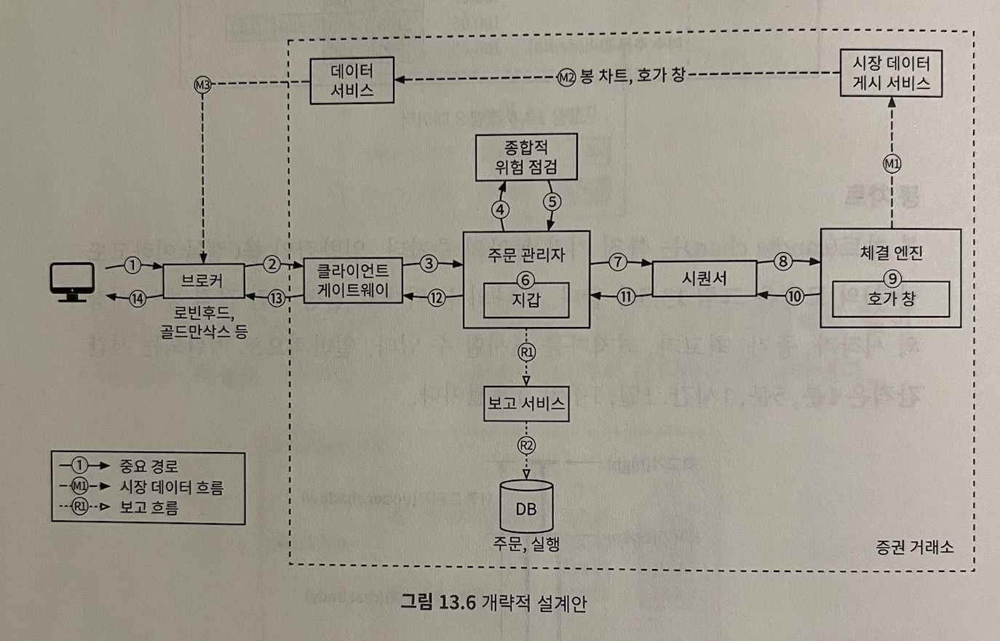
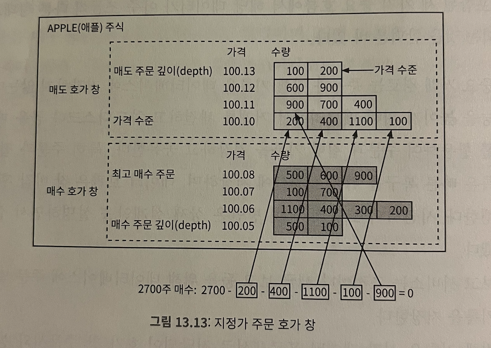
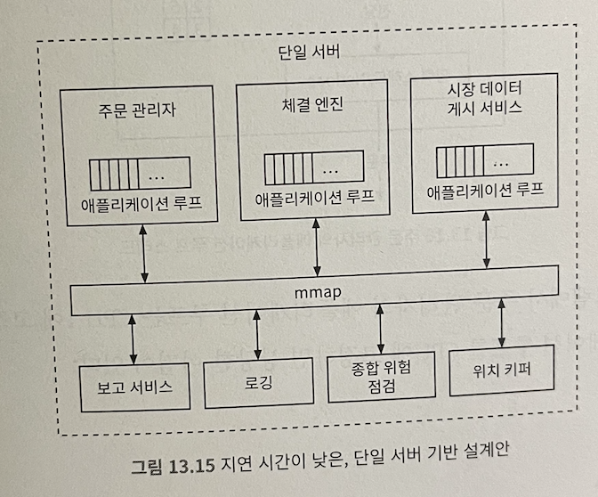
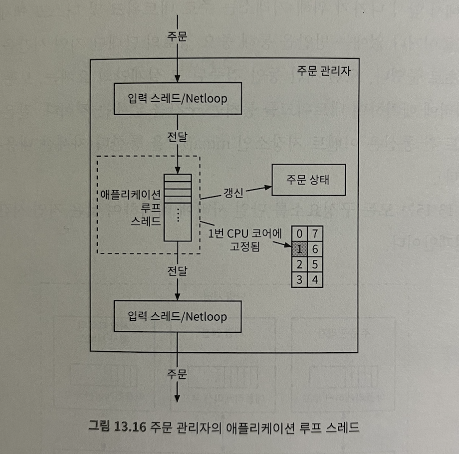
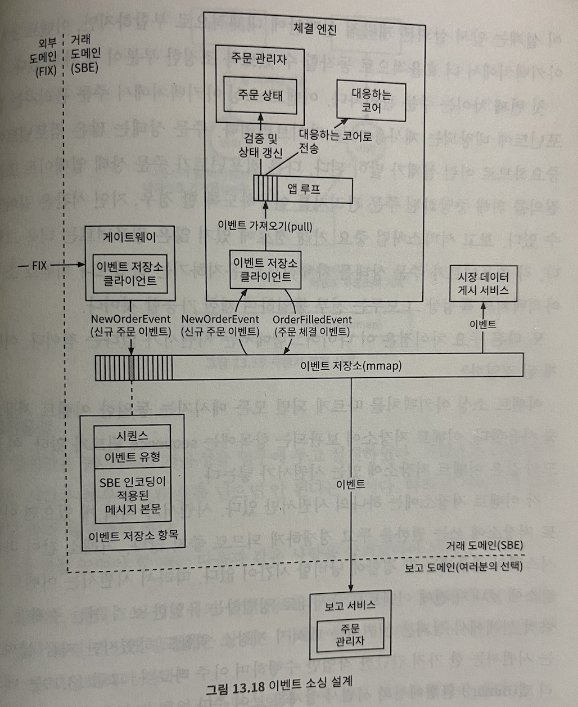

# 13장 증권 거래소

- 요구사항: 가용성, 결함 내성, 지연 시간, 보안

## 증권 거래 101

- 브로커: 사용자 인터페이스 제공
- 기관 고객
- 주문: 지정가 주문, 시장가 주문
- 시장 데이터 수준: L1, L2, L3
- 봉 차트
- FIX(Financial Information Exchange Protocol)

## 개략적 설계안

- 거래 흐름: 하나의 주문이 어떤 절차로 처리되는지?
- 시장 데이터 흐름: 하나의 주문이 체결 엔진부터 데이터 서비스를 거쳐 브로커로 전달되어 집행되기까지의 과정
- 보고 흐름: 주문 및 실행 기록에서 보고에 필요한 모든 데이터를 데이터베이스에 기록

## 거래 흐름

### 체결 엔진(교차 엔진)

- 주문서/호가 창 유지 관리
- 매수/매도 주문 연결
- 집행 기록 스트림을 시장 데이터로 배포

### 시퀀서

- 체결 엔진에 주문 전달하기 전에 순서 id 붙여 보낸다
- 체결 엔진이 처리를 끝낸 모든 집행 기록 쌍에도 순서 id 붙인다
- 입력 시퀀서, 출력 시퀀서 모두 고유 순서 유지
- 순서 id 찍는 이유? 시의성/공정성, 빠른 복구 및 재생, 정확한 1회 실행 보증 + 메시지 큐 역할

### 주문 관리자

- 한 쪽에서 주문 받고 다른 쪽에서 집행 기록 받음, 주문 상태 관리
  - 위험성 검토
  - 사용자 지갑에 거래를 처리하기에 충분한 자금이 있는지 확인
  - 시퀀서에 주문 전달
- 체결 엔진으로부터 집행 기록 받음 - 브로커에 반환
- 빠르고 효율적이고 정확해야

### 클라이언트 게이트웨이

- 거래소 문지기
- 클라이언트로부터 주문 받아 주문 관리자에게 보낸다
- 지연 시간에 민감, 가벼우면서 빠르게 올바른 목적지로 주문을 전달해야
- 어떤 기능을 클라이언트 게이트웨이에 넣을지? 복잡한 기능이라면 체결 엔진 또는 위험 점검 컴포넌트에 맡겨야

- 코로케이션: 브로커가 거래소 데이터 센터에서 임대한 서비스 일부에서 실행하는 거래엔진 소프트웨어
  - 매우 낮은 지연 시간 요구 

### 시장 데이터 흐름

- 체결 엔진에서 집행 기록 수신, 집행 기록 스트림에서 호가 창과 봉 차트 그림
- 시장 데이터: 호가 창 + 봉 차트

### 보고 흐름

- 거래 이력, 세금 보고, 규정 준수 여부 보고, 결산
- 효율성, 짧은 지연 시간 < 정확성, 규정 준수 요구

### API 설계

- 주문, 체결 조회, 시장 데이터 조회, 분석을 위한 과거 데이터 다운로드

### 데이터 모델

- 상품: 자주 변경되지 않으므로 아무 데이터베이스에 저장 가능하며 캐싱 대상
- 주문: 매수/매도 실행 명령어, 메모리에 저장
- 집행 기록(충족): 체결이 이루어진 결과, 메모리에 저장

- 호가 창: 가격 수준 별로 정리, 빠른 업데이트 요구, 이중 연결 리스트 사용

- 봉 차트: 많은 종목의 가격 이력을 다양한 시간 간격 사용해 추적할 시 메모리를 많이 잡아먹음
  - 미리 메모리를 할당해 둔 링 버퍼에 봉 보관: 새 객체 할당 횟수 줄일 수 있다
  - 메모리에 두는 봉 개수 제한: 나머지는 디스크에 보관
  - 시장 데이터: 실시간 분석을 위해 메모리 상주 칼럼형 데이터베이스에 둔다

## 성능

### 지연 시간 줄이기

1. 중요 경로에서 실행할 작업 수 줄이기
2. 각 작업의 소요 시간 줄이기: 네트워크 및 디스크 사용량 경감, 각 작업의 실행 시간 경감
  - 모든 구성요소를 단일 서버로 배치: 네트워크 통하는 구간 없애기

#### 애플리케이션 루프 작업 실행 메커니즘

- while 순환문으로 실행 작업을 계속 폴링(polling)한다
  - 각 구성 요소의 실행 시간 줄여 전체 실행 시간(p99 지연 시간 낮춰) 예측 가능하도록 보장한다
  - CPU 효율성 극대화: 애플리케이션 루프를 단일 스레드로 구현, 특정 CPU 코어에 고정
  - 장점: 컨텍스트 스위치 없음, 락을 사용하지 않아도 된다
  - 단점: 스레드를 오래 점거하지 않도록 코딩이 복잡해짐

- mmap: POSIX 호환 UNIX 시스템 콜
  - 프로세스 간 고성능 메모리 공유 메커니즘 제공
  - 메모리에 매핑할 파일이 /dev/sm에 있을 때 디스크 I/O가 발생하지 않아 성능 이점이 더 커진다

#### 이벤트 소싱

- 현재 상태를 저장하는 대신 상태를 변경하는 모든 이벤트의 변경 불가능한 로그를 유지한다
- 주문 상태를 변경하는 모든 이벤트 추적: 모든 이벤트를 순서대로 재생하면 주문 상태 복구할 수 있다

#### 고가용성

- 주 인스턴스 다중화: 거래소 아키텍처의 단일 장애지점 식별
- 장애 감지 및 백업 인스턴스로의 장애 조치 결정이 빨라야 한다
  - 이벤트 저장소 데이터를 사용해 모든 상태 복구

#### 결험 내성

- 수동으로 장애 복구 조치 수행
  - 카오스 엔지니어링: 의도적으로 장애 주입하여 서비스 성능 개선
- 우선 순위에 따라 서비스 분류, 최소 서비스 수준 유지하기 위한 성능 저하 전략 정의해야 한다
- 데이터 손실이 허용될 수 있는 범위 파악

#### 체결 알고리즘

- FIFO 알고리즘 사용: 특정 가격 수준에서 먼저 들어온 주문이 먼저 체결, 마지막 주문이 나중에 체결

#### 결정론

- 기능적 결정론: 이벤트를 동일한 순서로 재생하면 항상 같은 결과 얻을 수 있도록 보장한다
  - 시퀀서, 이벤트 소싱 아키텍처 도입
  - 이벤트가 발생하는 실제 시간은 중요하지 않다
- 지연 시간 결정론: 각 거리 처리 시간이 거의 같다
  - 모든 거래에 안정적인 성능을 제공한다

#### 시장 데이터 게시 서비스 최적화

- 시장 데이터 게시 서비스: 체결 엔진의 체결 과과결고를 받아 호가 창/봉 차트 재구축하여 구독자에게 해당 데이터 게시
- 링 버퍼(원형 버퍼) 활용: 앞과 끝이 연결된 고정 크기 큐
  - 생산자는 데이터를 계속 넣고 소비자는 데이터를 꺼낸다
  - 링 버퍼의 공간은 사전에 할당: 객체 생성/삭제 연산은 필요하지 않다, 락 사용하지 않음

#### 시장 데이터의 공정한 배포

- 모든 수신자가 동시에 시장 데이터를 받을 수 있도록 보장해야한다
- 안정적 UDP를 사용하는 멀티캐스트: 한 번에 많은 참가자에게 업데이트를 하기 좋다
  - 유니캐스트: 하나의 출처에서 하나의 목적지로만 보내는 전송 프로토콜
  - 브로드캐스트: 하나의 출처에서 전체 하위 네트워크로 보낸다
  - 멀티캐스트: 하나의 출처에서 다양한 하위 네트워크상의 호스트로 보내는 방식, 보편적으로 사용

#### 코로케이션

- 헤지 펀드, 브로커 서버를 거래소와 같은 데이터 센터에 둘 수 있도록 한다
- 체결 엔진에 주문을 넣는 지연 시간 - 전송 경로 길이에 비례

#### 네트워크 보안

- 공개 서비스/데이터를 비공개 서비스에서 분리, 읽기 전용 사본 여러개 만들어 문제 격리
- 자주 업데이트되지 않는 데이터는 캐싱
- URL 강화
- 허용/차단 리스트 메커니즘 사용
- 처리율 제한 기능 활용