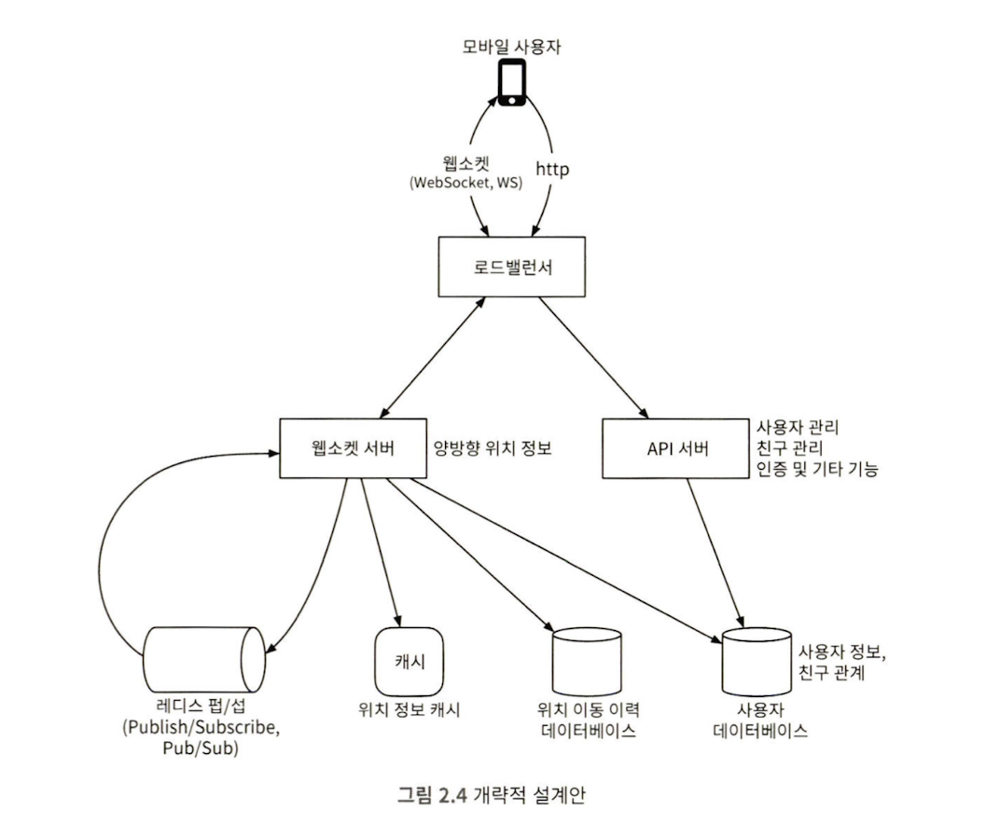
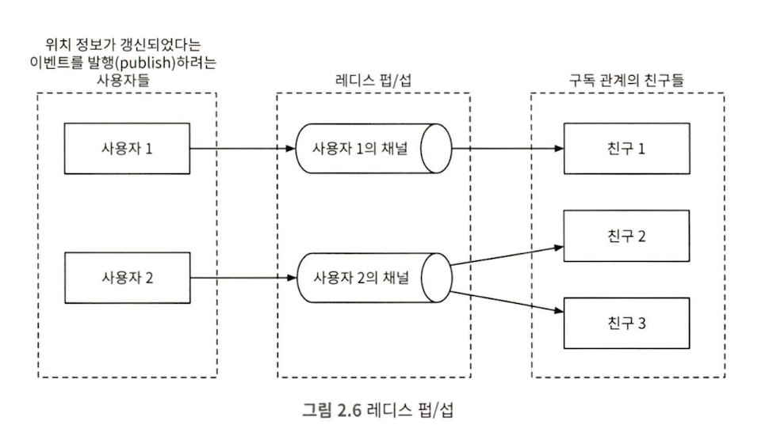

# 시스템디자인인터뷰2 - 2장: 주변 친구

Created: November 23, 2025 6:31 PM

# 문제 이해 및 설계 범위 확정

- “주변에 있다” - 5마일, 설정 변경 가능
    - 직선 거리 기준
- 유저 10억명, 그 중 10%가 기능 사용
- 사용자의 이동 이력 보관
- 10분 이상 비활성화시 주변 친구 목록에서 사라짐
- 각국 규제 감안 X(GDPR, CCPA)

## 기능 요구사항

- 모바일 앱에서 주변 친구 확인
    - 해당 친구까지의 거리, 데이터 마지막 업데이트 시점,
    - 몇 초 마다 갱신

## 비기능 요구사항

- 낮은 지연시간
- 안정성
- 결과적 일관성
    - 복제본의 데이터가 원본과 동일하게 변경되기까지 몇 초 용인

## 개략적 규모 추정

- “주변 친구” - 5마일 이내
- 친구 위치 정보 - 30초 주기 갱신
- 매일 기능 사용자 - 1억명으로 가정
- 동시 접속 사용자 - 일간 사용자의 10% 가정 → 천만명이 동시에 시스템 사용
- 평균적으로 한 사용자는 400명의 친구를 가짐
- 페이지당 20명의 주변 친구, 요청시 더 많은 친구 보여줌

<aside>
💡

QPS 계산

- 1억 DAU
- 동접: 10% * 1억 = 천만
- 30초마다 자기 위치를 시스템에 전송
- QPS → 천만/30 ~= 334,000
</aside>

# 개락저 설계안 제시 및 동의 구하기

## 개략적 설계안

P2P로도 구현 자체는 가능 → 비효율적

**공통 백엔드를 가지는 구조로 구성.**

- 모든 활성 상태 사용자의 위치 변화 내역 수신
- 사용자 위치 변경 내역 수신 때마다 해당 사용자의 모든 활성 상태 친구를  찾아 전달
    - 두 사용자 사이 거리가 임계치보다 멀 경우 전송 X

### 설계안

- API 서버: RESTful, Stateless로 구축
- 웹소켓 서버
    - 각 클라이언트 ↔ 특정 웹 소켓 서버와 지속적으로 연결 유지
- 레디스 위치 정보 캐시
    - 활성 상태 사용자의 가장 최근 위치 정보 캐시하는데 사용
    - 레디스 내 TTL 필드를 활용, 비활성화 기능 구현
- 사용자 DB
- 위치 이동 이력 DB
- 레디스 pub/sub 서버
    - 레디스 내 경량 메세지 큐 사용
        
        
        

### 주기적 위치 갱신시 Flow

1. 클라이언트가 위치 변경 사실 LB에 전송
2. LB가 웹 소켓 서버로 전송
3. 웹 소켓 서버는 위치 이동 DB에 기록
4. 위치 정보 캐시 업데이트
5. 위치 변경 사실을 PUB
6. SUB 되어있는 채널(활성화 친구)에서 수신
7. 메세지 받은 웹소켓 서버는 새 위치를 보낸 사용자와 메세지를 받은 사용자 간 거리 계산
8. 거리 < 검색 반경일 경우 메세지를 받은 사용자에 전송 

→ 한 사용자당 평균 400의 친구, 그 가운데 대략 10%가 활성화 유저

→ 한 사용자의 위치가 바뀔 때 위치 정보 전송은 대략 40건 발생

### API 설계

- 웹 소켓
    - [서버] 주기적인 위치 정보 갱신
        - 요청: 클라가 위치 정보 및 시간 전송
        - 응답: -
    - [클라] 갱신된 친구 위치 수신
        - 전송되는 데이트: 친구 위치 데이터, 타임스탬프
    - [서버] 웹 소켓 초기화
        - 요청: 클라가 위치 정보 및 시간 전송
        - 응답: 자기 친구들의 위치 데이터 수신
    - [클라] 새 친구 구독
        - 요청: 웹소켓 서버가 친구 ID 전송
        - 응답: 가장 최근의 위치정보 및 타임스탬프
    - [클라] 구독 해지
        - 요청: 웹 소켓 서버가 친구 ID 전송
        - 응답: -

### 데이터 모델

- 위치 정보 캐시
    - K-V: 사용자ID - (위도, 경도, 시각)
    - → DB보다 레디스가 목적에 부합(빠른 속도, TTL, 영속성 보장 필요 X)
- 위치 이동 이력 DB
    - 스키마
        
        
        | user_id | latitude | longitude | timestamp |
        | --- | --- | --- | --- |
    - 높은 쓰기 부하, 수평적 규모 확장 가능 DB → 카산드라

# 상세 설계

## 구성요소별 규모 확장성

- API 서버 → 무상태 서버의 확장은 상대적으로 쉬움
- 웹소켓 서버
    - 유상태 서버, 노드 제거시 기존 연결 종료할 수 있도록 LB와 관련 설계 필요

### 클라이언트 초기화

- 로직
    1. 캐시에 보관된 사용자 위치 갱신
    2. 핸들러 내에 위치 저장
    3. 사용자 DB에 사용자의 친구 정보 FETCH
    4. 위치 정보 캐시에 친구 위치 FETCH
    5. 친구와 사용자의 거리 확인,  검색 반경 이내이면 클라이언트에 반환
    6. 각 친구의 레디스 서버 PUB/SUB 채널 구독
    7. 사용자의 현재 위치를 PUB/SUB 채널에 전송

### 사용자 DB

- 하나의 DB 로 처리할 수 없음
- 사용자 ID 로 샤딩, 필요한 경우 사용자 및 친구 데이터를 관리하는 팀/서비스와 연동

### 위치 정보 캐시

- 위치 정보 캐시에 TTL이 있음 → 데이터는 일정 수준 이하로 유지
- 최빈시 천만 명의 사용자가 활성화, 위치 정보 보관에 100바이트
    - → nGB 의 레디스 서버 한대로 저장 가능
    - 최빈시 요청수…? → 부담스러울 수 있음
    - → 사용자 ID 기준 샤딩

### 레디스 PUB/SUB 서버

- 새 채널 생성 → 구독하려는 채널이 없는 경우 발생
- 구독자가 없을 경우 메세지는 버려짐, 부하 거의 없음
- 필요 서버 수?
    - 메모리 사용량
        - 모든 사용자들에 채널 하나씩 → 1억개
        - 한 사용자의 활성화 상태 친구중 100명이 사용, 한 명을 추적하기 위해 20바이트
        - → 모든 채널 저장 위해서 200GB(1억 * 20바이트 * 100명) 필요
        - → 100GB레디스 서버 2대
        - → cache.m7g.8xlarge ($3/hr)
            
            
            
    - CPU 사용량
        - 초당 1400만 건 처리?
        - 기가비트 네트워크 카드 탑재 모던 아키텍처 서버 1대 처리량 100,000 가정 → 140대 필요.
        - 레디스 PUB/SUB 서버의 병목은 메모리가 아니라 CPU 사용량.

### 분산 레디스 PUB/SUB 클러스터

→ 채널은 모두 독립적. 발생 사용자(채널) ID를 기준으로 샤딩

- 서비스 탐색 컴포너트를 도입, 수많은 노드의 정보를 관리
    1. 가용한 서버 목록을 유지, 해당 목록 갱신(예시 key-value: pub_sub_ring - [”p_1”, “p_2”, “p_3”…])
    2. 클라이언트(웹소켓 서버)로 하여금 “value”값이 변경될때 구독할 수 있도록 하는 기능
- Value: 활성 상태의 모든 레디스 pub/sub 해시 링 보관

- 웹소켓 서버는 해시 링에서 업데이트 발행할 채널이 있는 레디스 노드를 확인 → 위치 정보 업데이트 발행

### 레디스 PUB/SUB 규모 확장시 고려사항

- PUB/SUB에 전송되는 메세지는 보관X, 채널 구독자에 전송되면 바로 삭제됨 → 데이터는 무상태
- 채널의 구독자 목록은 노드에 보관되어 있음, 노드가 변경될 경우 새 노드로 구독자 목록 이전 및 구독자에 노드 변경 사실 알려야 함 → PUB/SUB 서버 자체는 유상태
- → 여유 두고 넉넉하게 프로비저닝 하는게 좋음
- 클러스터 크기 조정시 많은 채널이 해시 링 위의 새로운 노드로 이전됨
    - 재구독 요청 피크 발생, 해당 시점 위치 정보 누락 가능성
- 링 사이즈 조정 단계
    1. 새로운 링 크기 계산
    2. 해시 링 키에 달려있는 값을 갱신
    3. 대시보드 모니터링
- 운영시 노드 교체 → 해시 링 키 값 갱신, 웹소켓 서버에 통지, 재구독 이벤트 발생

### 친구 추가/삭제

- 친구 추가/삭제 시 클라에 연결된 웹소켓 서버에 알려야 함.
- 친구 추가/삭제 시 콜백을 추가해 활용 가능

### 친구가 많은 사용자

- 친구 수 상한 가정.
- 수천명의 친구가 있어도 친구들의 채널은 해시 링 안에 분포되어 있음
    - 한 노드에 몰리는 것 가정 안해도 됨.

### 주변의 임의 사용자

- 지오해시별 PUB/SUB 채널 생성
    
    
    
- 사용자 위치 변경시, 웹소켓 서버가 해당 위치에 지오해시 채널에 PUB
    - → 특정 위치의 사용자 알고싶은 경우, 지오해시 채널 SUB
    - 주변 지오해시까지 구독하면 경계에 있는 유저들까지 확인 가능

### 레디스 PUB/SUB 대안

- 얼랭
    - 분산 병렬 어플리케이션을 위한 언어/런타임
    - 얼랭 프로세스 생성 비용은 리눅스 프로세스에 비해 아주 저렴
    - → 유저와 프로세스 1:1 모델링 가능, 비용 저렴
    - 웹소켓 서비르를 얼랭으로 구현, Pub/SUB 클러스터를 분산 얼랭 어플리케이션으로 대체 가능.