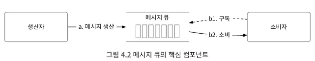
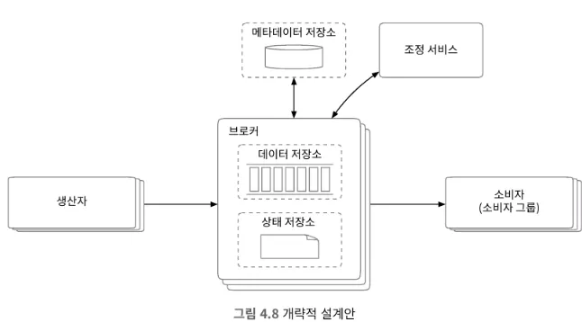
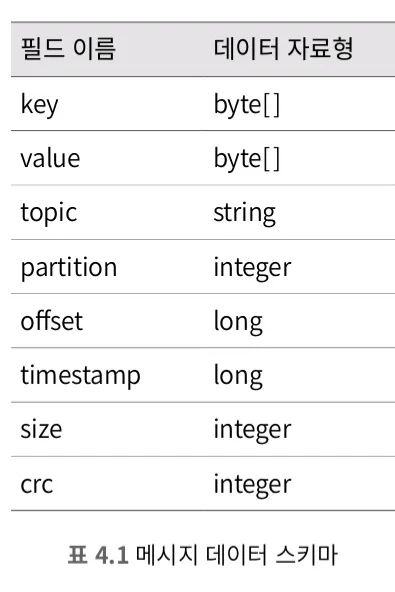
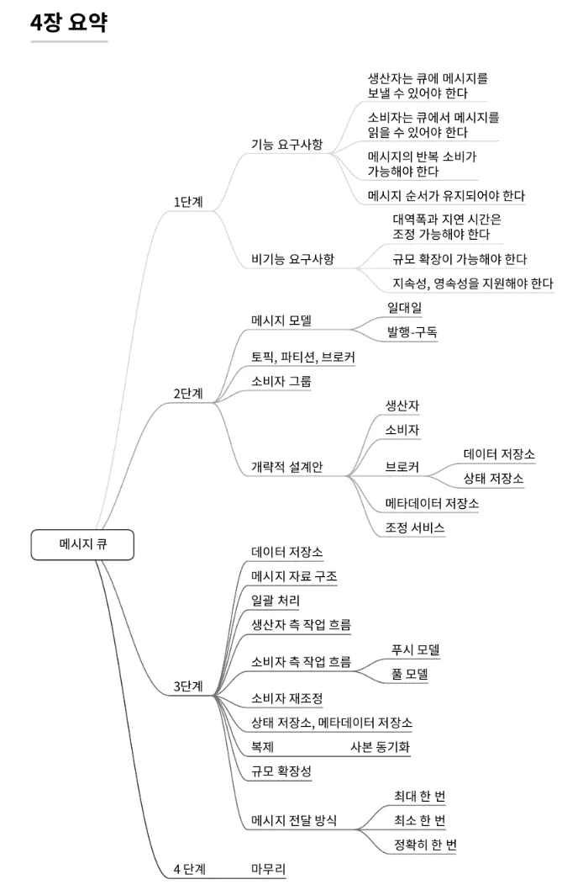

# 개요

- **분산 메시지 큐**
    - 현대적 소프트웨어 아키텍처를 따르는 시스템은 작고 독립적인 블록들로 구성되며, 이러한 블록 사이의 통신과 조율을 담당
- 분산 메시지 큐 사용 시 이점
    - **결합도 완화**: 컴포넌트 사이 강한 결합이 사라져, 각각 독립적 갱신 가능
    - **규모 확장성 개선**: 생산자와 소비자 시스템 규모를 트래픽 부하에 맞게 독립적으로 늘릴 수 있음
    - **가용성 개선**: 컴포넌트 간 장애 전달 없음
    - **성능 개선**: 용이한 비동기 통신
- 메시지 큐 vs 이벤트 스트리밍 플랫폼
    - 이벤트 스트리밍 플랫폼: 카프카, 펄사
    - 메시지 큐: RabbitMQ, RocketMQ  등

# 문제 이해 및 설계 범위 확정

메시지 큐의 기본 기능: **생산자**는 메시지를 큐에 보내고, **소비자**는 큐에서 메시지를 꺼냄

확장 및 고려 기능: 성능, 메시지 전달방식, 데이터 보관 기간 등

## 질문을 통한 요구사항

- 메시지의 형태 → 텍스트만
- 메시지 반복 소비 → 가능 (부가기능)
- 순서 보장 → 필요 (부가기능)
- 지속성 보장 → 2주 (부가 기능)
- 생산자와 소비자 수 → 다다익선
- 메시지 전달방식 → 최소 한 번 (필수), 다른 기능 선택 가능 (부가기능)
- 대역폭과 엔드투엔드 지연 시간 → 높은 수준의 대역폭과 낮은 전송 지연 필수

### 전통적 메시지 큐

위 요구 사항에 해당하는 큐 서비스는 전통적인 큐 서비스(RabbitMQ)와는 다르다.

- 메시지가 소비자에 전달 되끼까지 충분한 기간 동안만 메모리에 보관한다.
- 메시지 전달 순서가 보존되지 않는다.
- 생산 순서와 소비되는 순서가 다를 수 있다.

# 개략적 설계안 제시 및 동의 구하기

## 메시지 모델

위 설계안에 해당되는 방법은 두 가지 방법으로 모두 구현이 가능하다.

- 일대일 모델: 큐에 전송된 메시지는 오직 한 소비자만 가져갈 수 있다.
    - 설계안 대로 설계 시 ‘소비자 그룹’을 통해 지원
- 발행-구독 모델 (Pub-Sub): ‘토픽’이라는 새로운 개념을 도입해서, 해당 토픽을 구독하는 모든 소비자에게 전달한다.
    - 토픽: 메시지를 ‘토픽’에 보관한다.
    - 파티션: 토픽의 양이 커질 때, 샤딩 기법으로 토픽을 ‘파티션’으로 분리한다. FIFO 큐처럼 동작하며, 같은 파티션 안에서 순서가 유지된다. 메시지의 위치는 ‘오프셋’
    - 브로커: 파티션을 유지하는 서버는 ‘브로커’라고 부른다.
        
        
        

**클라이언트**

- **생산자:** 메시지를 특정 토픽으로 보낸다.
- **소비자 그룹:** 토픽을 구독하고 메시지를 소비한다.

**핵심 서비스 및 저장소**

- **브로커:** 파티션들을 유지한다. 하나의 파티션은 특정 토픽에 대한 메시지의 부분 집합을 유지한다.
- **저장소**
    - 데이터 저장소: 메시지는 파티션 내 데이터 저장소에 보관된다.
    - 상태 저장소: 소비자 상태는 이 저장소에 유지된다.
    - 메타데이터 저장소: 토픽 설정, 토픽 속성(property) 등은 이 저장소에 유지된다.
- **조정 서비스(coordination service)**
    - 서비스 탐색(service discovery): 어떤 브로커가 살아있는지 알려준다.
    - 리더 선출(leader election): 브로커 가운데 하나는 컨트롤러 역할을 담당해야 하며, 한 클러스터에는 반드시 활성 상태 컨트롤러가 하나 있어야 한다. 이 컨트롤러가 파티션 배치를 책임진다.
    - 아파치 주키퍼(Apache ZooKeeper)나 etcd가 보통 컨트롤러 선출을 담당하는 컴포넌트로 널리 이용된다.

# 상세 설계

장기 보관 요구사항 및 높은 대역폭 제공을 위해 세가지 중요한 결정

- **디스크 기반 자료구조** 활용
- **메시지 자료 구조**를 설계하고 활용
- **일괄처리** 우선 시스템 설계

## 데이터 저장소

- 메시지 큐의 트래픽 패턴*으로 인해, 쓰기 우선 로그(WAL) 사용
    - 트래픽 패턴*: 읽기와 쓰기가 빈번하게 발생한다. 갱신/삭제 연산은 발생하지 않는다.
- 쓰기 우선 로그 (WAL): 새로운 항목이 추가되기만 하는 일반 파일
    - 장점1) 지속성을 보장해야 하는 메시지에 추천
    - 장점2) 오프셋은 점진적으로 증가하며, 파티션 꼬리에 추가되어 접근이 빠르다.
    - 장점3) 보관 기한이 만료되거나 용량 한계에 도달 시 삭제 가능, 활성화 된 세그먼트에만 메시지 추가

## 메시지 자료 구조

- 높은 대역폭 달성을 위해 메시지 자료 구조 설정이 필요하며, 이는 메시지 자료 구조의 스키마 사례이다.

## 일괄 처리

메시지 큐 안에서 메시지 일괄 처리를 위해 무슨 일을 하는 지, 성능 개선에 중요한 이유

- **네트워크 왕복 비용 제거**: 여러 메시지를 한 번의 네트워크 요청으로 전송
- **높은 디스크 접근 대역폭 달성 가능**: 여러 메시지를 한 번에 기록하면, 디스크 캐시에서 더 큰 규모의 연속 공간 점유 가능

## 작업 흐름

### 생산자 측 작업 흐름

- 라우팅 계층과 버퍼
    - 라우팅 계층: 적절한 브로커에 메시지를 보내는 역할
    - 버퍼: 전송할 메시지를 보관했다가 목적지로 일괄 전송해 대역폭을 높일 목적

### 소비자 측 작업 흐름

- 푸시 vs 풀
    - 푸시모델: 브로커가 데이터를 소비자에게 보낸다.
    - 풀 모델: 소비자가 브로커로부터 가져온다.
- 대부분의 메시지 큐는 ‘풀 모델’을 지원한다.
    - 장점1) 메시지를 소비하는 속도는 소비자가 결정
    - 장점2) 메시지를 소비하는 속도가 생산 속도보다 느리면, 소비자를 늘려 해결할 수 있다.
    - 장점3) 일괄 처리에 적합하다.

## 소비자 재조정

- 어떤 소비자가 어떤 파티션을 책임지는지 정하는 프로세스이다.
- ‘코디네이터’가 중요한 역할을 한다.
    - 코디네이터는 소비자로부터 오는 박동 메시지를 살피고 각 소비자의 파티션 내 오프셋 정보를 관리한다.
- 재조정 방법
    - 새로운 소비자 합류
    - 기존 소비자 이탈
    - 기존 소비자 장애 발생

### 상태 저장소

- 상태 저장소에 저장되는 값
    - 소비자에 대한 파티션의 배치 관계
    - 각 파티션에서 마지막으로 가져간 메시지의 오프셋
- 상태 저장을 위해, **주키퍼와 같은 키-값 저장소** 사용

### 메타데이터 저장소

- 토픽 설정이나 속성 정보 보관
    - 파티션 수, 메시지 보관 기간, 사본 배치 정보 등

### 주키퍼

- 분산 메시지 큐를 설계하는 데 유용한 계층적 키-값 저장소 기능을 제공하는 서비스

### 복제

- 높은 가용성을 보장하기 위해, 데이터 복제가 필요하다. 이때 사본을 파티션에 어떻게 분산할지 기술하는 것을 사본 분산 계획이라고 한다.

### 사본 동기화

- 동기화된 사본(ISR- 상태값)은 리더와 동기화된 사본을 일컫는 용어다.
    - ISR은 성능과 영속성 사이의 타협점이다.

### 메시지 수신 응답 설정

ACK (Acknowledgement, 수신 응답)

- ACK=all: 모든 ISR이 메시지를 수신한 뒤에 ACK 응답을 받는다.
- ACK=1: 생산자는 ‘리더’가 메시지를 저장하고 나면 바로 ACK 응답을 받는다.
- ACK=0: 보낸 메시지에 대한 수신 확인 메시지를 기다리지 않고 계속 메시지를 전송한다.

## 메시지 전달 방식

- 최대 한 번: 메시지를 최대 한 번 (at-most once) 전달하는 방식
    - ACK=0
    - 메시지 전달이 실패해도 다시 시도하지 않음
- 최소 한 번: 메시지를 최소 한 번 (at-least once) 전달하는 방식
    - ACK=all or ACK=1
    - 전달 실패 시 게속 재시도
- 정확히 한 번: 구현하기 가장 까다로운 전송 방식
    - 사용자 입장에서는 편하지만, 시스템의 성능 및 구현 복잡도 측면에서 대가 필요
    - 지불, 매매, 회계 등 금융 관련 응용
    - 중복 허용하지 않으며, 입력에 항상 같은 결과를 내놓도록 구현되어 있지 않은 어플리케이션에 중요

## 고급 기능

- 메시지 필터링
    - 소비자가 모든 메시지를 받은 다음 필요 없는 메시지를 버리는 방법
    - 브로커에서 메시지를 필터링하여 소비자는 원하는 메시지만 받을 수 있도록 하는 방법
- 메시지의 지연 전송 및 예약 전송
    - 토픽에 바로 저장하지 않고 브로커 내부의 임시 저장소에 넣어두었다가 시간이 되면 토픽으로 옮김
    - 임시 저장소 및 타이밍 기능 중요
    - **메시지 예약 전송 기능은 지연 전송 기능과 유사**

# 마무리

- 고급 기능을 지원하는 분산 메시지 큐 시스텀 설계안
- 추가 고려 사항
    - 프로토콜
    - 메시지 소비 재시도
    - 이력 데이터 아카이브

## 요약도

