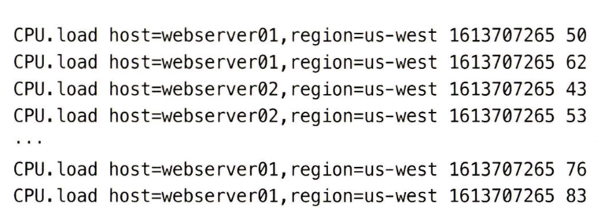
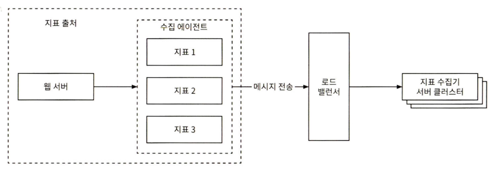
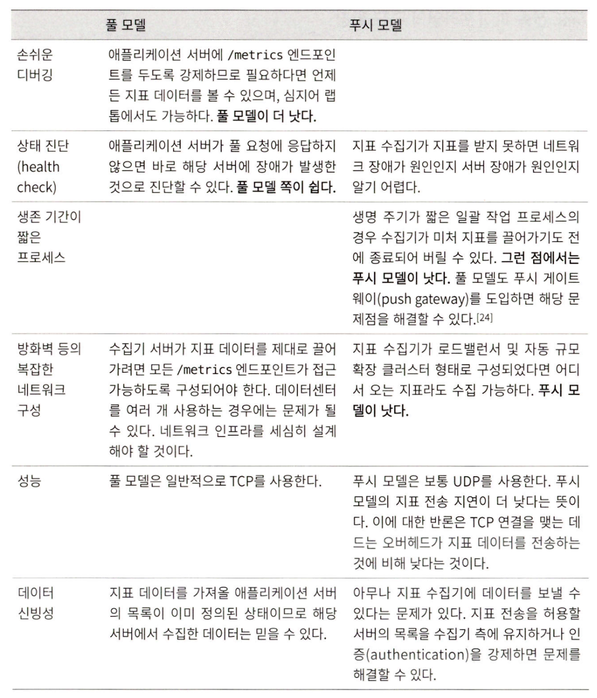

# 시스템디자인인터뷰2 - 5장 지표 모니터링 및 경보 시스템

Created: December 8, 2025 6:23 PM

# 1단계: 문제 이해 및 설계 범위 확정

## 개략적 요구사항 및 가정

- 회사 내에서 사용하는 서비스
- 대규모 인프라를 모니터링 해야 함
    - 일간 능동 사용자 수 1억명
    - 서버 풀 1000개, 풀당 서버 수 100개, 서버 당 100개의 운영 지표 수집 → 천만 개의 지표
    - 데이터 보관 기간은 1년(리텐션)
    - 수집한 그대로 데이터 저장 1주일, 그 뒤 1분 단위 데이터로 변환 후 30일 보관, 그 뒤 1시간 단위 데이터로 변환 후 1년 보관
- 모니터링할 지표 예시
    - CPU 사용률
    - 요청 수
    - 메모리 사용량
    - 메세지 큐 내 메세지 수

## 비기능 요구사항

- 규모 확장성
- 낮은 응답 지연
- 안정성 → 중요 경보 놓치지 않도록
- 유연성 → 유연하게 변경 가능한 파이프라인을 이용해 구축

# 2단계: 개략적 설계안 및 동의 구하기

## 기본 사항 - 5개 구성요소

- 데이터 수집
- 데이터 전송
- 데이터 저장소
- 경보
- 시각화

## 데이터 모델

- 시계열(Time series) 형태
- `지표 이름` - `레이블(host, env… 등)` - `데이터` 구조로 구성
    - 지표 이름 : 문자열
    - 태그/레이블 집합: <키:값> 상의 리스트
    - 지표 값 및 그 타임스탬프의 배열 : <값, 타임스탬프> 쌍의 배열
        
        
        

## 데이터 접근 패턴

- 쓰기 부하가 막대함
- 읽기 부하는 일시적인 스파이크 패턴
    - 쿼리시, 경보 확인시에만 발생

## 데이터 저장소 시스템

- MySQL… 등 범용 저장소는 적합하지 않음.
    - 미칠듯한 쿼리 튜닝 등이 필요. 태그/레이블로 쿼리할일이 많은데 이 경우 태그/레이블로 인덱싱… 등 복잡함.
- NoSQL 역시 해박한 지식 필요.
- 시계열 데이터에 최적화된 저장소 시스템 활용
    - 별도의 질의 언어, 인터페이스, Aggregation 기능 등 지원
    - OpenTSDB, InfluxDB, Prometheus
        - → 보통 프로메테우스 많이 사용(+ Thanos, Victoriametrics, cortex)

## 개략적 설계안


# 3단계: 상세 설계

## 지표 수집

- Pull/Push 방식이 있음

### 풀 모델

- 지표 수집기가 지표 출처에서 당겨(Pull)옴
- 지표 수집기는 서비스 탐색 서비스(Service Discovery Service) 를 활용해 수집할 출처 관리 필요


- 수천 대 서버의 지표를 수집하기 위해 안정 해시 사용, 수집 대상을 해시 링 위에 배치해 각 수집기별로 분산해 처리

### 푸시 모델

- 지표 출처가 지표 수집기로 밀어넣음(Push)
- 중간에 데이터 집계(Aggreation)을 위한 구성요소를 추가 할 수 있음
- 중간에 LB를 넣어 부하에 맞춰 수집기 사이즈 조절 가능
    
    
    

### 풀/푸시 모델 장단점 비교

- 풀 → 프로메테우스
    - 디버깅이 쉬움, 헬스체크 구현 쉬움, 데이터 신빙성 높음
- 푸시 → Cloudwatch, ELK(Filebeat…)
    - Short-Lived 프로세스의 모니터링에 적합, 네트워크 구성 간략화 가능



## 규모 확장

- 수집되는 메트릭 양이 늘어날수록, 지표 수집기-데이터베이스 간 부하가 증가
- 데이터베이스에 장애 발생 시 손실 발생 가능성 있음.
- 중간에 큐 시스템에 전송하여 스트림 처리 서비스가 데이터베이스에 저장하도록 할 수 있음
- → 결합도 낮추기, 데이터베이스 장애시 데이터 소실되지 않음


## 데이터 집계 지점

- 지표 집계를 어디서 하느냐에 따라서 성능, 구조가 달라질 수 있음.
- 수집 에이전트가 집계 → 복잡한 집계는 불가
- 파이프라인에서 집계 → 플링크 같은 스트림 프로세싱 엔진 필요. 원본 데이터를 저장하지 않아 정밀도/유연성 낮음
- 질의 시 집계 → 쿼리가 느려질 가능성

## 질의 서비스

- 시각화/경보 시스템에서 질의하는 요청을 처리하는 역할.
- 클라이언트와 데이터베이스 사이 결합도 낮출 수 있음.


- 시각화/경보 시스템에서 플러그인 형태로 이미 지원하는 경우가 많음.
- 시계열 DB에서 자체 캐시가 있는 경우도 많음.
- 질의어
    - 책에서는 SQL - Flux 예시.
    - 단순 이동 평균의 SQL-PromQL 비교
    - SQL
    
    ```jsx
    SELECT 
        timestamp,
        response_time,
        AVG(response_time) OVER (
            ORDER BY timestamp 
            ROWS BETWEEN 4 PRECEDING AND CURRENT ROW
        ) as sma_5
    FROM metrics
    WHERE timestamp >= NOW() - INTERVAL '1 hour';
    ```
    
    - PromQL
    
    ```jsx
    # 5분 이동 평균
    avg_over_time(api_response_time[5m])
    
    # 더 부드러운 추세선
    rate(api_response_time_sum[5m]) 
    / 
    rate(api_response_time_count[5m])
    ```
    

## 저장소 계층

- 신중하게 선택할 것.
    - 프로메테우스는 메모리 기반. 장기저장을 위해서는 별도의 구성요소가 필요…
    - 시각화/수집 에이전트나 기타 사내 요구사항에 따라 지원 기능이 있거나 없을 수 있음.
- 저장 용량 최적화
    - 인코딩/압축 → 비슷한 값의 연속일 경우, 차이(delta)만 저장하여 압축 가능
    - 다운샘플링 → 시간 해상도를 낮춰(모든 데이터 → 1분 간격 → 1시간 간격) 최적화 가능
    - 냉동 저장소 → Storage-Tiering, 사용 데이터의 빈도에 따라 hot-warm-cold…등의 티어로 나눠 저장

## 경보 시스템

- 경보 관리자가 일정 주기로 확인, 이벤트 발생 시 카프카 등의 큐에 작성
- 경보 소비자는 큐에 이벤트가 있을 경우, 각 엔드포인트로 알림


- 잘 되어있는게 많음. 보통 시계열DB와 연관되어 있는 솔루션이 있음.
    - Prometheus - AlertManager

## 시각화 시스템

- Grafana로 대동단결…

# 4단계: 마무리

- 핵심 키워드
    - 데이터 수집 모델: 풀 모델-푸시 모델
    - 카프카를 활용한 확장 방안
    - 최적 시계열 데이터베이스의 선정
    - 다운샘플링을 통한 데이터 크기 절감
    - 경보/시각화 시스템 - 구현 or 구입 (Buy or Build)