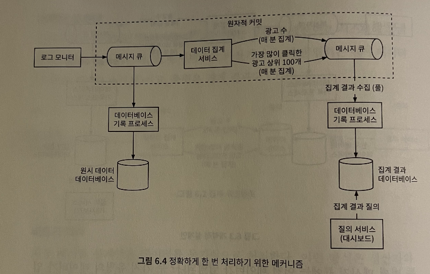
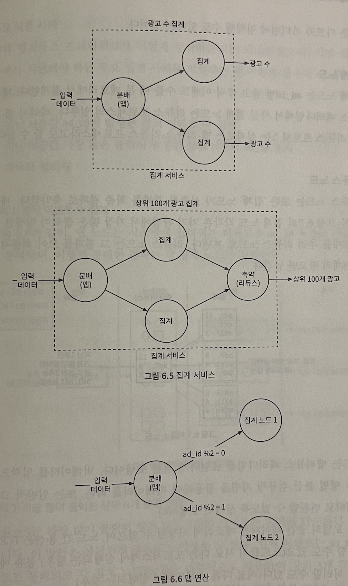
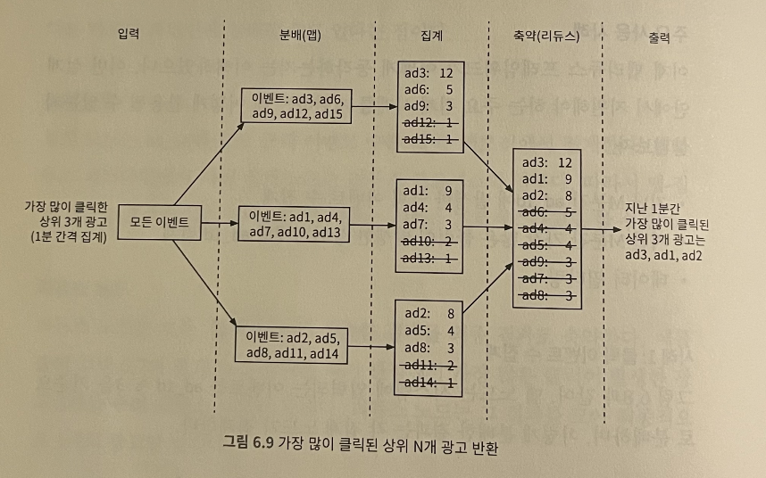
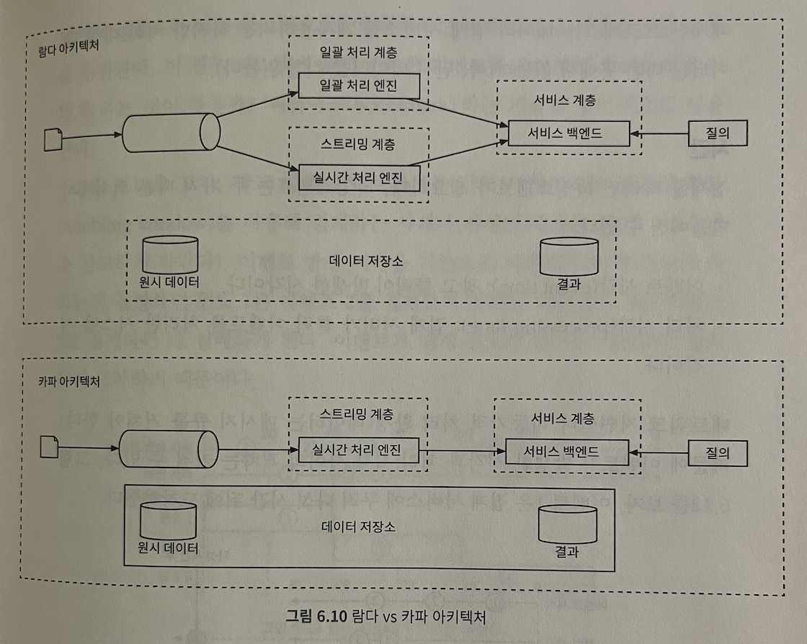
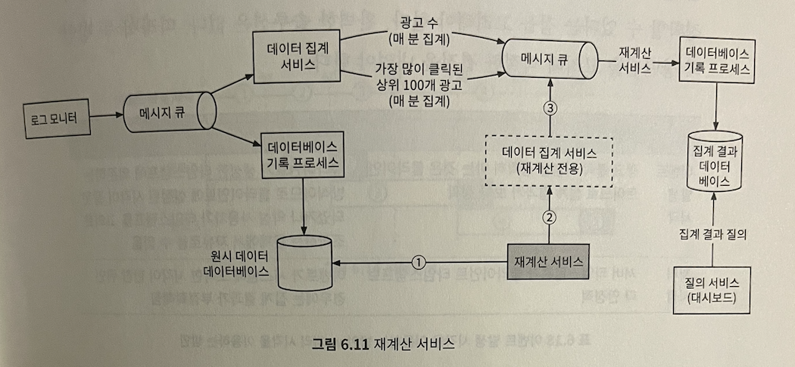
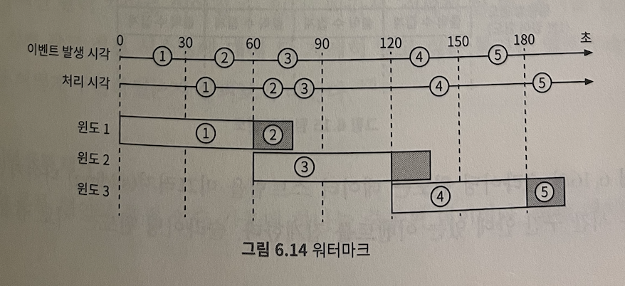

# 6장 광고 클릭 이벤트 집계

빅데이터 처리 시스템 중 하나

## 질의 API

- 사용 대상: 대시보드 이용하는 데이터 과학자, 제품 관리자, 광고주
- 지난 M분간 각 ad_id에 발생한 클릭 수 집계
- 지난 M분간 가장 많은 클릭이 발생한 상위 N개 ad_id 목록

## 데이터 모델

> 둘 다 저장하는 것을 추천한다

- 원시 데이터(raw data): 디버깅에 활용, 데이터 양이 많으므로 질의 대신 백업 데이터로 활용
- 집계 결과 데이터(aggregated data): 활성 데이터로 사용하되 데이터 손실 가능성있음

- 막대한 쓰기 연산: 카산드라, InfluxDB가 쓰기/시간 범위 질의에 최적화

## 개략적 설계안

- 데이터 양을 고려하여 메시지 큐 도입
- 정확하게 한 번에(exactly once) 집계 결과를 처리하기 위해(atomic commit) 메시지 큐를 거쳐 데이터베이스에 값 저장

## 집계 서비스

- 맵리듀스(MapReduce) 프레임워크: 광고 클릭 이벤트를 집계하는 방안
- 유향 비순환 그래프(directed acyclic graph, DAG): 시스템을 맵/집계/리듀스 노드 등 작은 컴퓨팅 단위로 세분화
  - 각 노드는 한 가지 작업만 처리 - 처리 결과는 다음 노드에 인계

### 맵 노드(map node)

- 데이터 출처에서 읽은 데이터를 필터링/변환하는 역할
  - 입력 데이터를 정리하거나 정규화해야 하는 경우
  - 데이터가 생성되는 방식에 대한 제어권이 없는 경우: 동일한 광고 아이디(ad_id)를 갖는 이벤트가 다른 카프카 파티션에 입력되는 경우

### 집계 노드

- 리듀스 프로세스의 일부: ad_id별 광고 클릭 이벤트 수를 매 분 메모리에서 집계

### 리듀스 노드

- 모든 '집계' 노드가 산출한 결과를 최종 결과로 *축약*
- DAG: 맵 리듀스 패러다임을 표현하기 위한 모델
  - 입력으로 받은 빅데이터를 병렬 분산 컴퓨팅 자원을 활용해서 일반적인 크기 데이터로 변환
  - 중간 데이터는 메모리에 저장
  - 노드 간 통신은 TCP로 처리 가능: 노드들이 서로 다른 프로세스에서 실행되는 경우
  - 공유 메모리로 처리 가능: 서로 다른 스레드에서 실행되는 경우

#### 사용 사례

- 클릭 이벤트 수 집계: 맵 노드는 시스템에 입력되는 이벤트를 ad_id % N 기준으로 분배, 분배 결과는 각 집계노드가 집계
- 가장 많이 클릭된 상위 N개 광고 반환: 각 집계 노드에서 힙을 사용해서 상위 M개 광고를 식별, 마지막 단계의 리듀스 노드는 전달받은 M개 광고 중 지난 1분간 가장 많이 클릭된 광고 N개 고름

  

- 데이터 필터링: 필터링 기준을 사전저에 정의해서 해당 기준에 따라 집계
- 스타 스키마(star schema): 데이터 웨어하우스에서 사용
  - 차원(dimension): 필터링에 사용되는 필드
  - 장점: 이해하기 쉽고 구축하기 간단함, 기존 집계 서비스 재사용, 결과를 미리 계산하므로 데이터에 빠르게 접근
  - 단점: 필터링 기준이 많을수록 생성되는 버킷과 레코드 개수가 많아진다

## 상세 설계

### 스트리밍 vs 일괄 처리

- 스트림 처리: 데이터를 오는 대로 처리, 실시간으로 집계된 결과 생성
- 일괄 처리: 이력 데이터 백업용
- 람다(lambda): 스트리밍/일괄 처리 경로 동시 지원하는 시스템 아키텍처
  - 관리해야할 코드가 2개
- 카파 아키텍처(Kappa architecture): 일괄 처리, 스트리밍 처리 경로 하나로 결합
  - 단일 스트림 처리 엔진으로 실시간 데이터 처리/재처리 문제 해결

### 데이터 재계산

- 이력 데이터 재처리(historical data replay): 버그 등의 이유로 이미 집계한 데이터 재계산

1. 원시 데이터 저장소에서 직접 데이터 검색하여 일괄 처리 프로세스를 따른다
2. 추출된 데이터는 전용 집계 서비스로 전송된다. 
   1. 전용 집계 서비스를 두는 이유? 실시간 데이터 처리 과정이 과거 데이터 재처리 프로세스와 간섭하는 것 막기 위해
3. 집계 결과는 두 번째 메시지 큐로 전송되어 집계 결과 데이터베이스에 반영 

### 시간

- 이벤트 시각(event time): 광고 클릭 발생한 시각
- 처리 시각(processing time): 집계 서버가 클릭 이벤트를 처리한 시스템 시각

> 네트워크 지연, 비동기 처리 환경으로 두 개의 시각 차이는 커질 수 있음

- 이벤트 발생 시각을 집계에 사용하는 경우: 지연된 이벤트 처리 문제 잘 해결해야
  - 정확한 집계 결과: 클라이언트가 광고 클릭 시점을 정확하게 알 수 있음
  - 클라이언트가 생성한 타임스탬프에 의존: 설정된 시각 자체가 잘못되었거나 타임스탬프 조작 가능성 있음

- 처리 시각을 집계에 사용하는 경우: 집계 결과가 부정확할 수 있음
  - 서버 스탬프를 사용하므로 보다 안정적
  - 이벤트가 시스템에 도착한 시각이 한참 뒤인 경우 집계 결과 부정확: 데이터 정확도 떨어짐
  - 시스템에 늦게 도착한 이벤트 처리? 워터마크(watermark) 사용

#### 워터마크(watermark)

- 시스템에 늦게 도착한 이벤트 처리
- 집계 윈도의 확장: 집계 결과의 정확도를 높일 수 있음

- 비즈니스 요구사항에 따라 워터마크의 크기 달라짐
  - 구간이 긴 경우: 늦게 도착하는 이벤트 포착, 그만큼 시스템의 이벤트 처리 시간은 늘어남
  - 짧은 경우: 데이터 정확도 쩔어짐, 시스템의 응답 지연 낮아짐
  - 전반적으로 워터마크 사용하면, 데이터의 정확도는 높아지지만 대기 시간이나 전반적인 지연 시간은 늘어난다

#### 집계 윈도

- 크게 4개로 나눠짐: 텀블링 윈도, 고정 윈도, 호핑 윈도, 슬라이딩 윈도

| 텀블링 윈도                                | 슬라이딩 윈도                                                           |
| ------------------------------------------ | ----------------------------------------------------------------------- |
| 같은 크기의 겹치지 않는 구간으로 시간 분할 | 데이터 스트림을 같은 시간 구간 안에 있는 이벤트 집계: 서로 겹칠 수 있음 |
| 매 분 발생한 클릭 이벤트 집계하기에 적합함 | 지난 M분간 가장 많이 클릭된 상위 N개 광고 알아내기에 적합               |

#### 전달 보장

- 데이터 정확성, 무결성이 아주 중요: 집계 결과는 과금 등에 활용
  - 이벤트의 중복 처리를 어떻게 피할 수 있는가?
  - 모든 이벤트 처리는 어떻게 보장할 수 있는가?

- 최대 한 번(at-most once), 최소 한 번(at-least once), 정확히 한 번(exactly once)
  - 약간의 중복 허용이 가능하다면: '최소 한 번'이 적절
  - 데이터의 차이가 과금으로 이어진다면: '정확히 한 번'이 적절

- 데이터 중복 케이스: 클라이언트가 같은 이벤트를 여러 번 보내는 경우, 서버(집계 서비스 노드) 장애

### 시스템 규모 확장

- 메시지 큐, 집계 서버, 데이터베이스의 상호 결합도 낮음: 각기 독립적으로 규모 늘릴 수 있음

#### 메시지 큐의 규모 확장

- 생산자(producer): 생산자 인스턴스 수에 제한 두지 않아 확장성 쉽게 달성
- 소비자(consumer): 소비자 그룹 내 재조정(rebalancing) 메커니즘은 노드 추가/삭제를 통해 규모 조정
  - 각 소비자가 한 파티션에서만 이벤트를 소비할 수 있도록
  - 카프카 소비자가 많은 경우: 재조정 작업 시간이 길어지므로 소비자 추가 작업은 시스템 사용량이 많지 않은 시간에 실행
- 브로커(broker)
  - 해시 키: 같은 ad_id를 갖는 이벤트를 같은 카프카 파티션에 저장, 집계 서비스는 같은 파티션에서 같은 ad_id를 갖는 이벤트를 확인할 수 있다
  - 파티션 수: 사전에 충분한 파티션을 확보해서 프로덕션 환경에서 파티션의 수가 동적으로 늘어나는 상황은 피하는 것이 좋다
  - 토픽의 물리적 샤딩: 데이터를 여러 토픽으로 나누면 시스템의 처리 대역폭을 낮출 수 있다, 복잡성과 유지 관리 비용이 늘어남

#### 집계 서비스의 규모 확장

- 노드 추가/삭제로 수평적으로 규모 확장이 가능하다
- 집계 서비스의 처리 대역폭 높이는 방법?
  1. ad_id마다 별도의 처리 스레드 두기 << 구현하기 좀 더 쉽다: 자원 공급자에 대한 의존 관계 없음
  2. 집계 서비스 노드를 자원 공급자(아파치 하둡 YARN 등)에 배포: 다중 프로세싱 활용 << 실제로 더 많이 쓰이는 방안: 컴퓨팅 자원을 더 많이 추가하여 시스템 규모 확장 가능하므로

#### 데이터베이스의 규모 확장

- 카산드라: 안정 해시와 유사한 방식으로 수평적인 규모 확장 지원
  - 데이터와 그 사본은 각 노드에 균등하게 분산

### 핫스팟(hotspot) 문제

- 다른 서비스나 샤드보다 더 많은 데이터를 수신하는 서비스, 샤드
- 한 노드가 감당할 수 있는 양보다 더 많은 이벤트를 수신한다면, 자원 관리자는 추가 자원을 신청/할당 - 이벤트를 자원의 갯수만큼 분할하여 기록

- 전역-지역 집계(Global-Local Aggregation), 분할 고유 집계(Split Distinct Aggregation) 등의 방안 존재함

### 결함 내성(fault tolerance)

- 집계는 메모리에서 이루어짐: 집계 노드에 장애 발생 - 집계 결과 또한 손실
- 시스템 상태(업스트림 오프셋 등)를 스냅샷으로 저장하고 마지막으로 저장된 상태부터 복구하는 것이 바람직
  - 집계 서비스 노드 하나에 장애: 해당 노드를 새 노드로 대체하고 마지막 스냅샷에서 데이터 복구

### 데이터 정합성

- 지속적 모니터링: 지연 시간(latency), 메시지 큐 크기, 집계 노드의 시스템 자원
- 조정(reconcillation): 다양한 데이터를 비교하여 데이터 무결성 보증하는 기법
