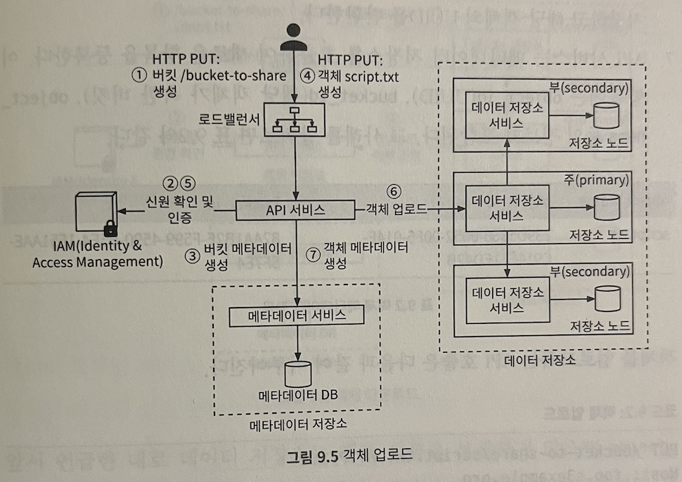
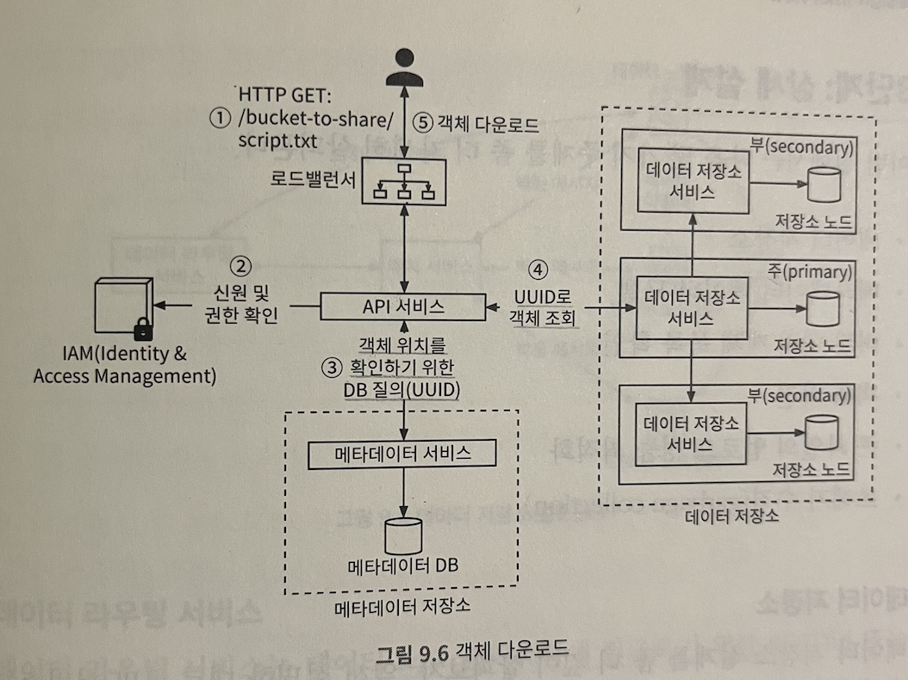
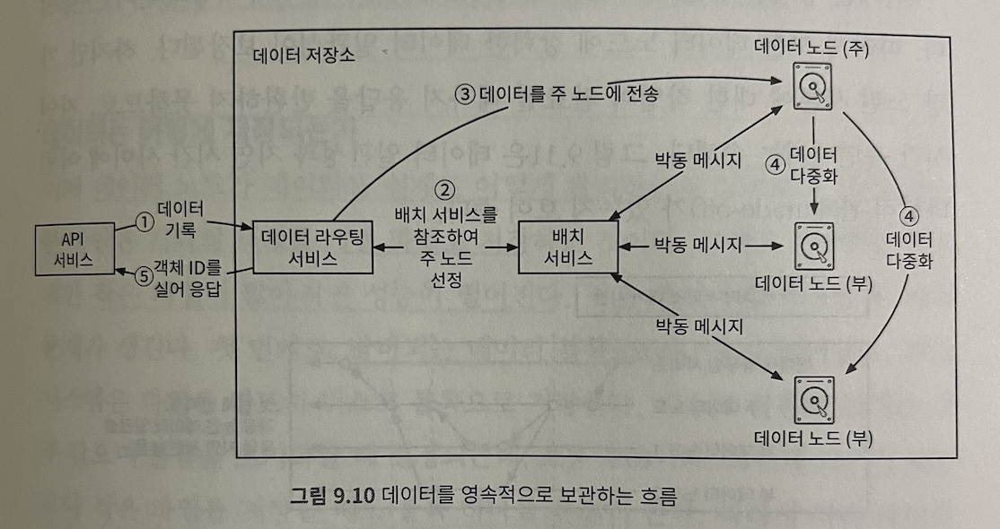

# 9장 S3와 유사한 객체 저장소

S3: RESTful API 기반 인터페이스로 이용 가능한 객체 저장소

## 저장소 시스템(Storage System)

### 블록 저장소

- 서버에 물리적으로 연결되는 형태의 드라이브: HDD(Hard Dist Drive), SSD(Solid State Drive)
- 원시 블록(raw block)을 서버에 볼륨(volume) 형태로 제공: 가장 유연하고 융통성이 높다
- 서버에 물리적으로 연결 + 고속 네트워크 또는 업계 표준 연결 프로토콜인 FC(Fibre Channel), iSCSI 통해 연결 가능

### 파일 저장소

- 블록 저장소 위에 구현
- 파일, 디렉터리를 손쉽게 다루기 위해 더 높은 수준의 추상화(abstraction) 제공
- 데이터는 계층적으로 구성되는 디렉터리 안에 보관
- 가장 널리 사용되는 범용 저장소 솔루션
- 파일 수준 네트워크 프로토콜(SMB/CIFS, NFS) 사용시, 하나의 저장소를 여러 서버에 동시에 붙일 수 있음
- 조직 구성원에게 폴더, 파일 공유용으로 사용하기 좋음

### 객체 저장소

- 데이터 영속성 높임, 대규모 애플리케이션 지원, 비용 절감을 위해 성능 희생
- 데이터 아카이브, 백업에 주로 사용
- 모든 데이터를 수평적 구조 내에 보관: 계층적 디렉터리는 제공하지 않음
- 데이터 접근은 RESTful API 사용

### 용어 정리

- 버킷(bucket): 객체를 보관하는 논리적 컨테이너
- 객체(object): 버킷에 저장하는 개별 데이터, 데이터(페이로드)와 메타데이터 가짐
- 버전(versioning): 한 객체의 여러 버전을 같은 버킷 안에 둘 수 있도록 하는 기능
- URI(Uniform Resource Identifier): 객체 저장소는 버킷과 객체에 접근할 수 있도록 하는 RESTful API 제공
- SLA(Service-Level Agreement): 서비스 제공자 - 클라이언트 사이에 맺어지는 계약
  - 객체 내구성, 복원 가능성, 가용성 제공

## 객체 저장소 속성

- 객체 불변성(object immutability)
- 키-값 저장소(key-value store): URI는 키로, 데이터는 값에 해당
- 저장은 1회, 읽기는 여러 번: 객체 저장소에 대한 95% 요청이 READ
- 소형 및 대형 객체 동시 지원

UNIX 파일 시스템의 설계 철학과 아주 비슷: 파일명과 데이터는 같은 곳에 저장되지 않는다
- 데이터는 불변인 반면, 메타데이터는 변경 가능: 단순한 설계 가능

### 객체 업로드

### 객체 다운로드

- 버킷 이름, 객체 이름 연결: 폴더 구조 흉내
  - bucket-to-share/script.txt
- 데이터 저장소는 객체 이름을 보관하지 않음: 객체 다운로드 시 객체 이름을 UUID로 변환해야

### 데이터 저장소

- API 서비스는 사용자 요청 받으면 다른 내부 서비스 호출
- 데이터 저장소에서 객체를 저장하거나 가져온다

### 데이터 라우팅 서비스

- 데이터 노드 클러스터에 접근하기 위한 RESTful 또는 gRPC 제공

### 배치 서비스

- 어느 데이터 노드에 데이터 저장할지 결정
- 주, 부 데이터 노드로 구성
- 가상 클러스터 지도: 클러스터의 물리적 형상 정보 보관
- 지도에 보관되는 데이터 노드 위치 정보 이용: 데이터 사본(replica)가 물리적으로 다른 위치에 놓이도록(높은 데이터 내구성)
- 모든 데이터 노드와 지속적으로 박동 메시지를 주고 받으며 상태 모니터링
- 합의 프로토콜(팩서스, 래프트 등) 사용 권장: 건강한 노드 수가 클러스터 크기의 절반 이상이면 서비스 지속 보장

### 데이터 노드

- 실제 데이터 보관
- 다중화 그룹: 여러 노드에 데이터 복제, 데이터 안정성과 내구성 보증
- 배치 서비스에 주기적으로 박동 메시지 보내는 서비스 데몬 돌음
  - 배치 서비스에서 박동 메시지 처음으로 받으면: 해당 노드에 ID 부여 - 가상 클러스터에 지도 추가 - 정보 반환

### 데이터 저장 흐름

- 주 노드 선정: 조회 연산에 안정 해시 사용
- 데이터 다중화: 모든 데이터 노드에 데이터 일관성 보장

### 데이터 저장 관리

- 각각의 객체를 개별 파일로 저장: 작은 파일이 많아지면 성능이 떨어짐
- 시스템의 아이노드 용량 한계 초과
  - 아이노드: 파일 위치 저장
  - 캐싱을 하더라도 아이노드를 효과적으로 처리하지는 못함

> 작은 객체들을 큰 파일 하나로 모아서 해결

- 읽기-쓰기 파일에 대한 쓰기 연산은 순차적으로 이뤄져야 한다
  - 객체는 파일에 일렬 저장
  - 쓰기 연산을 병렬로 진행해도 객체 내용이 뒤섞이지 말아야

### 객체 소재 확인

- 필요 정보: 객체가 보관된 데이터 파일, 데이터 파일 내 객체 오프셋(offset), 객체 크기
- 파일 기반 키-값 저장소 이용 < RDB 사용: 읽기 연산이 빈번하므로

### 데이터 내구성

- 하드웨어 장애: 서버마다 랙 설치
  - 랙: 특정 열/층/방에 위치
- 데이터 3중 다중화
- 소거 코드: 데이터를 작은 단위로 분할하여 다른 서버에 배치, 일부 소실되어도 복구하기 위한 패리티를 만들어 중복성 확보(데이터 내구성 확보)
- 정확성 검증: 프로세스 경계에 데이터 검증 위한 체크섬(checksum) 둠
  - 체크섬: 데이터 에러를 발견하는 데 사용되는 작은 크기의 데이터 블록
  - 원본 - 새로 계산한 체크섬이 다른 경우: 데이터는 망가짐
  - 같은 경우: 99% 데이터 온전함
  - MD5, SHA1, HMAC

### 메타데이터 데이터 모델

- 스키마: 객체 이름으로 객체 ID 찾기, 객체 삽입/삭제, 같은 접두어 갖는 버킷 내 모든 객체 목록 확인
- bucket 테이블의 규모 확장: 데이터베이스 사본 만들어서 READ 부하 분산
- object 테이블의 규모 확장: 객체 메타데이터 보관
  - 샤딩으로 객체 메타데이터 테이블 규모 확장

### 버킷 내 객체 목록 확인

- `s3://버킷이름/객체이름`으로 접근
- S3 접두어: 사용자가 버킷 내 객체 정리 지원
  - 접두어는 디렉터리가 아니다

### 단일 데이터베이스 서버

- sql문 SELECT와 비슷

### 분산 데이터베이스

- 검색 질의를 모든 샤드에 돌린 다음 결과 취합

### 객체 버전

- 버킷 안에 한 객체의 여러 버전을 둘 수 있는 기능
- 실수로 지우거나 덮어 쓴 객체 복구용

### 큰 파일의 업로드 성능 최적화

- 멀티파트(multipart) 업로드: 큰 객체를 작게 쪼갠 다음 독립적으로 업로드, 모든 조각이 업로드되고 나면 객체 저장소는 그 조각 모아 원본 객체 복원

### 쓰레기 수집

- 더 이상 사용되지 않는 데이터에 할당된 저장 공간 자동으로 회수
  - 객체의 지연된 삭제: 삭제했다고 표시는 하지만 실제로는 지우지 않음
  - 갈 곳 없는 데이터: 반쯤 업로드되거나 업로드 취소된 데이터
  - 훼손된 데이터: 체크섬 검사에 실패한 데이터
- 데이터 저장소에서 객체를 바로 지우지 않고, 삭제된 객체는 정리 메커니즘을 주기적으로 실행하여 지움
- 사용되지 않는 사본에 할당된 저장 공간 회수하는 역할